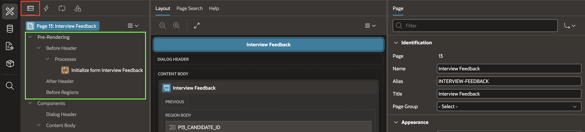
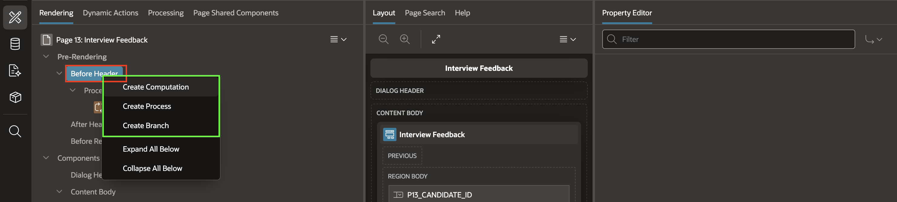
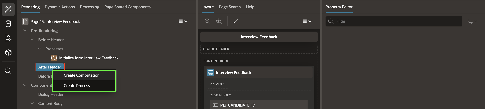
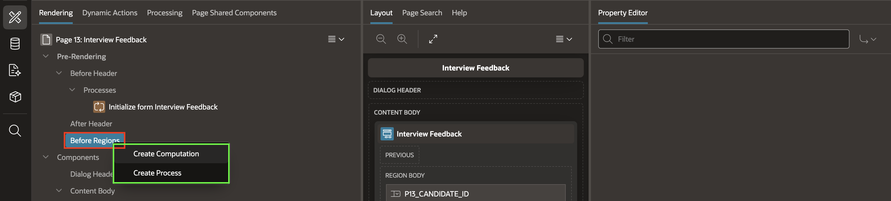
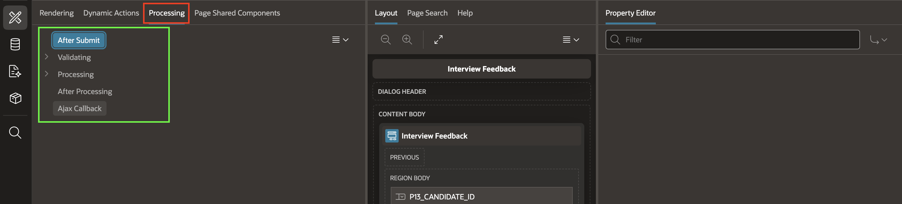

# Understanding Oracle APEX Page Processing

## Introduction

In this lab, you will explore the Oracle APEX page processing lifecycle. This helps you decide where to place computations, validations, processes, and branches.

Estimated Time: 5 minutes

### Objectives

In this lab, you will:

- Understand the pre-rendering processing points.
- Learn how processing works after a page is submitted.
- Identify where computations, validations, processes, and branches execute.
- Understand why processing order is important when troubleshooting page behavior.

## Task 1: Explore Pre-Rendering Processes

Pre-rendering processes execute before APEX displays the page. These processes prepare data, initialize page items, and control what the user sees when the page loads.

1. Open the **Talent Acquisition Portal (TAP)** application in App Builder.

2. Navigate to any page.

3. In the left pane, expand the **Pre-Rendering** node.

    

4. Review the following **Pre-Rendering** processing points:

    - **Before Header**:

        - Executes before the page begins rendering.
        - Commonly used to initialize page items, perform computations, or redirect users before any HTML is generated.

    

    - **Header**:
        - Generates the page header.
        - Typically managed by APEX and rarely requires custom logic.

    

    - **Before Regions**:

        - Executes after the page header but before page regions are rendered.
        - Commonly used to prepare values that regions, reports, or charts depend on.

    

5. Review the processing tree and observe where these processing points appear.

    *Note: Logic placed at the wrong pre-rendering point may result in page items displaying incorrect or outdated values.*

## Task 2: Explore Submit-Time Processing

In this task, you will explore the sections available in the Processing tab of Page Designer. These sections organize the server-side logic that Oracle APEX uses to validate data, execute processes, and handle asynchronous requests.

1. In the left pane, select the **Processing** tab.

2. The Processing tree displays the following sections:

    - After Submit
    - Validating
    - Processing
    - After Processing
    - Ajax Callback

    

3. Select **After Submit**.

    - The After Submit section contains all components that Oracle APEX executes when a page is submitted by clicking a button such as Create, Save, or Apply Changes.

    - This section groups the validations and processes that run during page submission.

    *Note: Components under After Submit are executed only when the page is submitted.*

4. Select **Validating**.

    - The Validating section contains all validations defined for the page.

    - Validations ensure that user input satisfies the business rules before any processing occurs.

    - Common validations include:

        - Required field validation
        - Date validation
        - Value range validation
        - SQL or PL/SQL expression validation
        - Custom business rule validation

    - If a validation fails, Oracle APEX displays an error message and prevents the remaining page processes from executing.

5. Select **Processing**.

    - The Processing section contains the server-side processes that execute after all validations have completed successfully.

    - Processes perform actions such as:

        - Inserting records into a database table
        - Updating existing records
        - Deleting records
        - Executing PL/SQL code
        - Calling REST services
        - Sending email notifications

    - A page can contain one or more processes. APEX runs them according to their sequence.

6. Select **After Processing**.

    - The After Processing section contains components that are available after page processing has completed successfully.

    - Depending on the page type and application design, this section may contain components such as:

        - Branches that redirect users to another page
        - Success messages
        - Post-processing actions

    - Some pages may not contain any components in this section.

    *Note: Modal dialog pages often use a Close Dialog action instead of a branch.*

7. Select **Ajax Callback**.

    - The Ajax Callback section contains server-side PL/SQL processes that run asynchronously without submitting the page.

    - Ajax Callbacks are commonly used with:

        - Dynamic Actions
        - JavaScript
        - Oracle APEX APIs

    - They enable the application to retrieve or update data in the background while the user remains on the current page.

    - Typical use cases include:

        - Populating dependent lists of values (LOVs)
        - Retrieving data dynamically
        - Performing server-side calculations
        - Validating data without a full page submission
        - Refreshing page regions

    *Note: Ajax Callbacks do not execute automatically during page submission. They run only when invoked by a Dynamic Action, JavaScript code, or an Oracle APEX API.*

## Summary

In this lab, you explored the Oracle APEX page processing lifecycle. You reviewed pre-rendering, submit-time processing, validations, processes, branches, and Ajax Callback sections. You can now place server-side logic in the right processing point and troubleshoot page behavior more easily.

## Acknowledgements

**Author** - Ankita Beri, Senior Product Manager; Roopesh Thokala, Principal Product Manager

**Last Updated By/Date** - Ankita Beri, July 28, 2026
