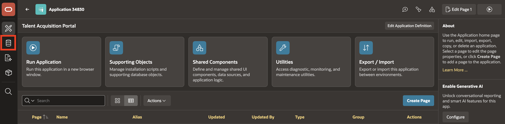
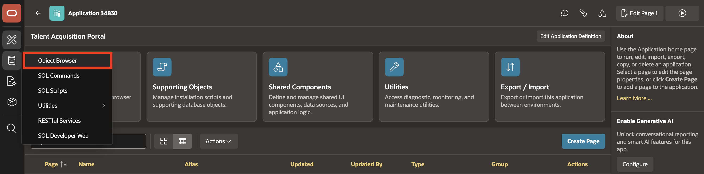
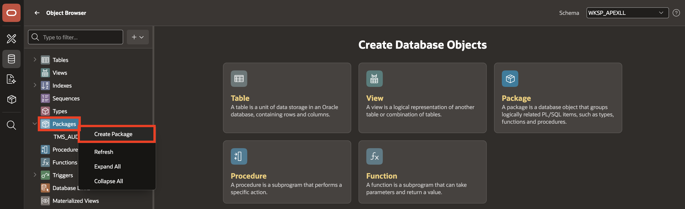
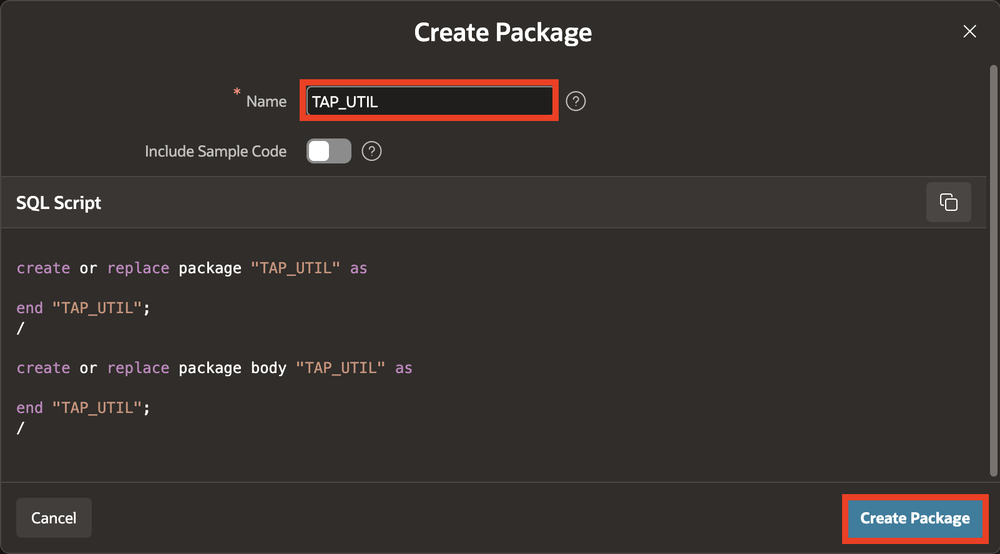
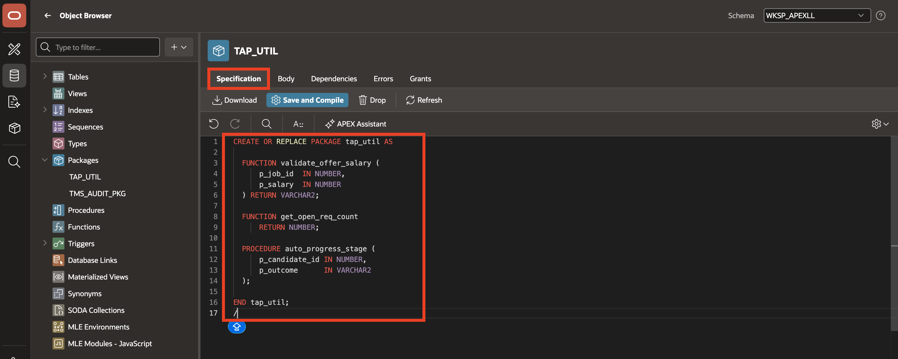
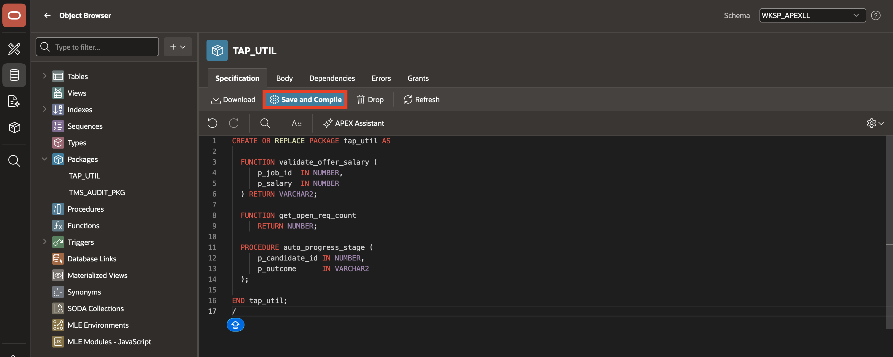
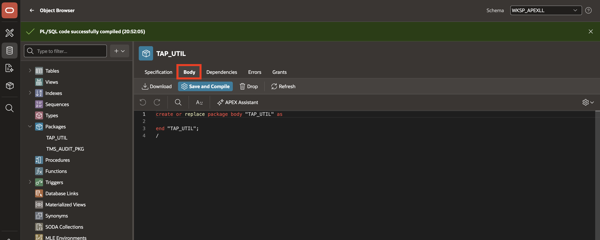
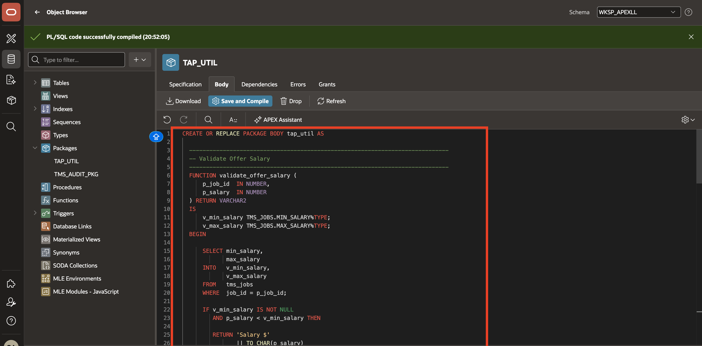
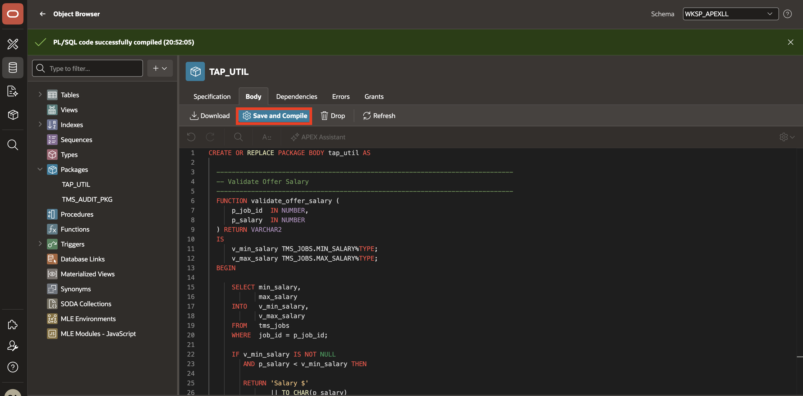
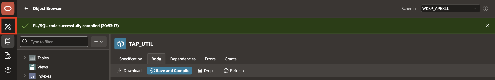

# Create TAP_UTIL Package

## Introduction

In this lab, you will create the `TAP_UTIL` PL/SQL package. The package centralizes Talent Acquisition Portal logic for offer salary validation, open requisition counts, and candidate stage progression.

Estimated Time: 5 minutes

### Objectives

In this lab, you will:

- Create the `TAP_UTIL` package specification.
- Create the `TAP_UTIL` package body.
- Add reusable PL/SQL logic for offer validation and pipeline status.

## Task 1: Create the TAP_UTIL Package

1. In Oracle APEX, go to **SQL Workshop**.

    

2. Open **Object Browser**.

    

3. In Object Browser, open the create menu and select **Package**.

    

4. For **Name**, enter `TAP_UTIL`, and then click **Create Package**.

    

5. In the **Specification** tab, replace the generated package specification with the following code:

    ```
    <copy>
    CREATE OR REPLACE PACKAGE tap_util AS

      FUNCTION validate_offer_salary (
          p_job_id  IN NUMBER,
          p_salary  IN NUMBER
      ) RETURN VARCHAR2;

      FUNCTION get_open_req_count
          RETURN NUMBER;

      PROCEDURE auto_progress_stage (
          p_candidate_id IN NUMBER,
          p_outcome      IN VARCHAR2
      );

    END tap_util;
    /
    </copy>
    ```

    

6. Click **Save and Compile**.

    

7. Confirm that the package specification compiles successfully, and then open the **Body** tab.

    

8. Replace the generated package body with the following code:

    ```
    <copy>
    CREATE OR REPLACE PACKAGE BODY tap_util AS

      -----------------------------------------------------------------------------
      -- Validate Offer Salary
      -----------------------------------------------------------------------------
      FUNCTION validate_offer_salary (
          p_job_id  IN NUMBER,
          p_salary  IN NUMBER
      ) RETURN VARCHAR2
      IS
          v_min_salary TMS_JOBS.MIN_SALARY%TYPE;
          v_max_salary TMS_JOBS.MAX_SALARY%TYPE;
      BEGIN

          SELECT min_salary,
                 max_salary
          INTO   v_min_salary,
                 v_max_salary
          FROM   tms_jobs
          WHERE  job_id = p_job_id;

          IF v_min_salary IS NOT NULL
             AND p_salary < v_min_salary THEN

             RETURN 'Salary $'
                    || TO_CHAR(p_salary)
                    || ' is below the minimum band of $'
                    || TO_CHAR(v_min_salary);

          ELSIF v_max_salary IS NOT NULL
             AND p_salary > v_max_salary THEN

             RETURN 'Salary $'
                    || TO_CHAR(p_salary)
                    || ' exceeds the maximum band of $'
                    || TO_CHAR(v_max_salary);

          END IF;

          RETURN NULL;

      EXCEPTION
          WHEN NO_DATA_FOUND THEN
              RETURN 'Invalid Job ID.';
      END validate_offer_salary;

      -----------------------------------------------------------------------------
      -- Count Open Requisitions
      -----------------------------------------------------------------------------
      FUNCTION get_open_req_count
          RETURN NUMBER
      IS
          v_count NUMBER;
      BEGIN

          SELECT COUNT(*)
          INTO   v_count
          FROM   tms_job_requisitions
          WHERE  status = 'Open';

          RETURN v_count;

      END get_open_req_count;

      -----------------------------------------------------------------------------
      -- Auto Progress Candidate Stage
      -----------------------------------------------------------------------------
      PROCEDURE auto_progress_stage (
          p_candidate_id IN NUMBER,
          p_outcome      IN VARCHAR2
      )
      IS
      BEGIN

          IF UPPER(p_outcome) = 'PROCEED' THEN

              UPDATE tms_candidates
              SET current_stage =
                      CASE current_stage
                          WHEN 'Applied'   THEN 'Screening'
                          WHEN 'Screening' THEN 'Interview'
                          WHEN 'Interview' THEN 'Offer'
                          ELSE current_stage
                      END
              WHERE candidate_id = p_candidate_id;

          ELSIF UPPER(p_outcome) = 'REJECT' THEN

              UPDATE tms_candidates
              SET current_stage = 'Rejected'
              WHERE candidate_id = p_candidate_id;

          END IF;

      END auto_progress_stage;

    END tap_util;
    /
    </copy>
    ```

    

9. Click **Save and Compile**.

    

10. Confirm that the package body compiles successfully.

    The package now exposes reusable PL/SQL functions and procedures for later validations and processes.

    

## Summary

You created the `TAP_UTIL` package. It validates offer salary bands, counts open requisitions, and updates candidate stages based on interview outcomes.

## Acknowledgements

**Author** - Ankita Beri, Senior Product Manager; Roopesh Thokala, Principal Product Manager

**Last Updated By/Date** - Ankita Beri, July 28, 2026
