# Add Processing to the Offer Form

## Introduction

In this lab, you will add page processing logic to the Talent Acquisition Portal. You will validate offered salary on the Offer Form and add an AJAX Callback process for pipeline statistics.

Estimated Time: 8 minutes

### Objectives

In this lab, you will:

- Add a salary validation to the Offer Form.
- Use the `TAP_UTIL.validate_offer_salary` function in a page validation.
- Add an AJAX Callback process to the TAP Home page.
- Return pipeline statistics as JSON.

## Task 1: Add a Salary Validation to the Offer Form

1. From the left navigation menu, select **App Builder**.

2. Select the **Talent Acquisition Portal** application.

    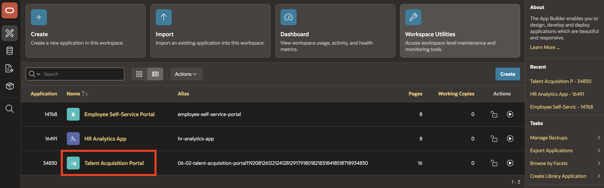

3. Open the **Form on Offers** page in Page Designer.

    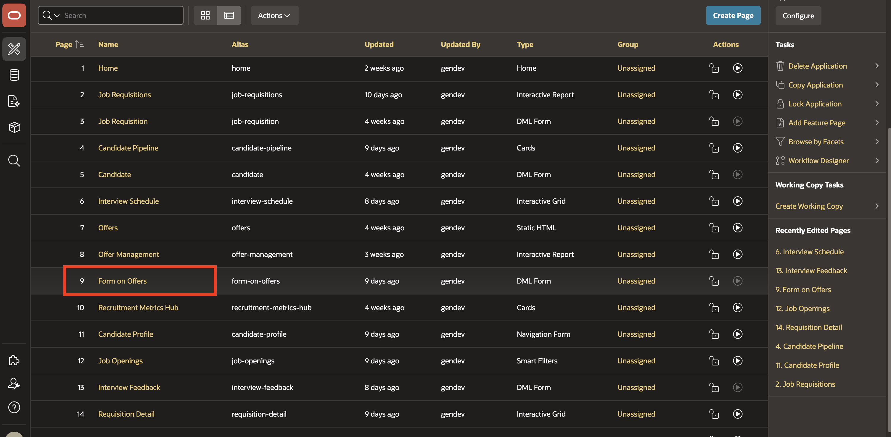

4. In the left pane, select the **Processing** tab.

    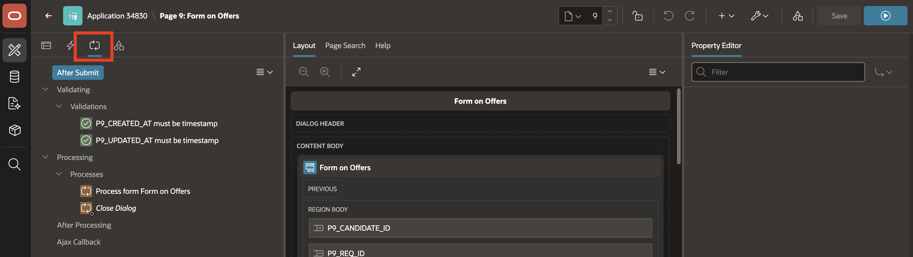

5. Right-click **Validating** and select **Create Validation**.

    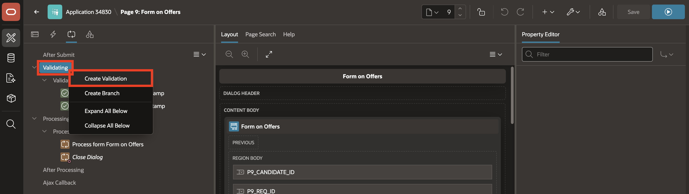

6. In the Property Editor, enter or select the following settings:

    - Identification > Name: **Salary Within Job Band**

    - Under Validation:

        - Type: **PL/SQL Function Body returning (Error Text)**

        - PL/SQL Function Body returning Error Text: Enter the following in the code editor:

        ```
        <copy>
        DECLARE
        l_job_id tms_job_requisitions.job_id%TYPE;
        BEGIN
        SELECT r.job_id
            INTO l_job_id
            FROM tms_job_requisitions r
        WHERE r.req_id = :P9_REQ_ID;

        RETURN tap_util.validate_offer_salary(l_job_id, :P9_OFFERED_SALARY);
        EXCEPTION
        WHEN NO_DATA_FOUND THEN
            RETURN 'Invalid requisition selected.';
        END;
        </copy>
        ```

    - Under Error:
        - Error Location: **Inline with Field**

        - Associated Item: **P_OFFERED_SALARY**

    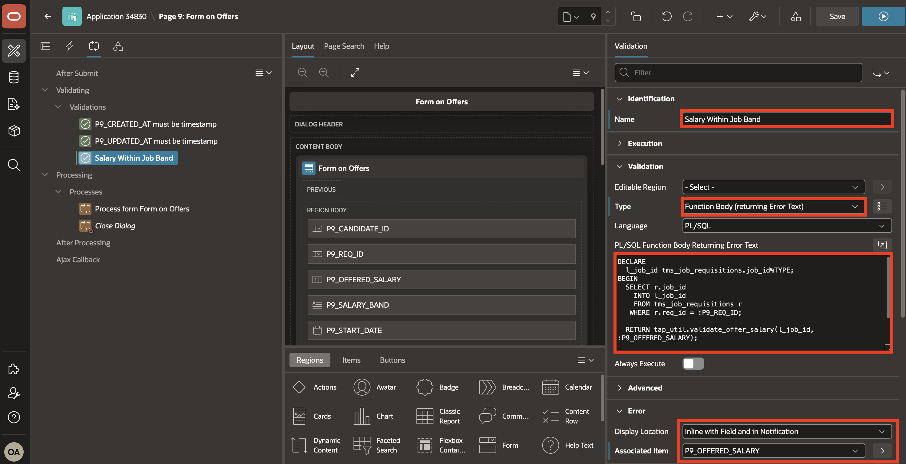

7. Save the page.

    This validation prevents offers from being submitted when the offered salary is outside the salary band for the selected job.

    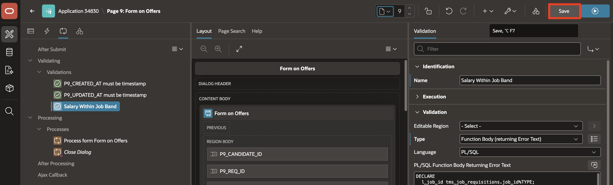

## Task 2: Add an AJAX Callback for Pipeline Stats

1. From the Page Designer Toolbar, navigate to **Page Selector** and select page **1** Home page.

    The source identifies this as page 1.

    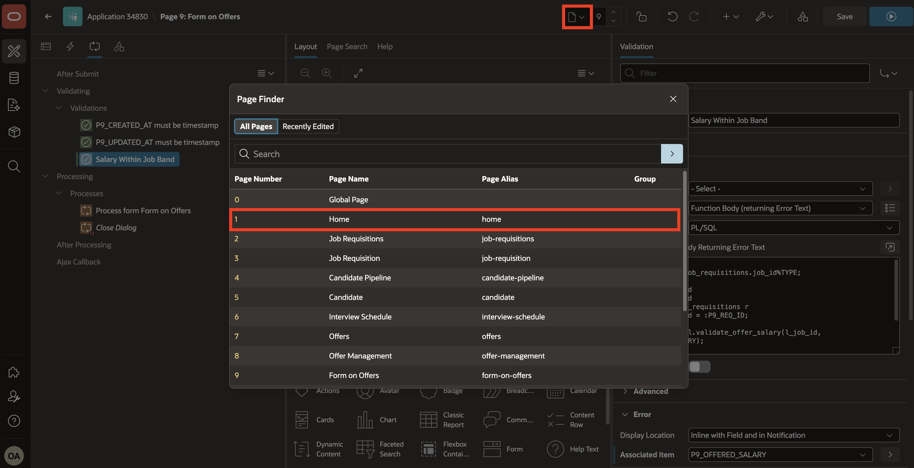

2. In the left pane, select the **Processing** tab.

    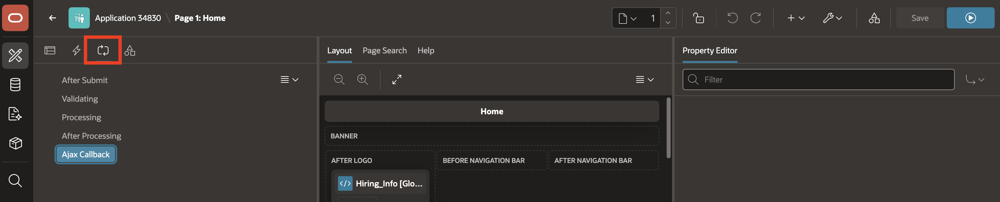

3. Right-click **AJAX Callback** and select **Create Process**.

    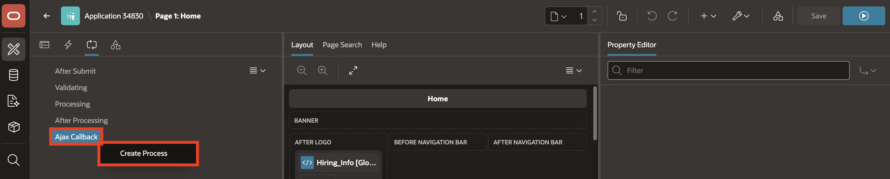

4. In the Property Editor, enter or select the following settings:

    - Identification > Name: **Get Pipeline Stats**

    - Source > PL/SQL Code: Enter the following in the code editor:

    ```
    <copy>
     DECLARE
      l_active_candidates NUMBER;
    BEGIN
      SELECT COUNT(*)
      INTO   l_active_candidates
      FROM   tms_candidates
      WHERE  current_stage NOT IN ('Hired', 'Rejected');

      APEX_JSON.OPEN_OBJECT;
      APEX_JSON.WRITE('open_reqs', tap_util.get_open_req_count);
      APEX_JSON.WRITE('active_candidates', l_active_candidates);
      APEX_JSON.CLOSE_OBJECT;
    END;
    </copy>
    ```

    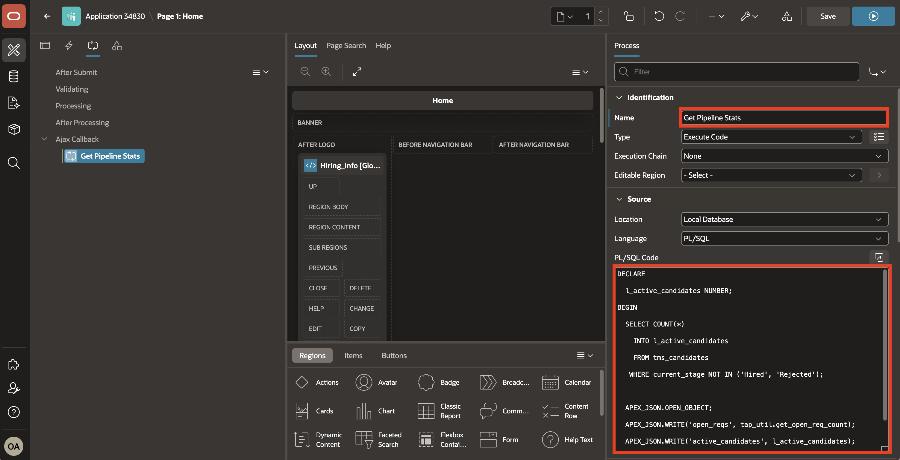

5. Save the page.

    A Dynamic Action in Module 12 can call this callback to refresh the dashboard without reloading the page.

    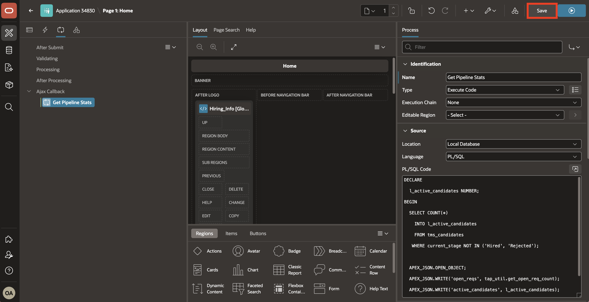

## Summary

You added salary validation to the Offer Form and created an AJAX Callback process for pipeline statistics. The Talent Acquisition Portal can now validate offer data and return dashboard values.

## Acknowledgements

**Author** - Ankita Beri, Senior Product Manager; Roopesh Thokala, Principal Product Manager

**Last Updated By/Date** - Ankita Beri, July 28, 2026
