# Create ESS_UTIL and Wire the Leave Form

## Introduction

In this lab, you will add leave request logic to the **Employee Self-Service Portal**. You will create the `ESS_UTIL` package, calculate requested days, validate dates and leave balance, and confirm DML processing.

Estimated Time: 4 minutes

### Objectives

In this lab, you will:

- Create the `ESS_UTIL` package.
- Add a computation for requested leave days.
- Add validations for date order and leave balance.
- Confirm the Leave Request form uses Automatic Row Processing.

## Task 1: Create the ESS_UTIL Package

1. From the left navigation menu, select **SQL Workshop**.

2. Open **SQL Commands**.

    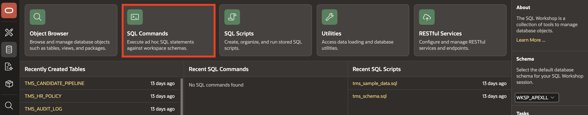

3. Paste and run the following package **specification**:

    ```
    <copy>
    CREATE OR REPLACE PACKAGE ess_util AS
      FUNCTION calculate_leave_balance (
          p_emp_id        IN NUMBER,
          p_leave_type_id IN NUMBER
      ) RETURN NUMBER;
    END ess_util;
    /
    </copy>
    ```

    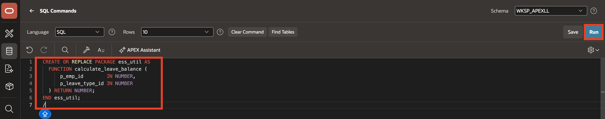

4. Paste and run the following package **body**:

    ```
    <copy>
    CREATE OR REPLACE PACKAGE BODY ess_util AS
      FUNCTION calculate_leave_balance (
          p_emp_id        IN NUMBER,
          p_leave_type_id IN NUMBER
      ) RETURN NUMBER
      IS
          l_year        NUMBER := EXTRACT(YEAR FROM SYSDATE);
          l_remaining   TMS_LEAVE_BALANCES.REMAINING%TYPE;
          l_entitlement TMS_LEAVE_TYPES.MAX_DAYS_PER_YEAR%TYPE;
          l_used        NUMBER := 0;
      BEGIN
          IF p_emp_id IS NULL OR p_leave_type_id IS NULL THEN
              RETURN NULL;
          END IF;

          -- First try the current balance table.
          BEGIN
              SELECT b.remaining
                INTO l_remaining
                FROM tms_leave_balances b
               WHERE b.employee_id   = p_emp_id
                 AND b.leave_type_id = p_leave_type_id
                 AND b.year          = l_year;

              RETURN l_remaining;
          EXCEPTION
              WHEN NO_DATA_FOUND THEN
                  NULL;
          END;

          -- Fallback: calculate from entitlement minus approved leave requests.
          BEGIN
              SELECT lt.max_days_per_year
                INTO l_entitlement
                FROM tms_leave_types lt
               WHERE lt.leave_type_id = p_leave_type_id;
          EXCEPTION
              WHEN NO_DATA_FOUND THEN
                  RETURN NULL;
          END;

          SELECT NVL(SUM(lr.days_requested), 0)
            INTO l_used
            FROM tms_leave_requests lr
           WHERE lr.employee_id   = p_emp_id
             AND lr.leave_type_id = p_leave_type_id
             AND lr.status        = 'Approved'
             AND EXTRACT(YEAR FROM lr.start_date) = l_year;

          RETURN GREATEST(l_entitlement - l_used, 0);
      END calculate_leave_balance;
    END ess_util;
    /
    </copy>
    ```

    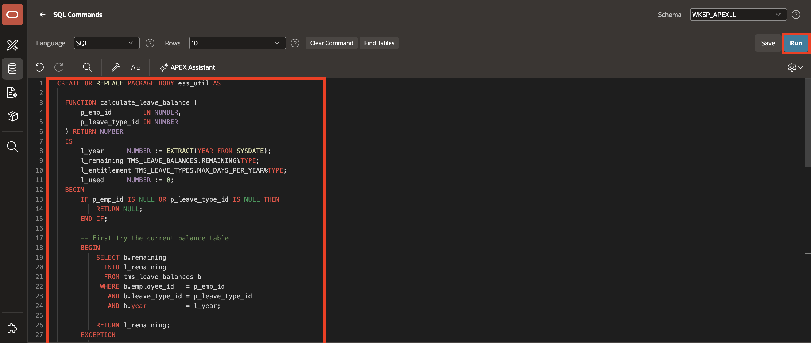

5. Confirm that the package compiles successfully.

    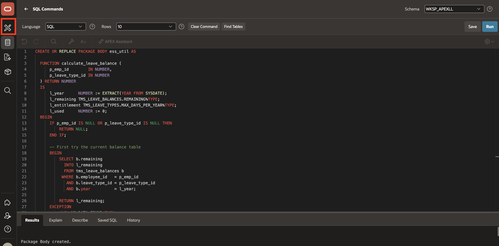

## Task 2: Add Leave Request Form Processing

1. From the left navigation menu, select **App Builder**.

2. Select the **Employee Self-Service Portal** application.

3. Open the **Leave Request** form page.

    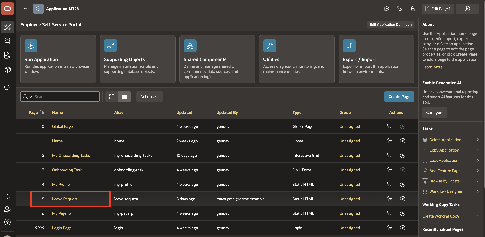

4. Select `P5_DAYS_REQUESTED`.

    This allows APEX to calculate the value during page processing instead of requiring the user to enter it manually.

    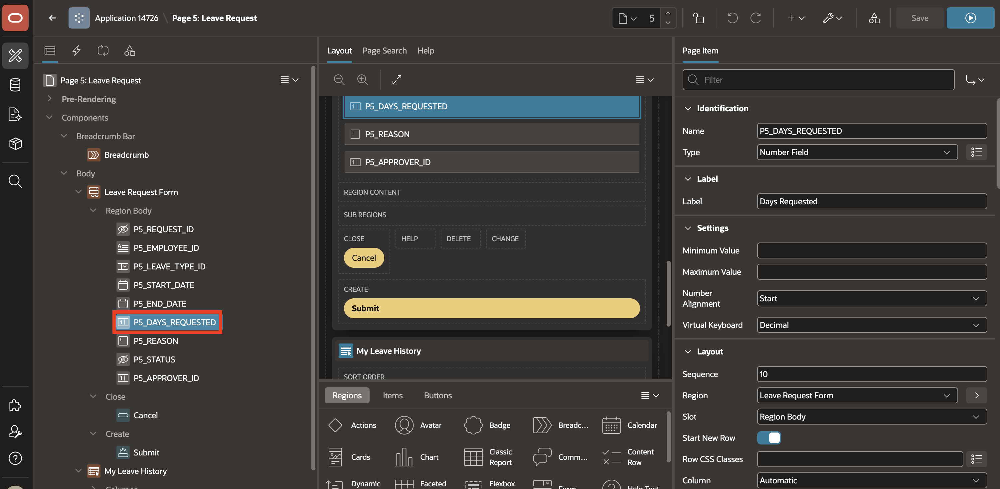

5. In the Property Editor, set **Value Required** to **No**.

6. Right-click `P5_DAYS_REQUESTED` and select **Create Computation**.

    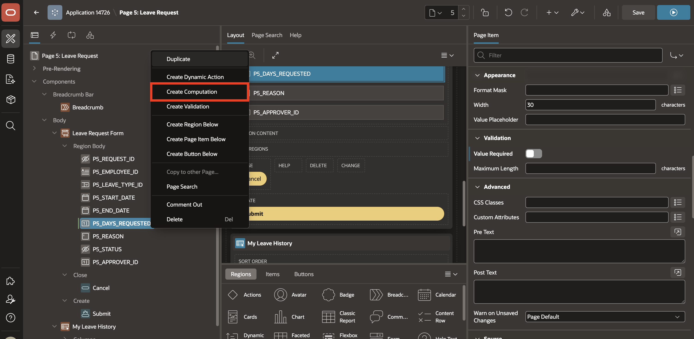

7. In the Property Editor, enter or select the following settings:

    - Execution > Point: **After Submit**

    - Under Computation:

        - Type: **Expression**

        - Language: **PL/SQL**

        - PL/SQL Expression: Enter the following in the code editor:

        ```
        <copy>
        TRUNC(TO_DATE(:P5_END_DATE, 'MM/DD/YYYY')) - TRUNC(TO_DATE(:P5_START_DATE, 'MM/DD/YYYY')) + 1
        </copy>
        ```

    This computation automatically calculates the number of requested leave days.

    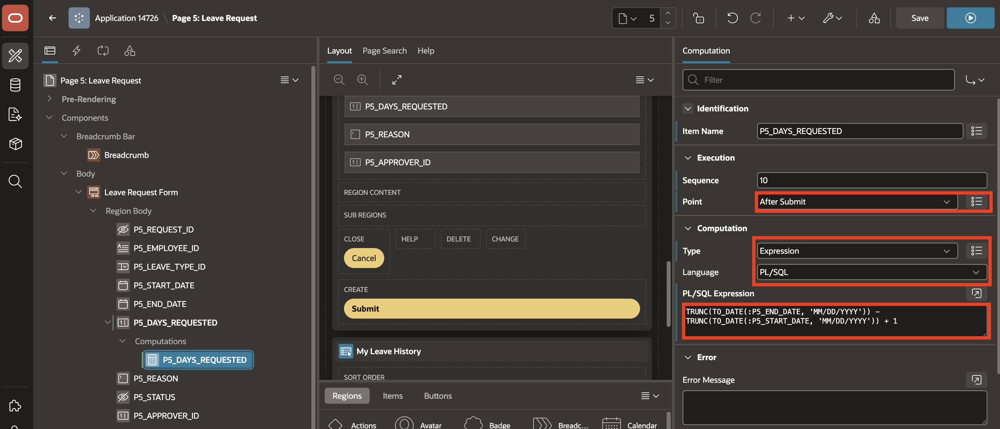

8. Navigate to the **Processing** tab.

9. Right-click **Validating** and select **Create Validation**.

    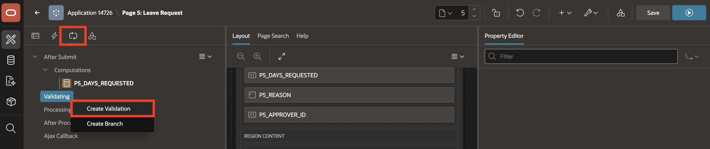

10. In the Property Editor, enter or select the following:

    - Identification > Name: **End date must be after start date**

    - Under Validation:

        - Type: **PL/SQL Function Body (returning Error Text)**

        - PL/SQL Function Body returning Error Text: Enter the following in the code editor:

        ```
        <copy>
        IF :P_END_DATE IS NOT NULL
        AND :P_START_DATE IS NOT NULL
        AND TRUNC(:P_END_DATE) < TRUNC(:P_START_DATE)
        THEN
        RETURN 'End date must be after start date';
        END IF;

        RETURN NULL;
        </copy>
        ```

    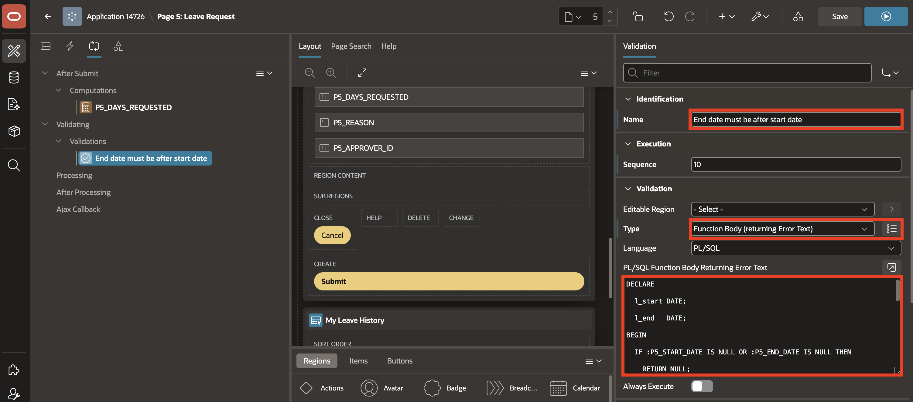

11. Right-click **Validating** and select **Create Validation**.

    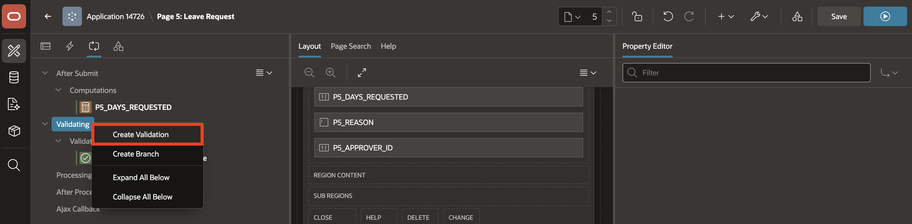

12. In the Property Editor, enter or select the following:

    - Identification > Name: **Sufficient balance**

    - Under Validation:

        - Type: **PL/SQL Function Body (returning Error Text)**

        - PL/SQL Function Body returning Error Text: Enter the following in the code editor:

        ```
        <copy>
        DECLARE
        l_balance NUMBER;

        BEGIN

        l_balance := ess_util.calculate_leave_balance(:P5_EMPLOYEE_ID, :P5_LEAVE_TYPE_ID);
        IF l_balance IS NULL THEN

        RETURN 'Unable to determine leave balance.';

        ELSIF l_balance < :P5_DAYS_REQUESTED THEN

        RETURN 'Insufficient leave balance.';

        END IF;
        RETURN NULL;
        END;
        </copy>
        ```

    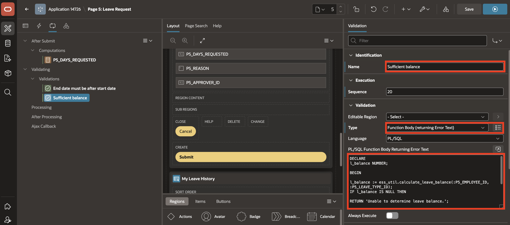

13. Navigate to the **Rendering** tab.

14. Select **Submit** button and set **Database Action** to **SQL Insert Action**.

    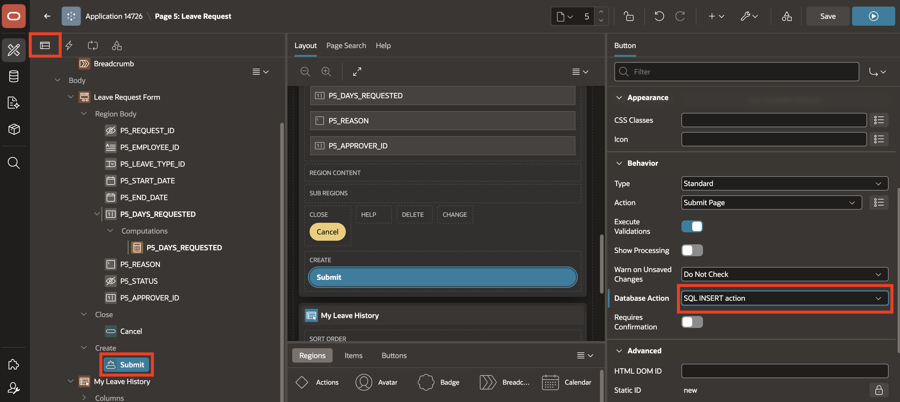

15. Navigate back to the **Processing** tab.

16. Right-click **Processing** and select **Create Process**.

    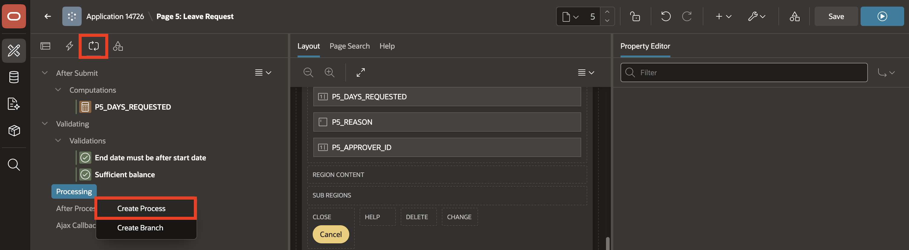

17. In the Property Editor, enter or select the following:

    - Under Identification:

        - Name: **Process form Leave Request**

        - Type: **Automatic Row Processing (DML)**

    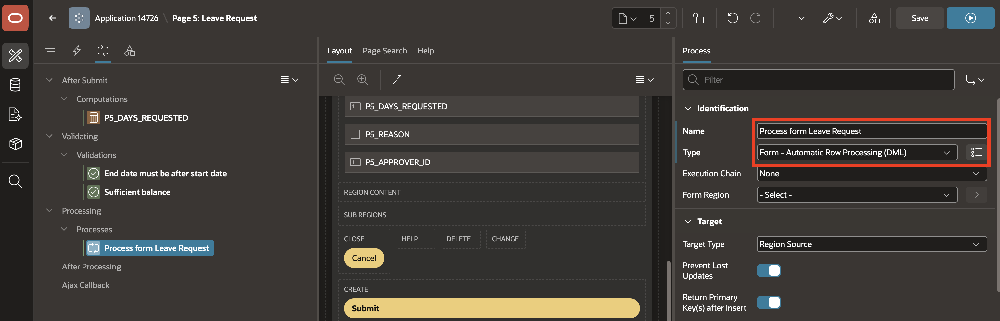

18. Save the page.

    The Leave Request form can now calculate requested days, block invalid date ranges, check leave balance, and save submitted data.

    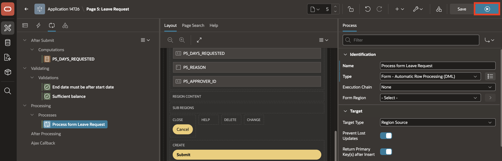

## Summary

You created `ESS_UTIL` and wired the Leave Request form with computations, validations, and DML processing. The Employee Self-Service Portal can now process leave request submissions.

## Acknowledgements

**Author** - Ankita Beri, Senior Product Manager; Roopesh Thokala, Principal Product Manager

**Last Updated By/Date** - Ankita Beri, July 28, 2026
