# Sign up for an APEX Workspace

## Introduction

Oracle APEX is a low-code application platform for Oracle Database. In this lab, you will create an APEX Service instance and provision an APEX workspace for the workshop.

Estimated Time: 5 minutes


### What is an APEX Workspace?
An APEX Workspace is a logical domain where you define APEX applications. Each workspace is associated with one or more database schemas (database users) which are used to store the database objects, such as tables, views, packages, and more. APEX applications are built on top of these database objects.

## Create an APEX Service Instance

Oracle Application Development (APEX Service) is a low-cost Oracle Cloud service that offers convenient access to the Oracle APEX platform. Visit [https://apex.oracle.com/en/platform/apex-service/](https://apex.oracle.com/en/platform/apex-service/) to learn more about APEX service on Oracle Cloud.

In this part, you will create an Oracle APEX Application Development Service trial account. After you sign up, you will create an *APEX Service*. The final step is to provision an Oracle APEX workspace.

1. [Click this link to create your free account](https://signup.cloud.oracle.com/). When you complete the registration process, you will receive an account with a $300 credit that you can use to create an APEX Service. You can then use any remaining credit to continue to explore the Oracle Cloud.

2. Once the Signup process is complete, OCI signs you in automatically to the Oracle Cloud Infrastructure (OCI) Console.
    -  In case you have closed the browser, you can always refer to the **Get Started Now with Oracle Cloud** email that you should have received to sign in to the OCI Console.   
    Make a note of your **Username**, **Password**, and **Cloud Account Name**.

        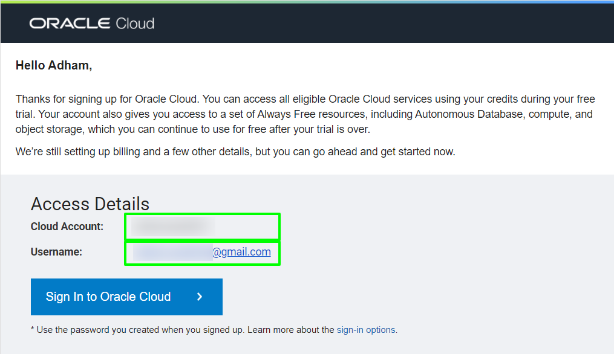

    - Alternatively, you can sign in to your Oracle Cloud account by accessing the following URL from your browser:       
    [https://cloud.oracle.com](https://cloud.oracle.com)

        Enter your **Cloud Account Name** in the input field and click the **Next** button.

        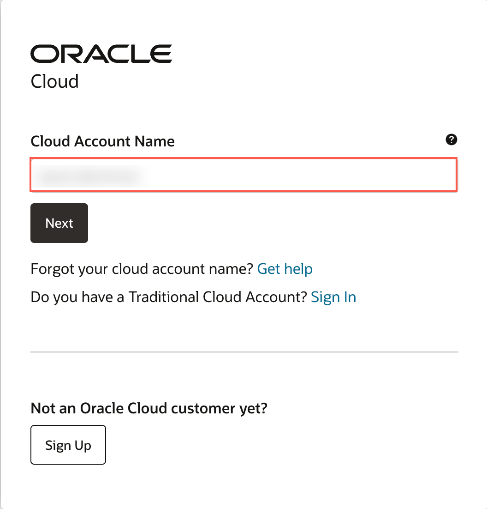

        Enter your **User Name** and **Password** in the input fields, and click **Sign In**.

        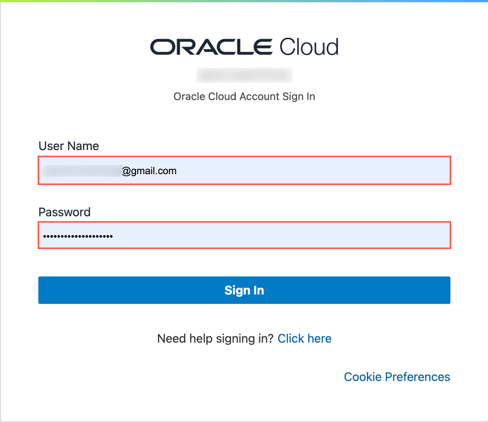

3. On the OCI Console home page, under Quickstarts, click **Deploy a low-code app on Autonomous Database using APEX** card to launch the quickstart.

    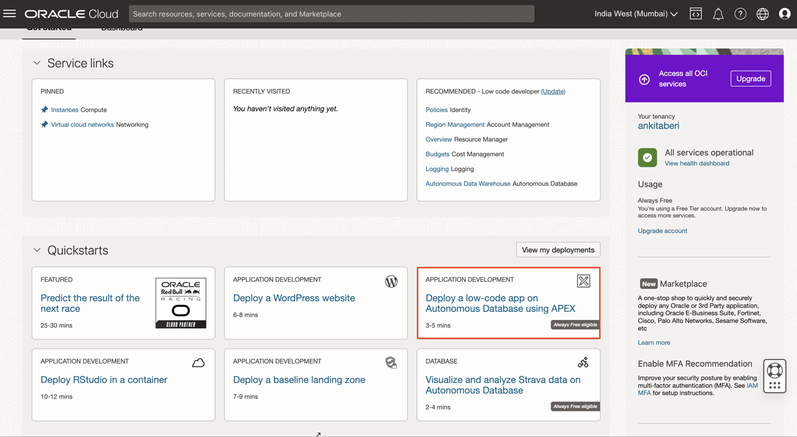

4. A drawer opens with an overview of the steps that the package runs to deploy the APEX instance. Click **Continue**.

    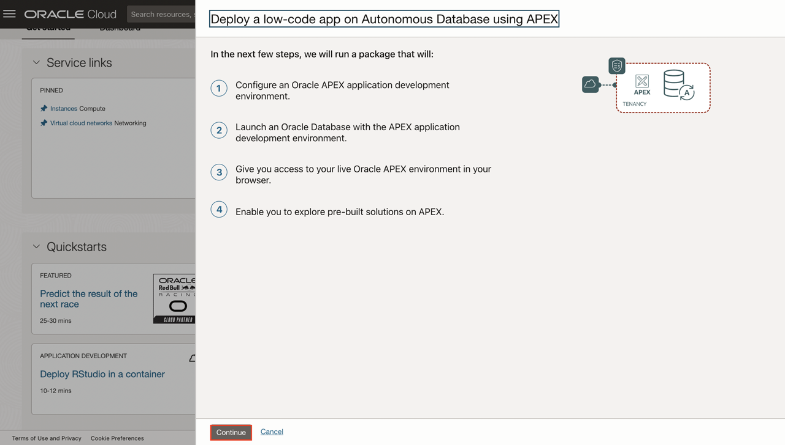

5. Provide a password for the ADMIN database user in the Autonomous Database. This password is also used to sign in to the APEX Administrative Services account. Click **Start Deployment**.

    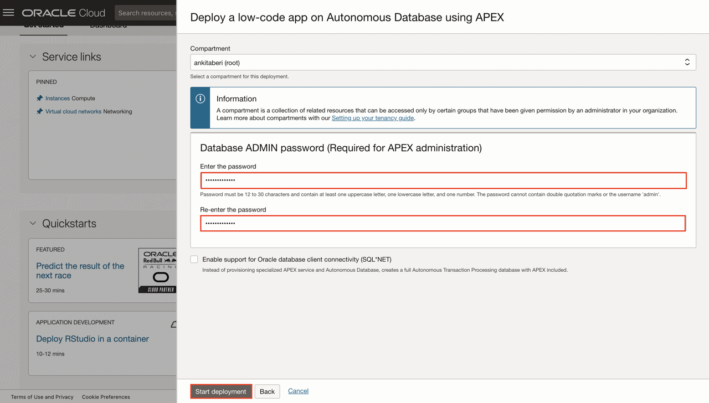

6. The deployment starts. Review the progress of each deployment step.

    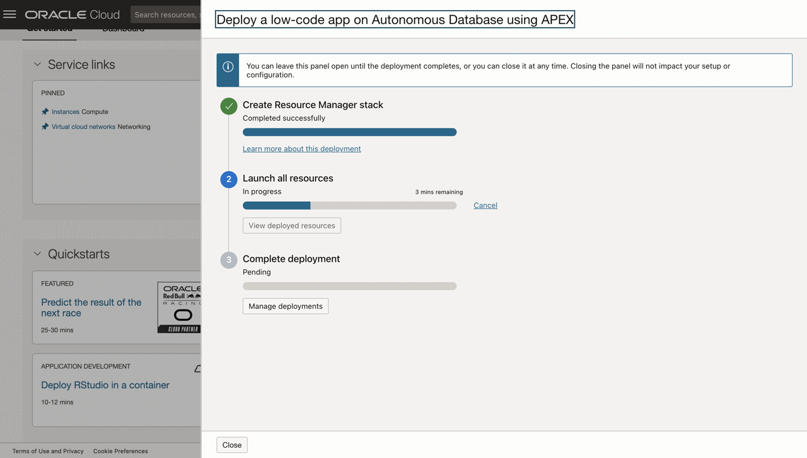

7. After the deployment completes, click **Launch APEX** to launch APEX Administrative Services.

    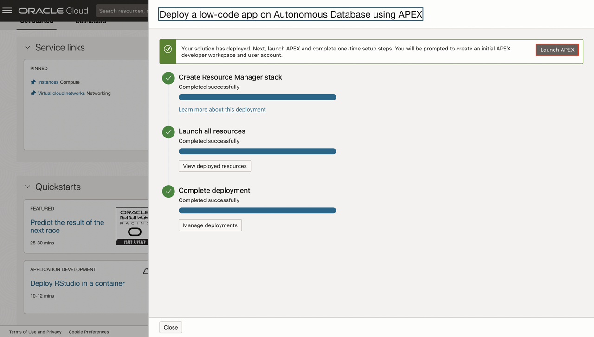


8. The Administration Services Sign In page appears. Enter the password for the Administration Services and click **Sign In to Administration**.
  The password is the same as the one entered for the ADMIN user when creating the APEX service: **```SecretPassw0rd```**
  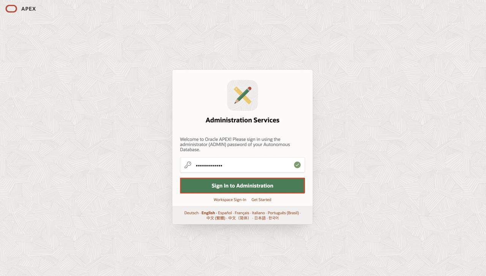

9. Click **Create Workspace**.

  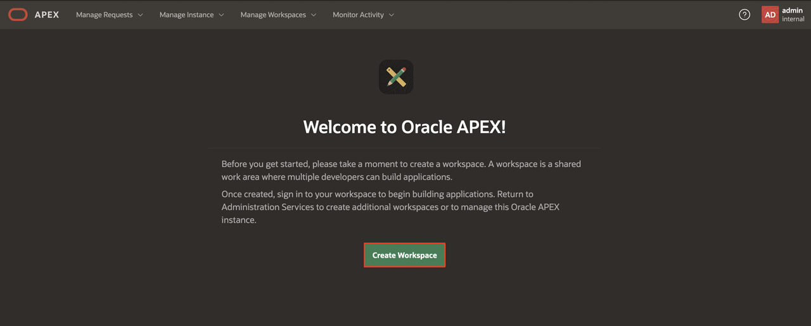

10. Depending on how you would like to create your workspace, select **New Schema** or **Existing Schema**. If you are getting started, select **New Schema**.

  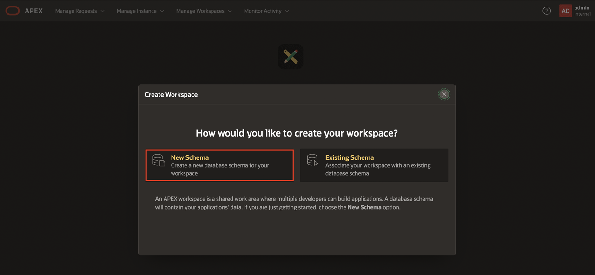

11. In the Create Workspace dialog, enter the following:

    | Property | Value |
    | --- | --- |
    | Workspace Name | DEMO |
    | Workspace Username | DEMO |
    | Workspace Password | **`SecretPassw0rd`** |

  Click **Create Workspace**.

  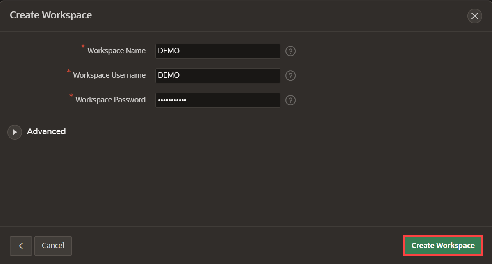

12. In the APEX Instance Administration page, click the **DEMO** link in the success message.         
  *Note: This will signs you out of APEX Administration so that you can sign in to your new workspace.*

  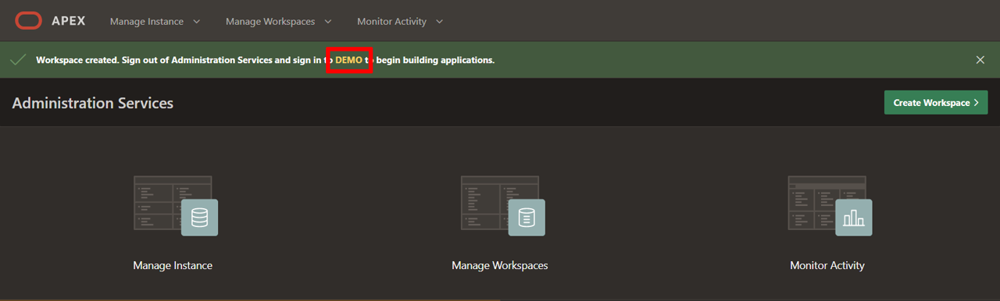

13. On the APEX Workspace sign-in page, enter **``SecretPassw0rd``** for the password, check the **Remember workspace and username** checkbox, and then click **Sign In**.

  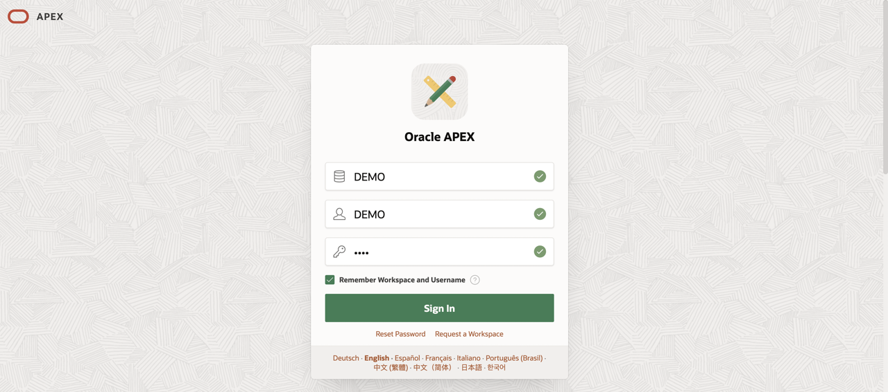

## Acknowledgements

**Author** - Ankita Beri, Senior Product Manager; Roopesh Thokala, Principal Product Manager

**Last Updated By/Date** - Ankita Beri, July 28, 2026
