# Build the ESS Onboarding Wizard Using Collections

## Introduction

In this lab, you will replace a single-page onboarding task flow with a three-step wizard. The wizard stores entered text and uploaded documents in an APEX Collection while the user moves through the steps. The final step commits the staged collection data to the database and creates onboarding tasks from templates.

Estimated Time: 15 minutes

### Objectives

In this lab, you will:

- Add onboarding database prerequisites.
- Create a three-step onboarding wizard.
- Stage personal information in an APEX Collection.
- Store uploaded documents in separate collection rows.
- Preview staged data and task templates.
- Commit onboarding data and clean up the collection.

## Task 1: Add Database Objects

Before you create the wizard, add the database objects that store onboarding templates and employee onboarding details.

1. In Oracle APEX workspace home page, go to **SQL Workshop**.

    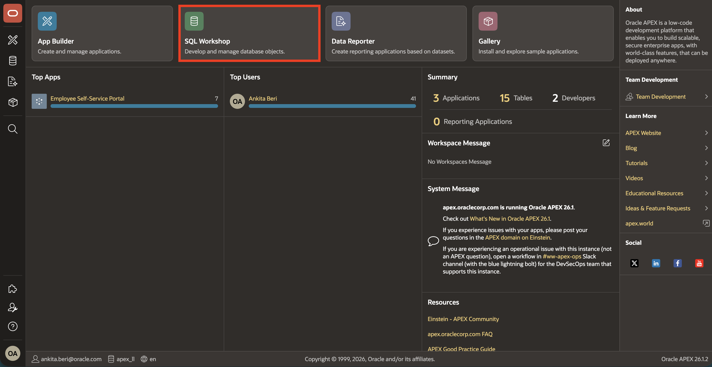

2. Now, open **SQL Commands**.

    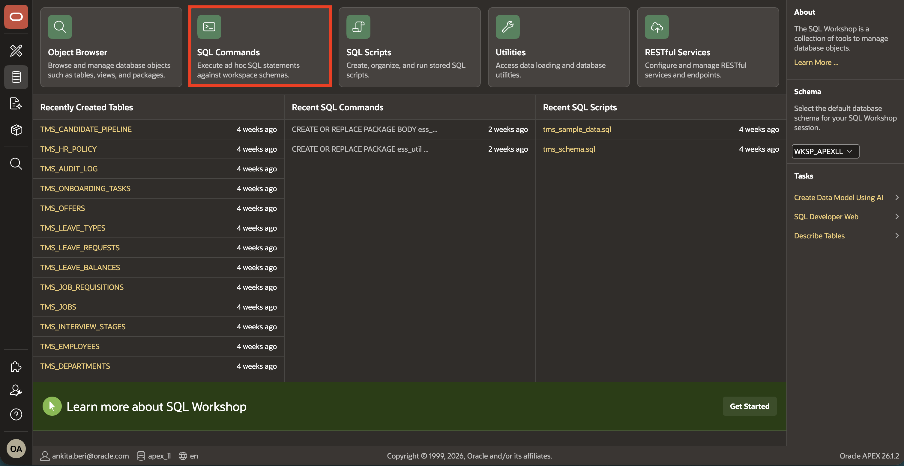

3. Copy and Paste the following SQL queries one after the other and click **Run**.

    ```
    <copy>
    CREATE TABLE tms_onboarding_task_templates (
        template_id      NUMBER GENERATED BY DEFAULT AS IDENTITY
                         CONSTRAINT tms_task_tpl_pk PRIMARY KEY,
        job_id           NUMBER        NOT NULL,
        task_name        VARCHAR2(200) NOT NULL,
        category         VARCHAR2(80),
        days_to_complete NUMBER(3) DEFAULT 7
    );
    </copy>
    ```

    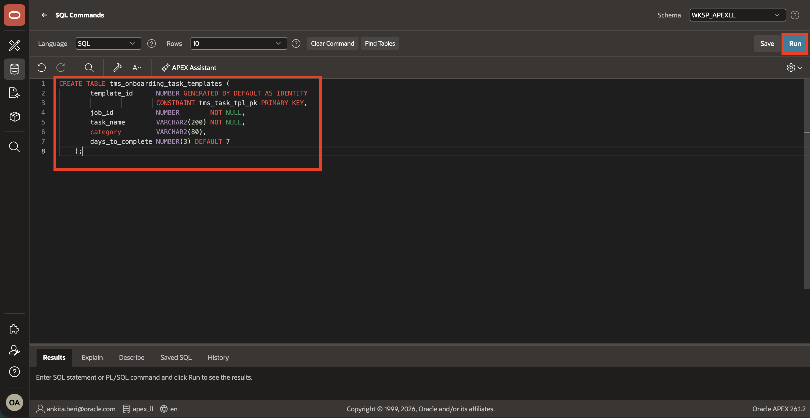

    ```
    <copy>
    ALTER TABLE tms_onboarding_task_templates
      ADD CONSTRAINT tms_task_tpl_job_fk
      FOREIGN KEY (job_id)
      REFERENCES tms_jobs (job_id);
    ```
    </copy>

    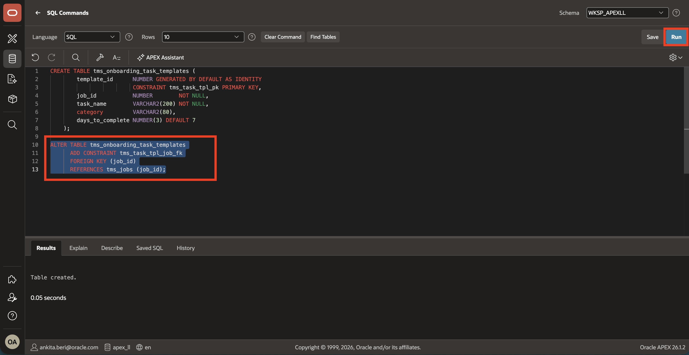

    ```
    <copy>
    ALTER TABLE tms_employees ADD (
        home_address  VARCHAR2(2000),
        passport_blob BLOB,
        contract_blob BLOB,
        taxform_blob  BLOB,
        emergency_contact_name VARCHAR2(2000),
        emergency_contact_phone VARCHAR2(2000),
        phone VARCHAR2(50)
    );
    </copy>
    ```

    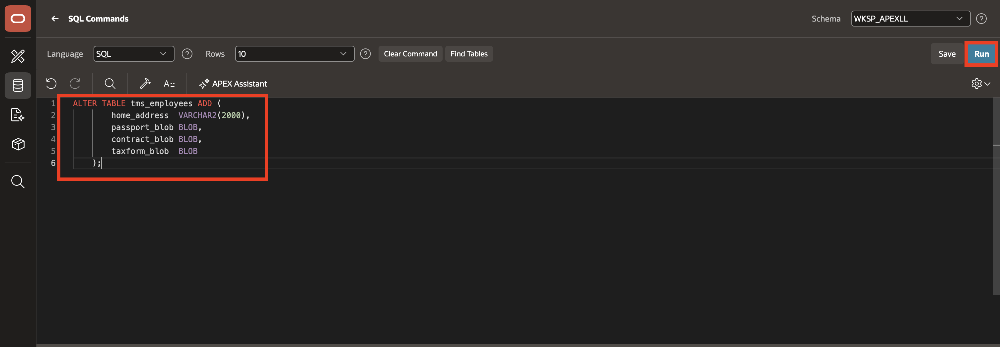

4. Confirm that the SQL completes successfully.

## Task 2: Create Onboarding Wizard Page

The wizard provides a guided, multi-step flow for onboarding data. APEX Collections hold the staged values until the user finishes the wizard.

1. From the left navigation menu, select **App Builder** icon.

    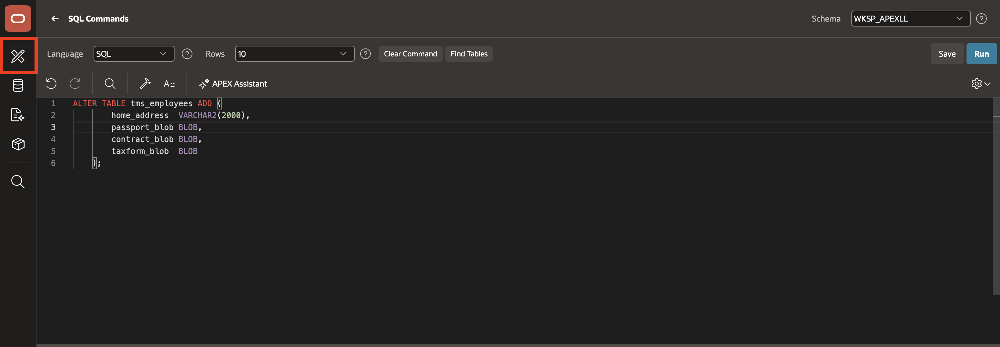

2. Open the **Employee Self-Service Portal** application.

    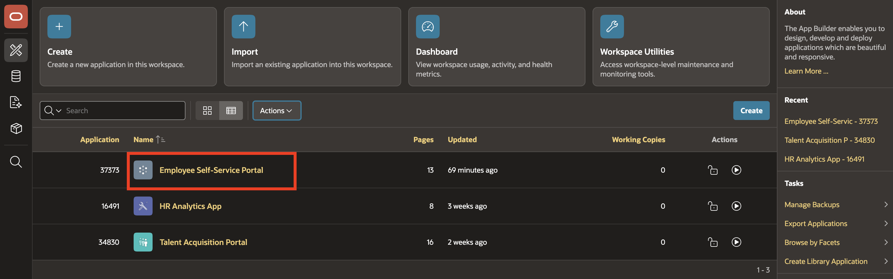

3. Click **Create Page**.

    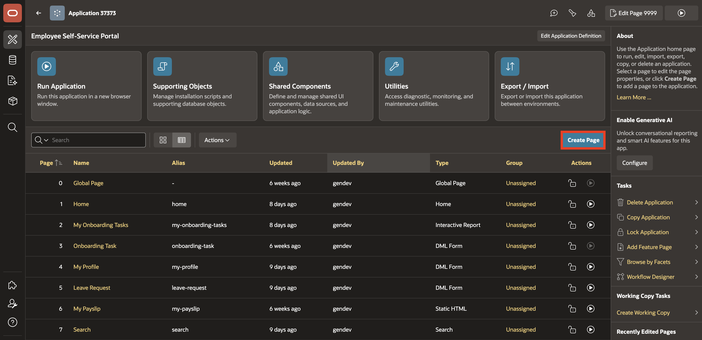

4. Under **Component** tab, select **Wizard**.

    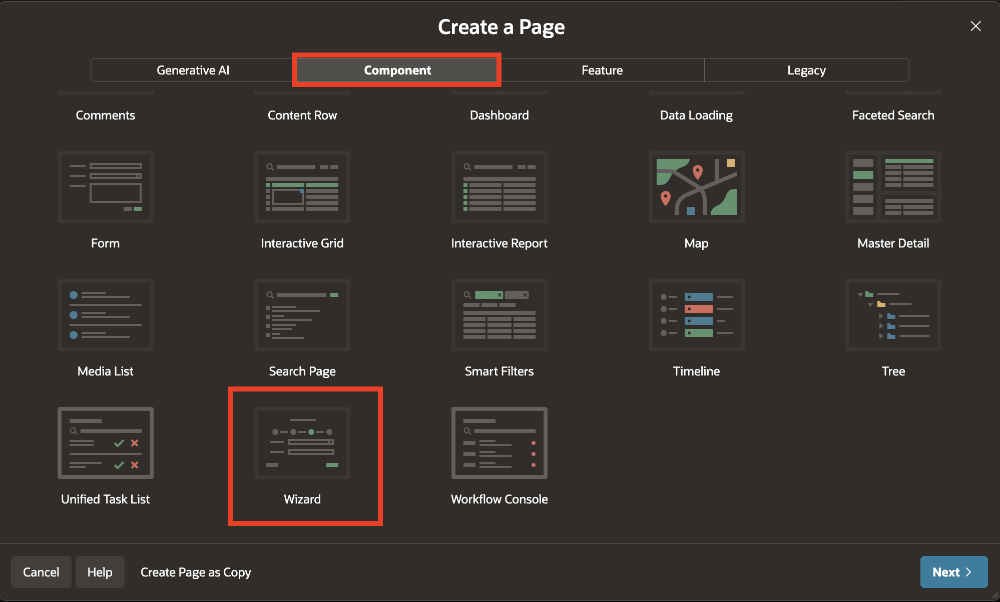

5. Enter or select the following attributes:

    - Page Definition > Wizard Name: **Onboarding Wizard**
    - Navigation > Parent Navigation Entry: **My Work**

6. Click **Create Wizard**.

    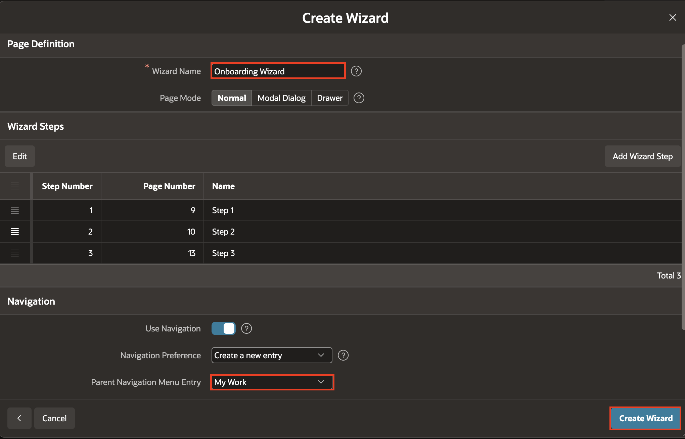

## Task 3: Configure Step 1 for Personal Information

Step 1 collects personal information and initializes the collection. The collection uses three rows: one row for text and passport data, one row for the employment contract, and one row for the tax form.

1. The first wizard step, **Page 9: Step-1**, in Page Designer will be opened.

2. Create a form region in the **Body** section. Right-click **Wizard Sub Regions** and select **Create Region**.

    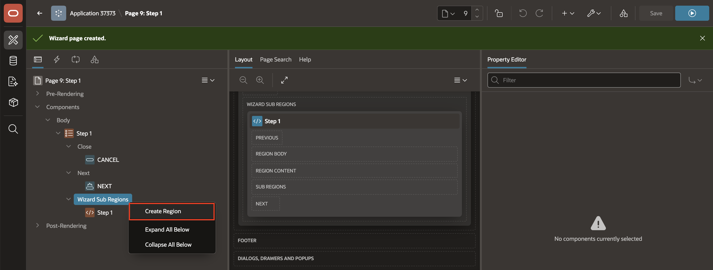

3. In the Property Editor, enter Name as **Personal Information**.

4. Right-click **Personal Information** and add the following page items one after the other:

    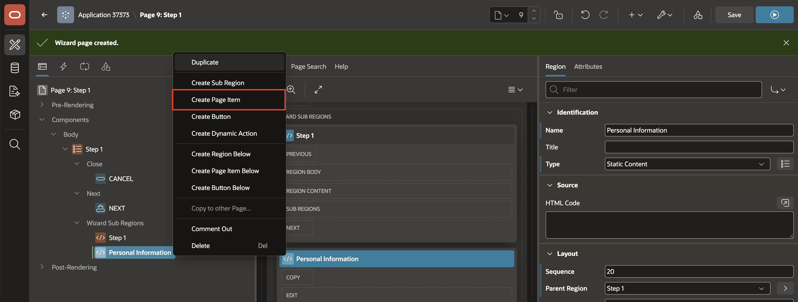

    | Item | Type | Label | Start New Row |
    | --- | --- | --- | --- |
    | `P9_FIRST_NAME` | Text Field | First Name| Toggle On |
    | `P9_LAST_NAME` | Text Field | Last Name |  Toggle Off |
    | `P9_EMAIL` | Text Field | Personal Email |  Toggle On |
    | `P9_PHONE` | Text Field | Phone | Toggle Off |
    | `P9_EMER_NAME` | Text Field | Emergency Contact Name|  Toggle On |
    | `P9_EMER_PHONE` | Text Field | Emergency Contact Phone| Toggle Off |
    | `P9_ADDRESS` | Textarea | Home Address |  Toggle On |

    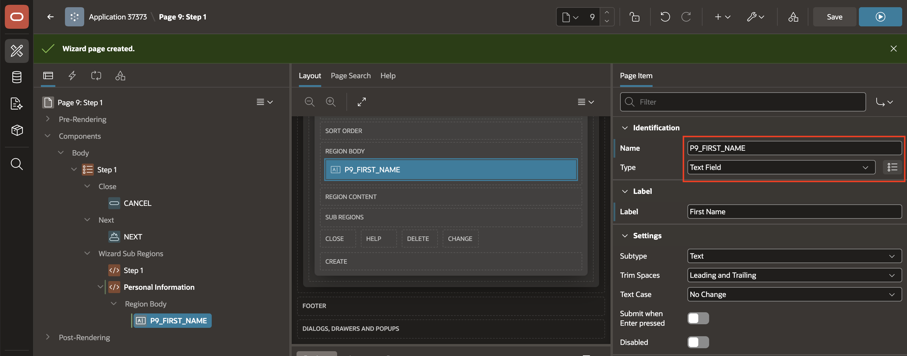

    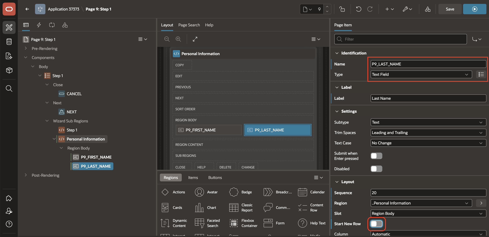

5. For `P9_EMAIL` page item, select Subtype as **E-Mail** under Settings.

    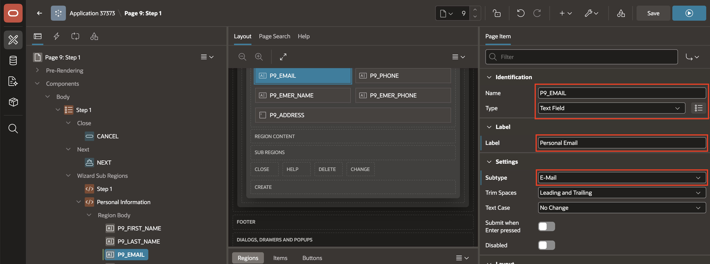

6. Navigate to **Processing** tab, right-click **Processing** and select **Create Process**.

    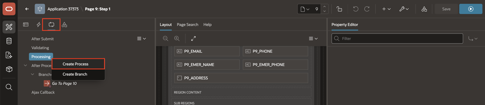

7. In the Property Editor, enter or select the following settings:

    - Identification > Name: **Save Personal Information**

8. For **PL/SQL Code**, enter the following code:

    <copy>

    ```sql
    BEGIN
        APEX_COLLECTION.CREATE_OR_TRUNCATE_COLLECTION('ONBOARDING_COLLECTION');

        APEX_COLLECTION.ADD_MEMBER (
            p_collection_name => 'ONBOARDING_COLLECTION',
            p_c001            => :P9_FIRST_NAME,
            p_c002            => :P9_LAST_NAME,
            p_c003            => :P9_EMAIL,
            p_c004            => :P9_PHONE,
            p_c005            => :P9_EMER_NAME,
            p_c006            => :P9_EMER_PHONE,
            p_c007            => :P9_ADDRESS
        );

        APEX_COLLECTION.ADD_MEMBER(
            p_collection_name => 'ONBOARDING_COLLECTION'
        );

        APEX_COLLECTION.ADD_MEMBER(
            p_collection_name => 'ONBOARDING_COLLECTION'
        );
    END;
    ```

    </copy>

    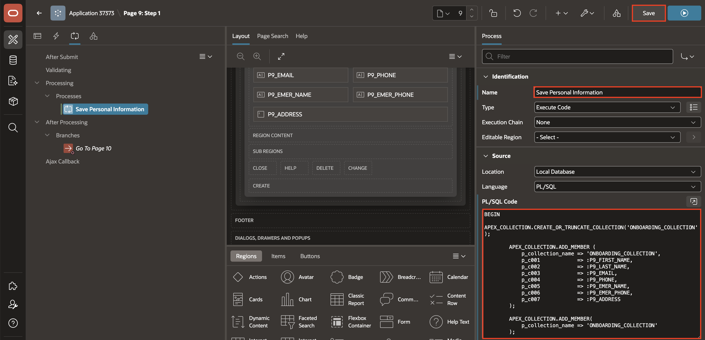

9. Click **Save**.

## Task 4: Configure Step 2 for File Uploads

Step 2 stores uploaded documents in the collection. Each document goes into a separate row, which keeps the collection easy to query and avoids bundling multiple documents into one BLOB.

1. From the Page Designer toolbar, navigate to page selector and open **Step-2** in Page Designer.

    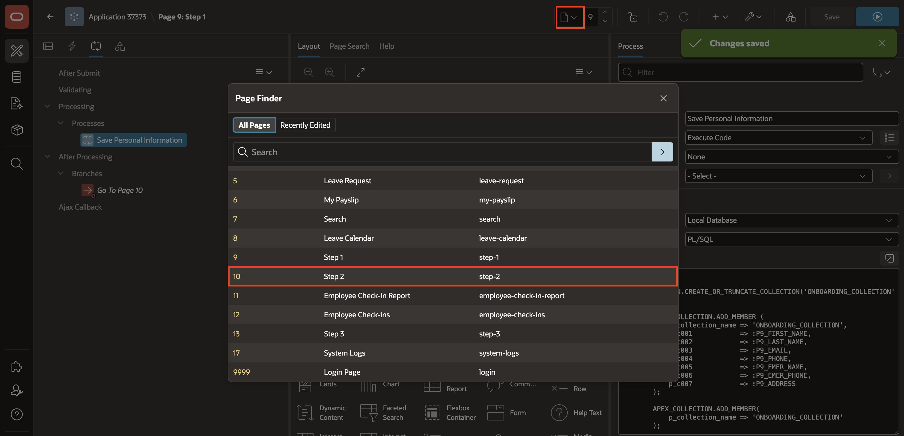

2. Navigate to **Rendering** tab, right-click **Wizard Sub Regions** and select **Create Region**.

    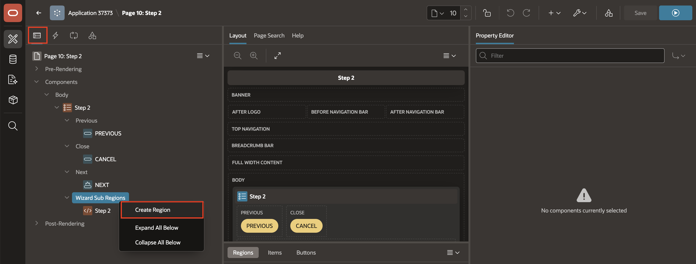

3. In the Property Editor, enter Name as **Document Upload**.

    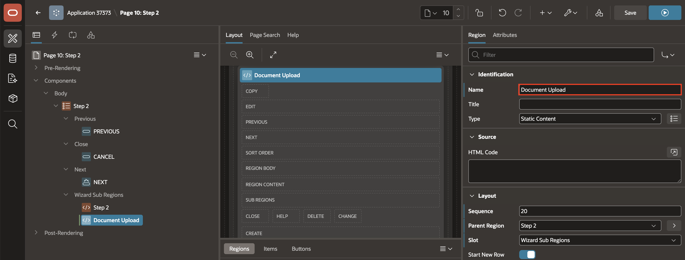

4. Now, right-click **Document Upload** and click **Create Page Item**.

    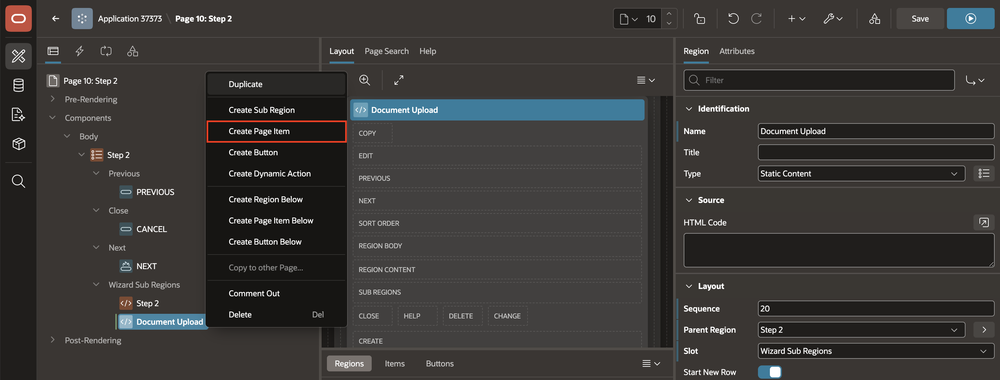

5. Add the following three file upload items one after the other:

    | Name | Type | Label |
    | --- | --- | --- |
    | `P10_PASSPORT` | File Upload | Passport / ID |
    | `P10_CONTRACT` | File Upload | Signed Contract |
    | `P10_TAX_FORM` | File Upload | Tax Form |

    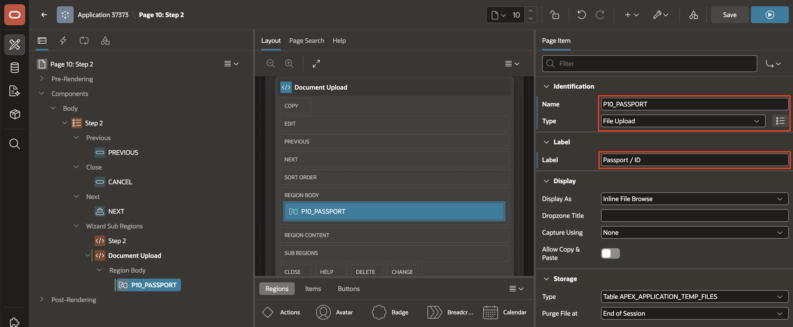

    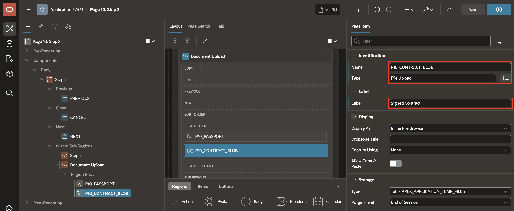

    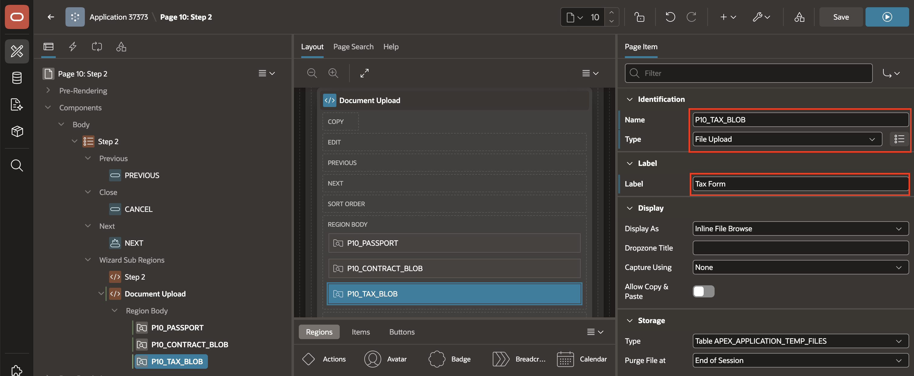

6. Navigate to **Processing** tab, right-click **Processing** and select **Create Process**.

    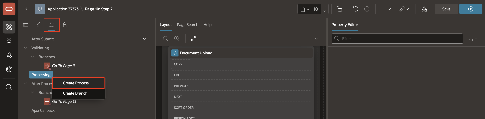

7. In the Property Editor, enter/select the following:

    - Identification > Name: **Upload Docs**

    - Source > PL/SQL Code: Copy and paste the following code:

    <copy>

    ```sql
    DECLARE
        v_blob BLOB;
    BEGIN
        IF :P10_PASSPORT IS NOT NULL THEN
            SELECT blob_content
            INTO   v_blob
            FROM   apex_application_temp_files
            WHERE  name = :P10_PASSPORT;

            APEX_COLLECTION.UPDATE_MEMBER_ATTRIBUTE(
                p_collection_name => 'ONBOARDING_COLLECTION',
                p_seq             => 1,
                p_blob_number     => 1,
                p_blob_value      => v_blob
            );
        END IF;

        IF :P10_CONTRACT_BLOB IS NOT NULL THEN
            SELECT blob_content
            INTO   v_blob
            FROM   apex_application_temp_files
            WHERE  name = :P10_CONTRACT_BLOB;

            APEX_COLLECTION.UPDATE_MEMBER_ATTRIBUTE(
                p_collection_name => 'ONBOARDING_COLLECTION',
                p_seq             => 2,
                p_blob_number     => 1,
                p_blob_value      => v_blob
            );
        END IF;

        IF :P10_TAX_BLOB IS NOT NULL THEN
            SELECT blob_content
            INTO   v_blob
            FROM   apex_application_temp_files
            WHERE  name = :P10_TAX_BLOB;

            APEX_COLLECTION.UPDATE_MEMBER_ATTRIBUTE(
                p_collection_name => 'ONBOARDING_COLLECTION',
                p_seq             => 3,
                p_blob_number     => 1,
                p_blob_value      => v_blob
            );
        END IF;
    END;
    ```

    </copy>

    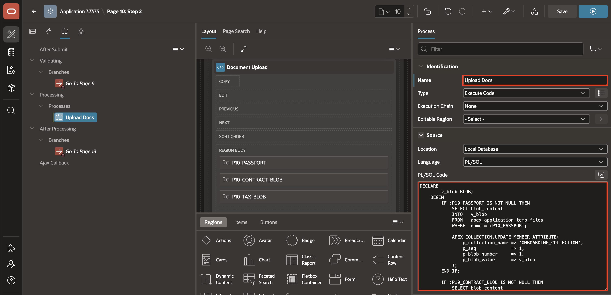

8. Navigate back to **Rendering** tab. Below the file upload items, create an **Interactive Report** region.

    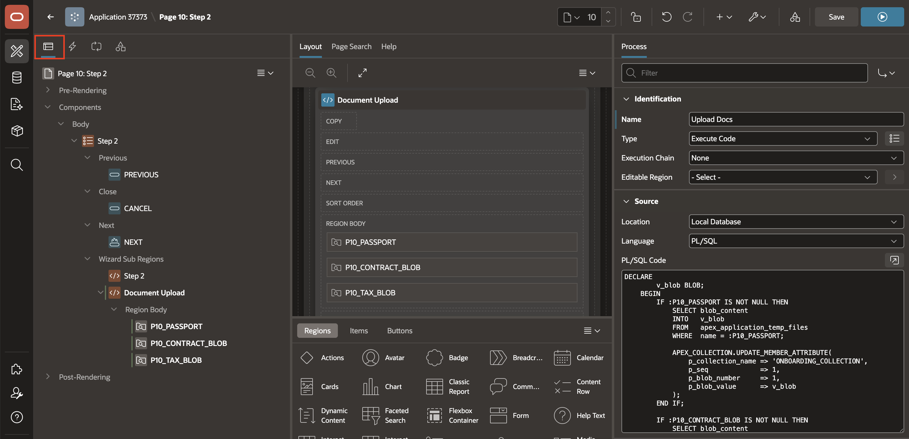

9. Right-click **Wizard Sub Regions** and select **Create Region**.

    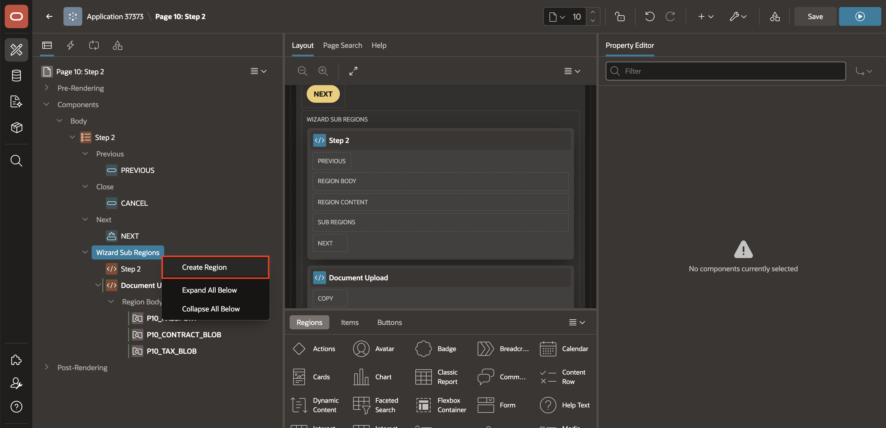

10. In the Property Editor, enter/select the following:

    - Under Identification:

        - Name: **Show Progress Report**

        - Type: **Interactive Report**

    - Under Source:

        - Type: **SQL Query**

        - SQL Query: Copy and Paste the following code:

       ```
       <copy>
        SELECT
            MAX(CASE WHEN seq_id = 1 AND blob001 IS NOT NULL THEN 'Passport ✅' ELSE 'Passport ❌' END) AS PASSPORT_STATUS,
            MAX(CASE WHEN seq_id = 2 AND blob001 IS NOT NULL THEN 'Contract ✅' ELSE 'Contract ❌' END) AS CONTRACT_STATUS,
            MAX(CASE WHEN seq_id = 3 AND blob001 IS NOT NULL THEN 'Tax Form ✅' ELSE 'Tax Form ❌' END) AS TAX_STATUS
        FROM apex_collections
        WHERE collection_name = 'ONBOARDING_COLLECTION';
        </copy>
        ```

    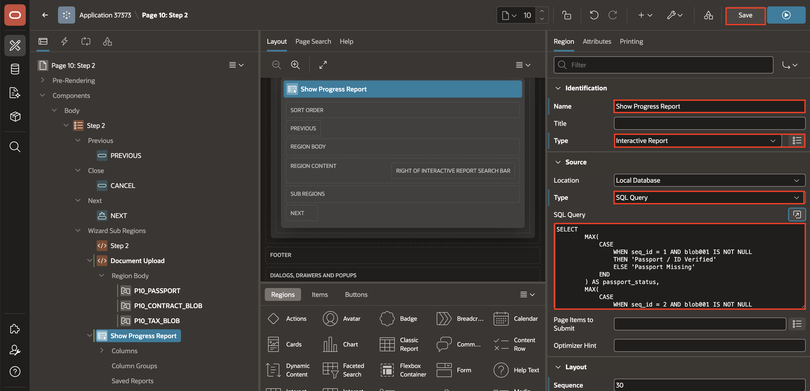

## Task 5: Configure Step 3 for Review and Final Processing

Step 3 shows the staged data, previews onboarding tasks, commits the data to the database, and removes the temporary collection.

1. From the Page Designer toolbar, navigate to page selector and open **Step-3** in Page Designer.

    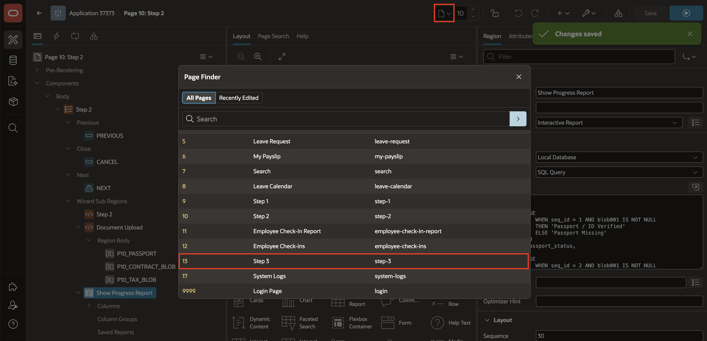

2. Now, we will create a **Classic Report** for profile summary. Right-click **Wizard Sub Regions** and select **Create Region**.

    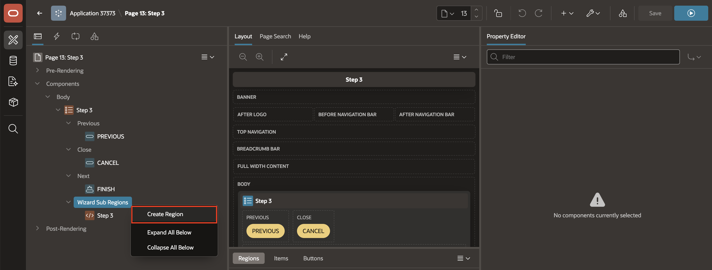

3. In the Property Editor, enter/select the following:

    - Under Identification:

        - Name: **Summary**

        - Type: **Classic Report**

    - Under Source:

        - Type: **SQL Query**

        - SQL Query: Copy and Paste the following code:

        ```
        <copy>
        SELECT c001 AS first_name,
            c002 AS last_name,
            c003 AS email,
            c004 AS phone,
            c005 AS emergency_contact,
            c006 AS emergency_phone,
            c007 AS home_address
        FROM apex_collections
        WHERE collection_name = 'ONBOARDING_COLLECTION'
        AND seq_id = 1;
        </copy>
        ```

    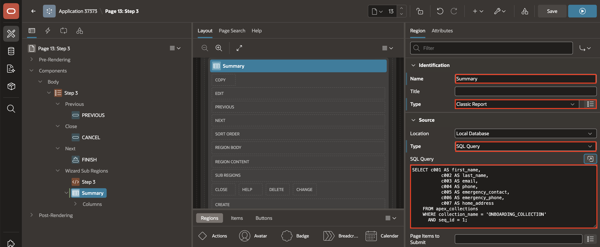

4. Create another **Classic Report** for the assigned milestone checklist preview. Right-click **Wizard Sub Regions** and select **Create Region**.

    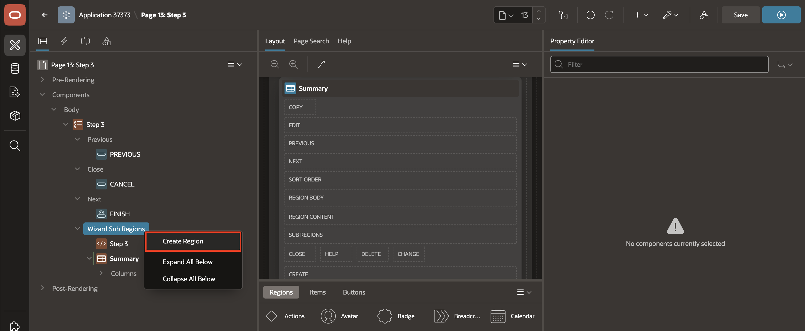

5. In the Property Editor, enter/select the following:

    - Under Identification:

        - Name: **Upcoming Tasks**

        - Type: **Classic Report**

    - Under Source:

        - Type: **SQL Query**

        - SQL Query: Copy and Paste the following code:

        ```
        <copy>
        SELECT task_name,
            category,
            days_to_complete
        FROM tms_onboarding_task_templates
        WHERE job_id = (
            SELECT job_id
            FROM tms_employees
            WHERE UPPER(email) = UPPER(:APP_USER)
        );
        </copy>
        ```

    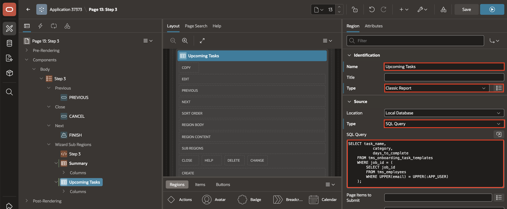

6. Navigate to **Processing** tab, right-click **Processing** and select **Create Process**.

7. In the Property Editor, enter/select the following:

    - Identification > Name: **Finalize Onboarding Data**


    ```
    <copy>
    DECLARE
        v_row1        apex_collections%ROWTYPE;
        v_contract    BLOB;
        v_taxform     BLOB;
        v_employee_id tms_employees.employee_id%TYPE;
    BEGIN
        SELECT employee_id
        INTO   v_employee_id
        FROM   tms_employees
        WHERE  UPPER(email) = UPPER(:APP_USER);

        SELECT *
        INTO   v_row1
        FROM   apex_collections
        WHERE  collection_name = 'ONBOARDING_COLLECTION'
        AND    seq_id = 1;

        SELECT blob001
        INTO   v_contract
        FROM   apex_collections
        WHERE  collection_name = 'ONBOARDING_COLLECTION'
        AND    seq_id = 2;

        SELECT blob001
        INTO   v_taxform
        FROM   apex_collections
        WHERE  collection_name = 'ONBOARDING_COLLECTION'
        AND    seq_id = 3;

        UPDATE tms_employees
        SET    phone                   = v_row1.c004,
               emergency_contact_name  = v_row1.c005,
               emergency_contact_phone = v_row1.c006,
               home_address            = v_row1.c007,
               passport_blob           = v_row1.blob001,
               contract_blob           = v_contract,
               taxform_blob            = v_taxform
        WHERE  employee_id = v_employee_id;

        INSERT INTO tms_onboarding_tasks (
            employee_id,
            task_name,
            category,
            due_date,
            status
        )
        SELECT v_employee_id,
               task_name,
               category,
               TRUNC(SYSDATE) + days_to_complete,
               'Pending'
        FROM tms_onboarding_task_templates
        WHERE job_id = (
            SELECT job_id
            FROM tms_employees
            WHERE employee_id = v_employee_id
        );

        IF APEX_COLLECTION.COLLECTION_EXISTS('ONBOARDING_COLLECTION') THEN
            APEX_COLLECTION.DELETE_COLLECTION('ONBOARDING_COLLECTION');
        END IF;
    EXCEPTION
        WHEN NO_DATA_FOUND THEN
            RAISE_APPLICATION_ERROR(
                -20001,
                'Logged-in account does not match an employee record: ' || :APP_USER
            );
    END;
    </copy>
    ```

8. Click **Save**.

## Task 6: Add Wizard Cancellation Handling

Cancellation must remove staged collection data so unfinished onboarding attempts do not remain in session state.

1. Apply this task to each wizard page: **Step-1**, **Step-2**, and **Step-3**.

2. Select the **Cancel** button. Update the following attributes:

    - Under Behavior:

        - Action: **Submit Page**

        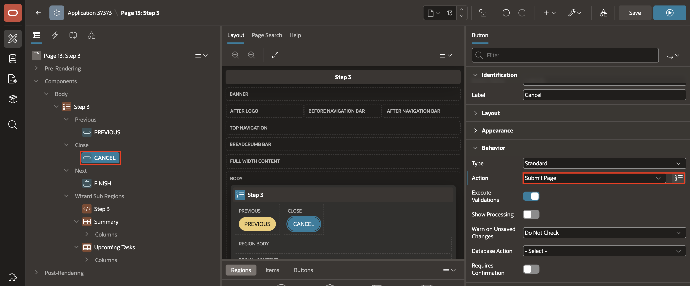

        - Execute Validations: Toggle **Off**

        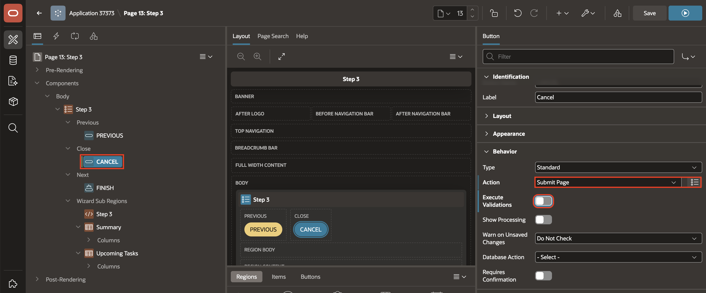

3. Navigate to the **Processing** tab, right-click **After Submit** process and click **Create Process**.

    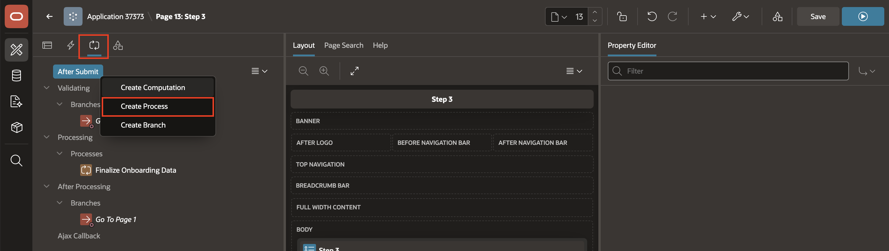

4. In the Property Editor, enter/select the following:

    - Identification > Name: **Execute Wizard Cancellation**

    - Source > PL/SQL Code: Copy and Paste the below code:

    ```
    <copy>
    IF APEX_COLLECTION.COLLECTION_EXISTS('ONBOARDING_COLLECTION') THEN
        APEX_COLLECTION.DELETE_COLLECTION('ONBOARDING_COLLECTION');
    END IF;
    </copy>
    ```


    - When Button Pressed: **Cancel**

    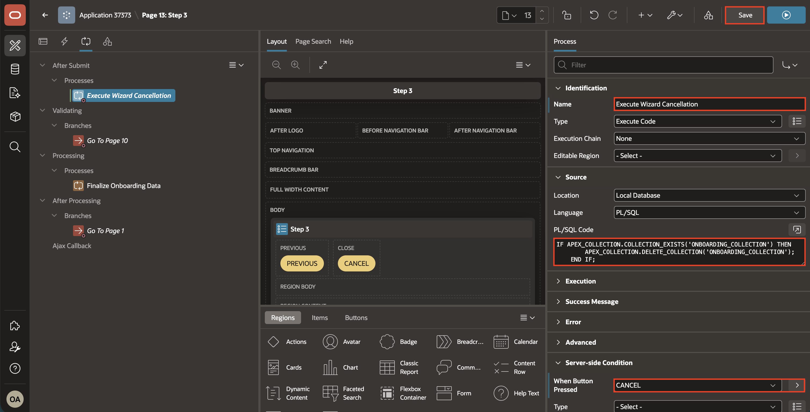

5. Now, right-click **After Processing** and select **Create Branch**.

    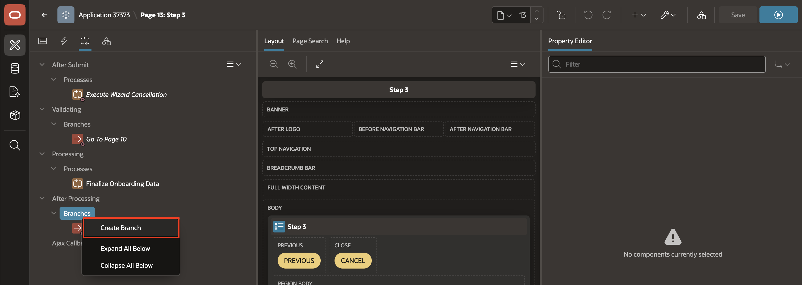

6. In the Property Editor, enter/select the following:

    - Identification > Name: **Go to Home Page**

    - Behavior > Target: Click **No Link Defined**

        - Target > Page: **1**

        - Clear Cache: **1**

    - Server-side Condition > When Button Pressed: **CANCEL**

    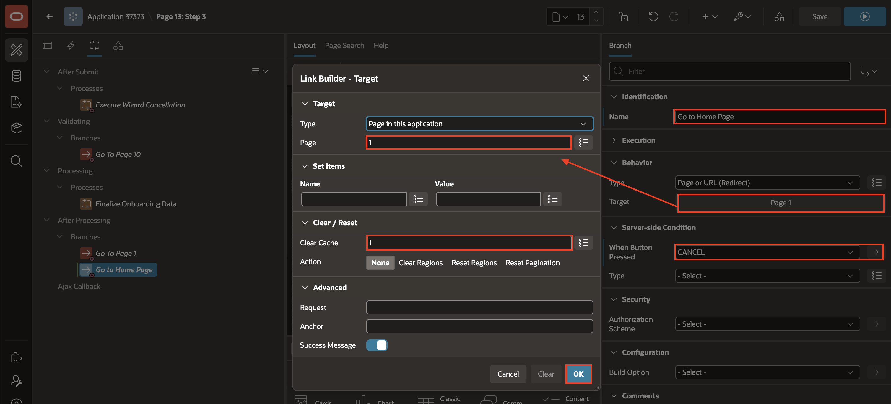

    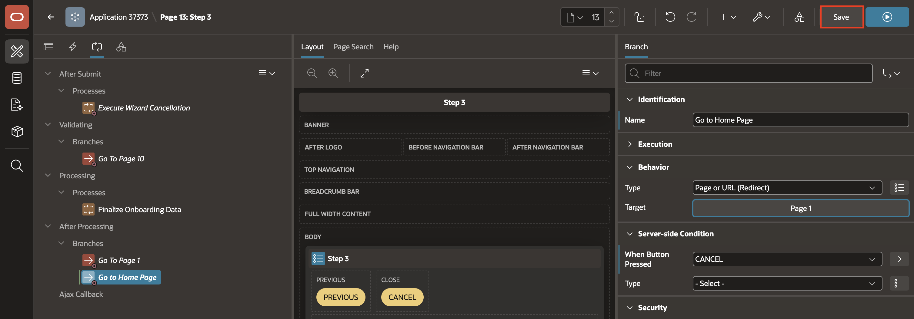

7. Click **Save**.

*Note: Make sure to do this task for Step 1 and Step 2.*

## Summary

You created a three-step onboarding wizard in the Employee Self-Service Portal. The wizard stages personal data and documents in an APEX Collection, previews onboarding information, commits final data to the database, creates onboarding tasks, and cleans up the collection when the user finishes or cancels.

## Acknowledgements

**Author** - Ankita Beri, Senior Product Manager; Roopesh Thokala, Principal Product Manager

**Last Updated By/Date** - Ankita Beri, August 12, 2026
