# Add Public Holidays to the Leave Calendar

## Introduction

In this lab, you will create a REST Data Source for public holidays and synchronize it into a local table. You will then update the Employee Self-Service Leave Calendar so leave requests and public holidays appear together.

Estimated Time: 5 minutes

### Objectives

In this lab, you will:

- Create a REST Data Source for public holidays.
- Enable Data Synchronization for the REST Data Source.
- Update the Leave Calendar SQL query.
- Add CSS for holiday events.
- Test the calendar output.

## Task 1: Create the Public Holidays REST Data Source

The REST Data Source retrieves public holiday data by year and country code. APEX detects those values as URL pattern parameters.

1. In the Employee Self-Service Portal application, open **Shared Components**.

2. Under **Data Sources**, open **REST Data Sources**.

    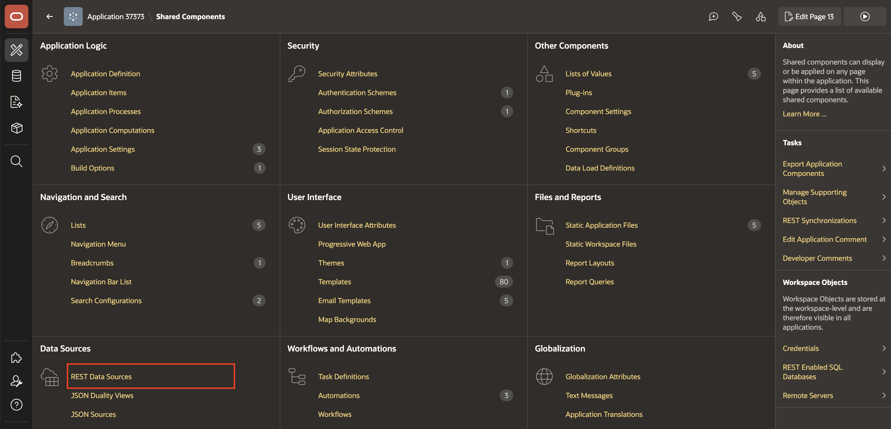

3. Click **Create**.

    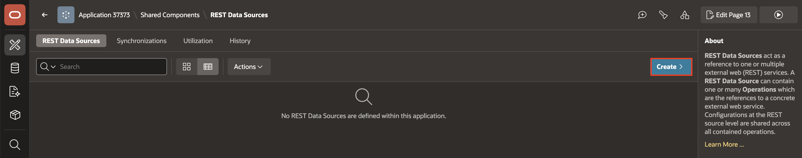

4. Select **Simple HTTP**.

    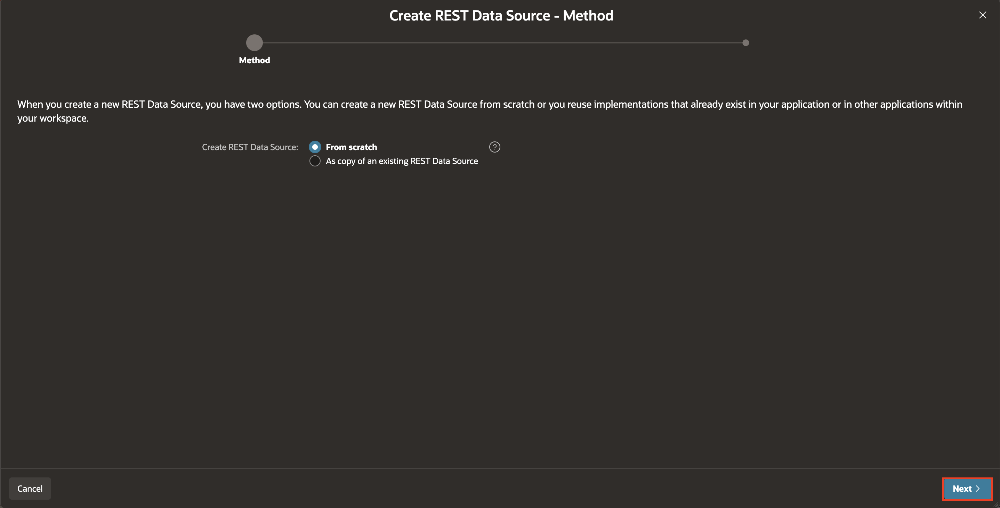

5. For the URL endpoint, enter:

    <copy>

    ```text
    https://date.nager.at/api/v3/publicholidays/{year}/{country_code}
    ```

    </copy>

    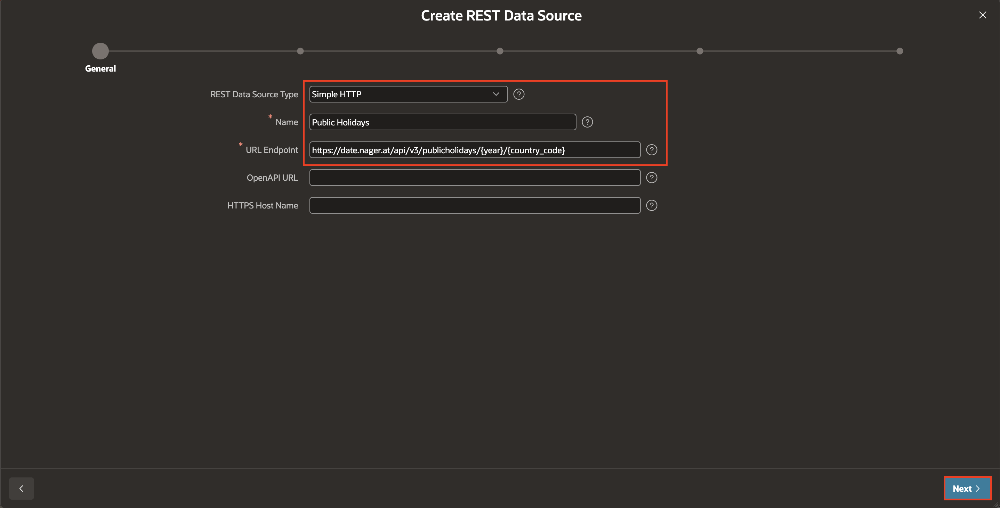

    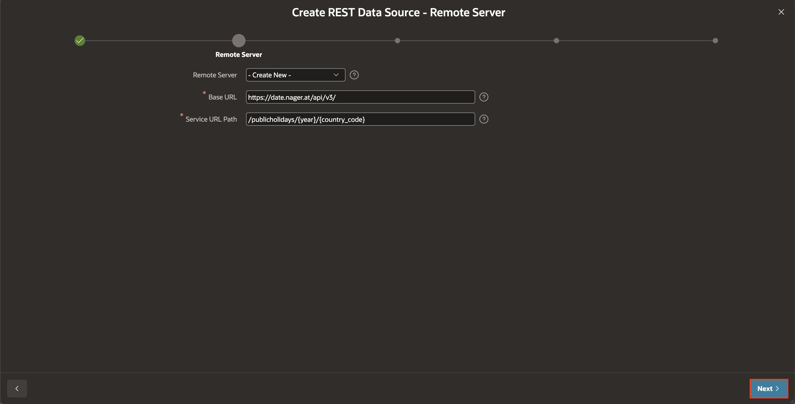

    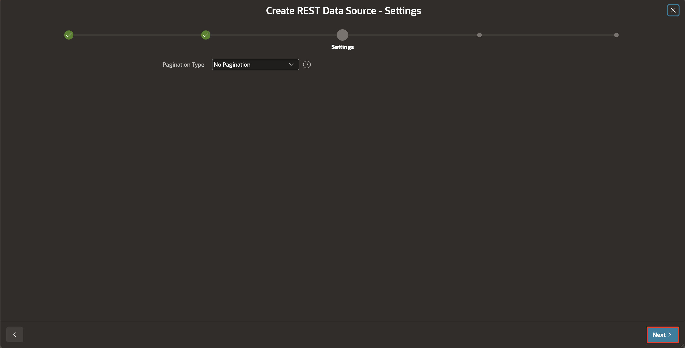

6. Open **Advanced** and confirm that `year` and `country_code` appear as URL pattern parameters.

    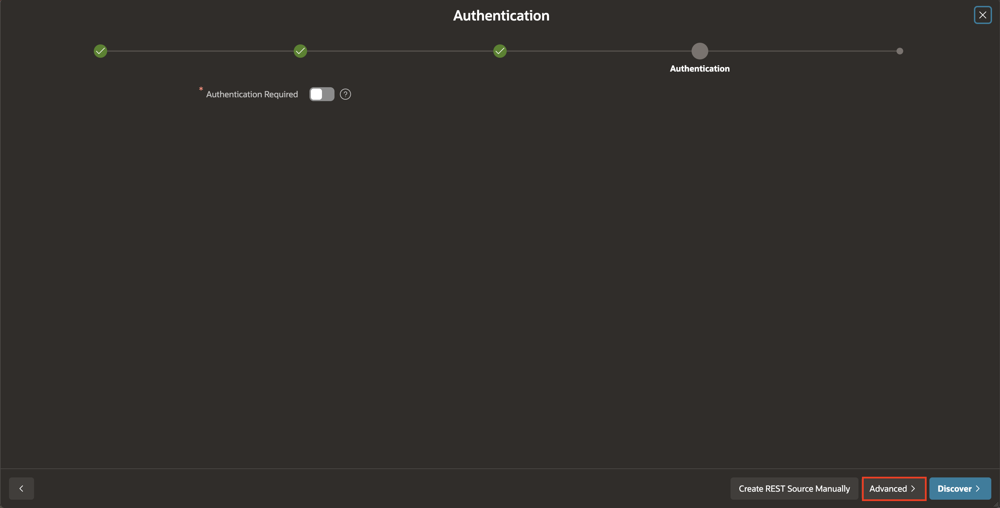

7. Set sample values:

    | Parameter | Value |
    | --- | --- |
    | `year` | `2026` |
    | `country_code` | `US` |

    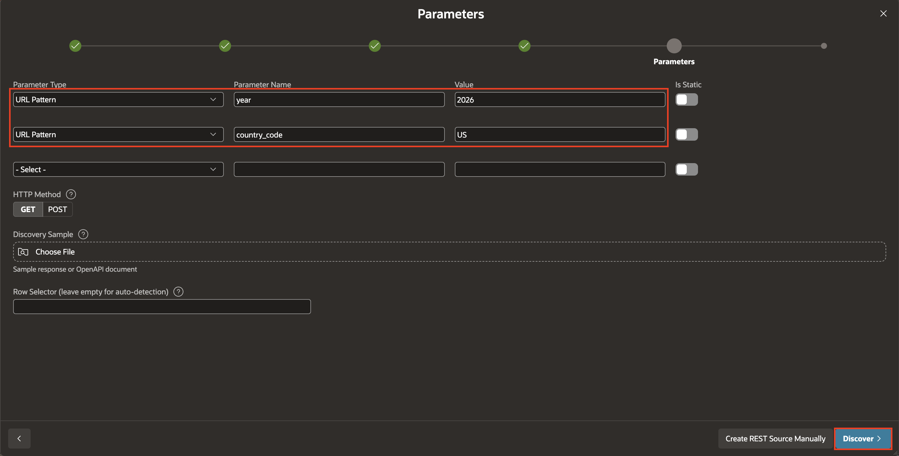

8. Click **Discover**.

    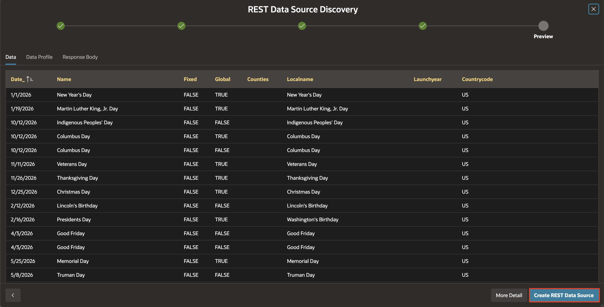

9. Save the REST Data Source.

    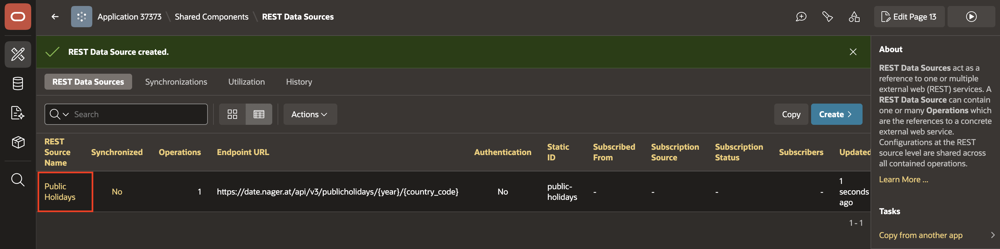

## Task 2: Enable Data Synchronization

Data Synchronization stores the public holiday response in a local table. The calendar can then query that table with the leave request data.

1. Open the REST Data Source you created.

2. Open **Data Synchronization**.

    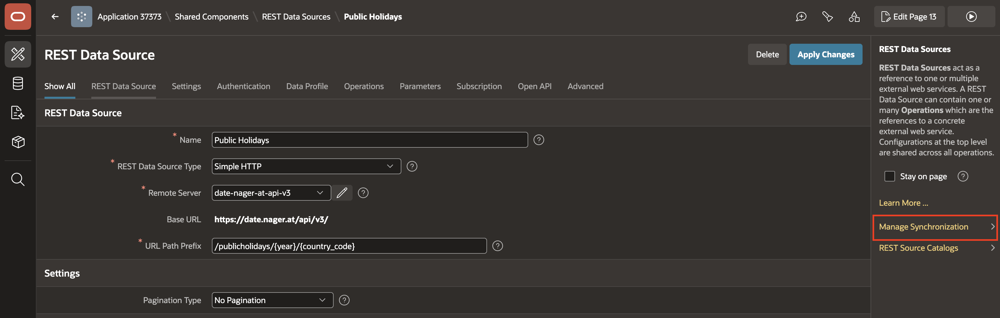

3. Enable synchronization.

4. Enter or select the following settings:

    - Target Table: **PUBLIC_HOLIDAYS_SYNC**
    - Sync Type: **Replace**
    - Schedule: **Weekly, every Monday**

    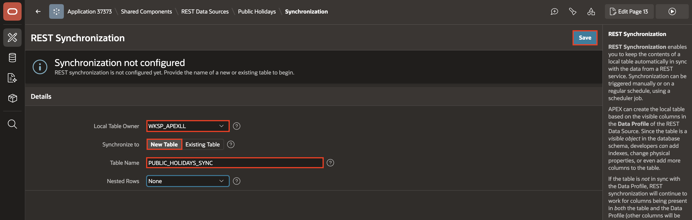

    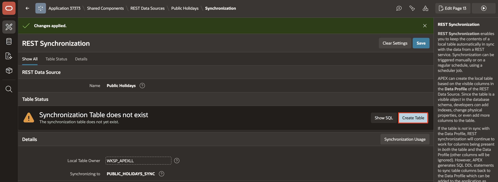

    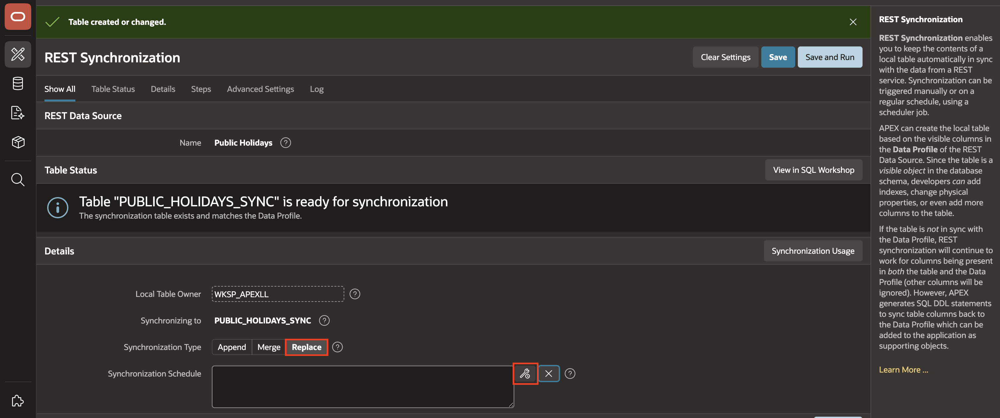

    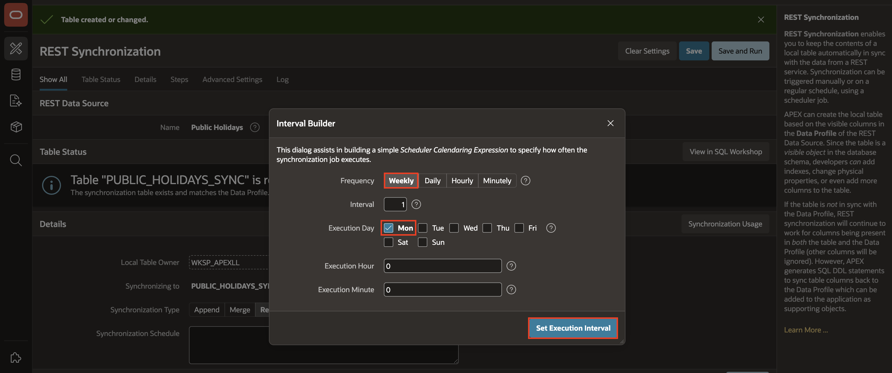

    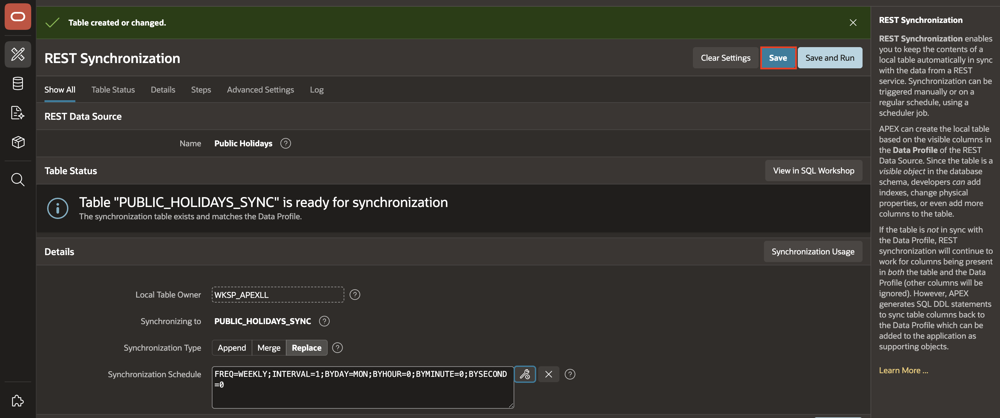

5. Run the synchronization once manually.

    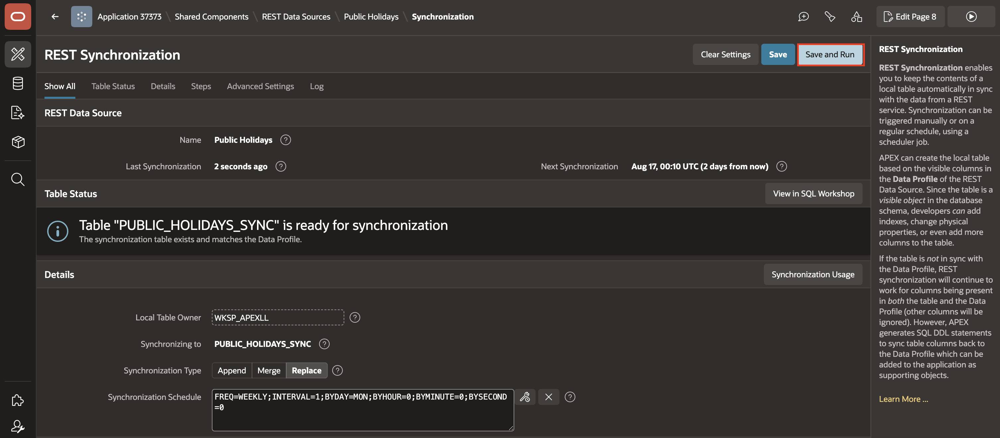

6. Confirm that the synchronized table contains data.

    For this API, the holiday date column is `DATE_` and the holiday name column is `LOCALNAME`.

    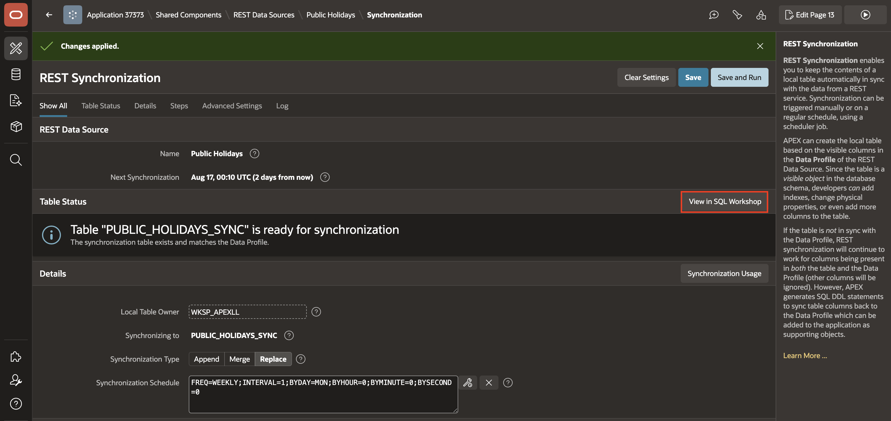

    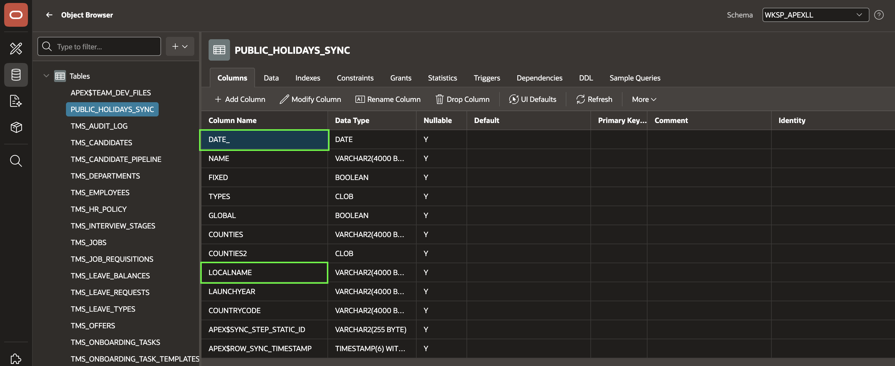

## Task 3: Update the Leave Calendar SQL Query

The updated calendar query combines leave request events with synchronized public holiday events.

1. Open the Leave Calendar page in Page Designer.

    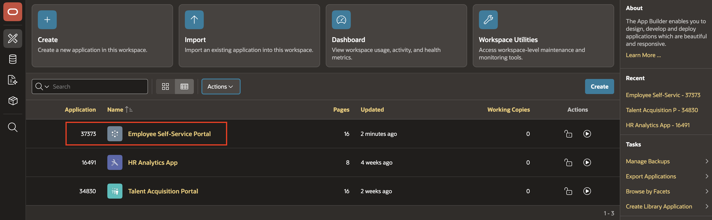

    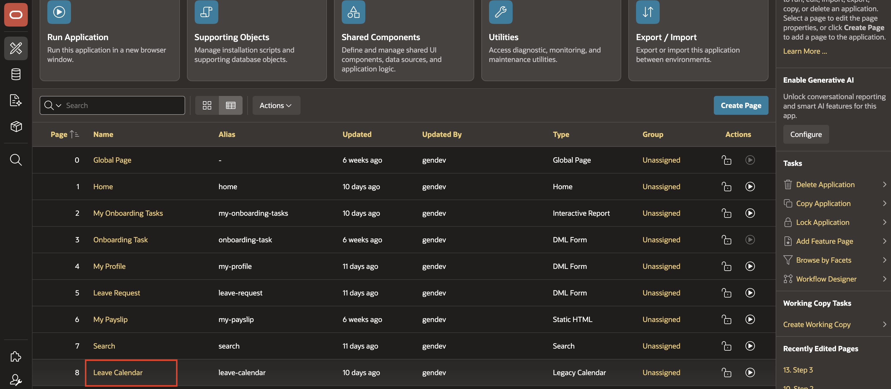

2. Select the Calendar region.

3. Replace the region source query with:

    <copy>

    ```sql
    SELECT lr.request_id                AS event_id,
           lt.name || ': ' || lr.status AS event_title,
           lr.start_date                AS start_date,
           lr.end_date + 1              AS end_date,
           CASE lr.status
               WHEN 'Approved' THEN 'event-approved'
               WHEN 'Pending'  THEN 'event-pending'
               WHEN 'Rejected' THEN 'event-rejected'
           END                          AS css_class
    FROM tms_leave_requests lr
    JOIN tms_leave_types lt
      ON lt.leave_type_id = lr.leave_type_id
    JOIN tms_employees e
      ON e.employee_id = lr.employee_id
    WHERE UPPER(e.email) = UPPER(:APP_USER)
    UNION ALL
    SELECT ROWNUM * -1     AS event_id,
           ph.localname    AS event_title,
           ph.date_        AS start_date,
           ph.date_ + 1    AS end_date,
           'event-holiday' AS css_class
    FROM public_holidays_sync ph;
    ```

    </copy>

    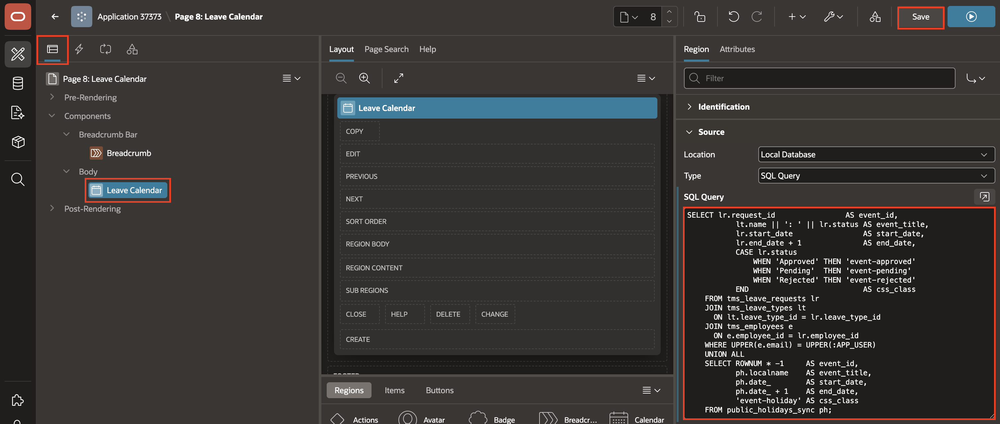

4. Save the page.

## Task 4: Add Holiday Styling

Holiday events use a separate CSS class so users can distinguish them from leave requests.

1. Open the page-level CSS settings for the Leave Calendar page.

2. Add the following Inline CSS:

    <copy>

    ```css
    .event-holiday {
      background-color: #bdbdbd !important;
      border-color: #9e9e9e !important;
      color: #333 !important;
    }
    ```

    </copy>

    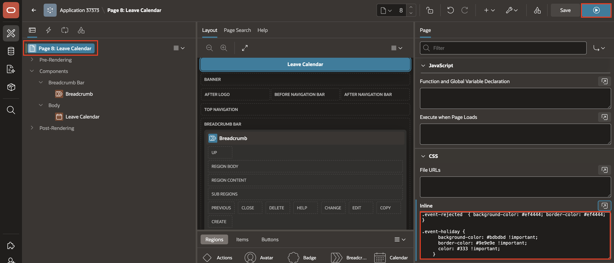

3. Save the page.

## Task 5: Test the Calendar

Test the page to confirm that leave requests and public holidays appear together.

1. Run the Leave Calendar page.

2. Confirm that leave events use their existing status colors.

3. Confirm that public holidays appear in grey.

4. Confirm that public holiday events are visible to users.

    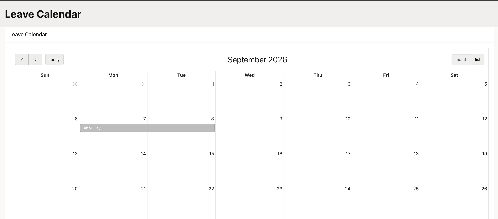

5. Confirm that the Monday synchronization job is scheduled.

## Summary

You created a REST Data Source for public holidays, synchronized the data into `PUBLIC_HOLIDAYS_SYNC`, updated the Leave Calendar query, styled holidays in grey, and tested the calendar output.

## Acknowledgements

**Author** - Ankita Beri, Senior Product Manager; Roopesh Thokala, Principal Product Manager

**Last Updated By/Date** - Ankita Beri, August 12, 2026
