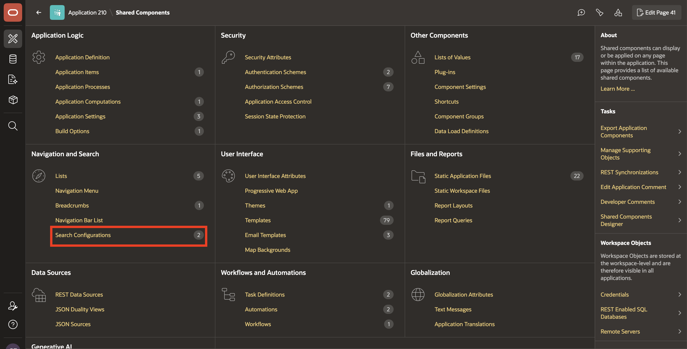
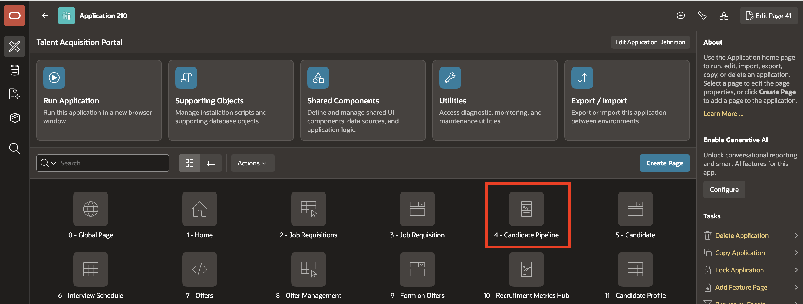
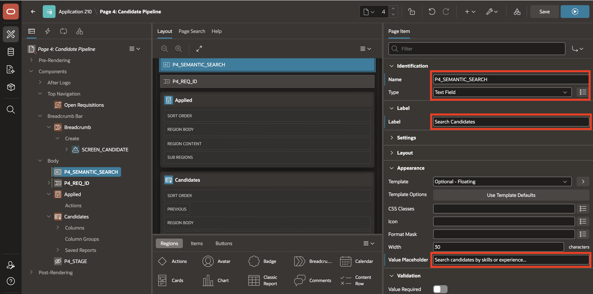
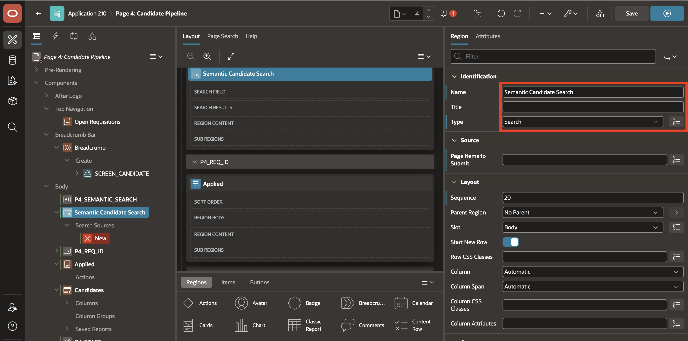
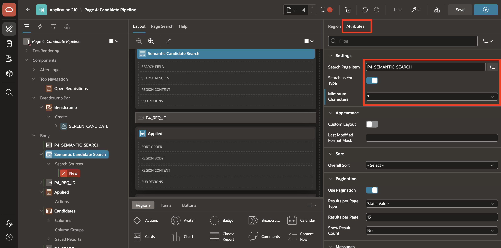

# Lab 3: Implement Semantic Search on the Candidate Pipeline in TAP

## Introduction

This lab adds semantic search to the Candidate Pipeline in TAP. You will create a vector search configuration, add a search page item, and validate ranking against natural-language skills queries such as low-code Oracle application developer, cloud infrastructure engineer, and AI database developer.

Estimated Lab Time: 10 minutes

### Objectives

In this lab, you will:
* create an Oracle AI Vector Search configuration for the candidate table,
* add a semantic search input to the Candidate Pipeline page,
* connect the search region to the vector source,
* validate result ranking with natural-language searches.

## Task 1: Create the vector search configuration

1. Open TAP and navigate to Shared Components.

    Go to Shared Components and then Search Configurations, and select Create.

    

2. Create the new configuration.

    Configure the settings as follows:

    - Type: Oracle AI Vector Search
    - Name: Candidate Semantic Search
    - Static ID: CANDIDATE_SEMANTIC_SEARCH
    - Source: TMS_CANDIDATES
    - Primary Key: CANDIDATE_ID
    - Vector Column: SKILLS_VECTOR
    - Vector Provider: DB ONNX Model

    

    Save the Search Configuration.

    

## Task 2: Add the search item and region on the Candidate Pipeline page

1. Open Page 4: Candidate Pipeline in Page Designer.

    

2. Create a page item above the Candidate Pipeline regions.

    Use the following values:

    - Name: P4_SEMANTIC_SEARCH
    - Type: Text Field
    - Label: Search Candidates
    - Placeholder: Search candidates by skills or experience...

    

3. Create a search region.

    Add a new region with the following details:

    - Type: Search
    - Title: Semantic Candidate Search

    

4. Configure the search region.

    In the region attributes, set:

    - Search Page Item: P4_SEMANTIC_SEARCH
    - Search as You Type: On
    - Minimum Characters: 3

    

5. Add the Search Source.

    Under the Search region, create a Search Source and configure it with:

    - Name: Candidate Semantic Search
    - Search Configuration: Candidate Semantic Search

    

    Save the page.

    


## Task 3: Test semantic candidate ranking

1. Run the Candidate Pipeline page.

    Open the Candidate Pipeline in TAP and enter the following search text in the Search Candidates field:

    ```text
    low code Oracle application developer
    ```

    Candidates with skills such as Oracle APEX, PL/SQL, ORDS, REST APIs, and Oracle Database should rank higher in the results.

    


2. Test an OCI-focused search.

    Search for:

    ```text
    cloud infrastructure engineer
    ```

    Candidates with OCI Compute, OCI Networking, IAM, Object Storage, and cloud architecture experience should rank higher.

    


3. Test an AI and vector-focused search.

    Search for:

    ```text
    AI semantic search database developer
    ```

    Candidates with Oracle AI Database, AI Vector Search, VECTOR, ONNX embedding models, SQL, and PL/SQL should rank higher.

    

## Summary

The Candidate Pipeline now supports semantic search using the vector embeddings generated from candidate skill descriptions. The ranking aligns with the meaning of the prompt rather than exact word matching alone.

## Acknowledgements
* **Author** - AI-generated LiveLabs workshop authoring workflow
* **Contributors** - Module 22 source material and APEX workshop guidance
* **Last Updated By/Date** - Copilot, August 2026
