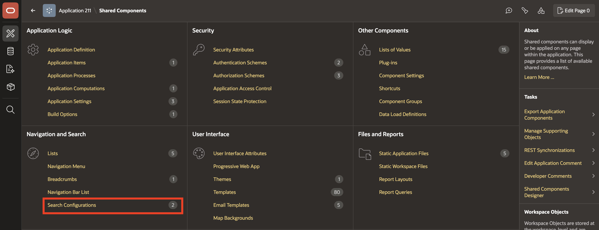
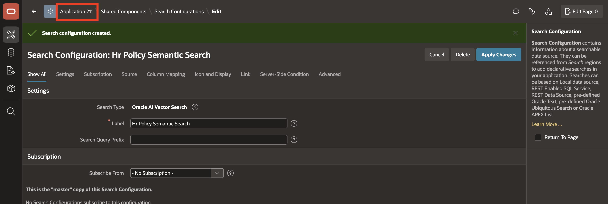
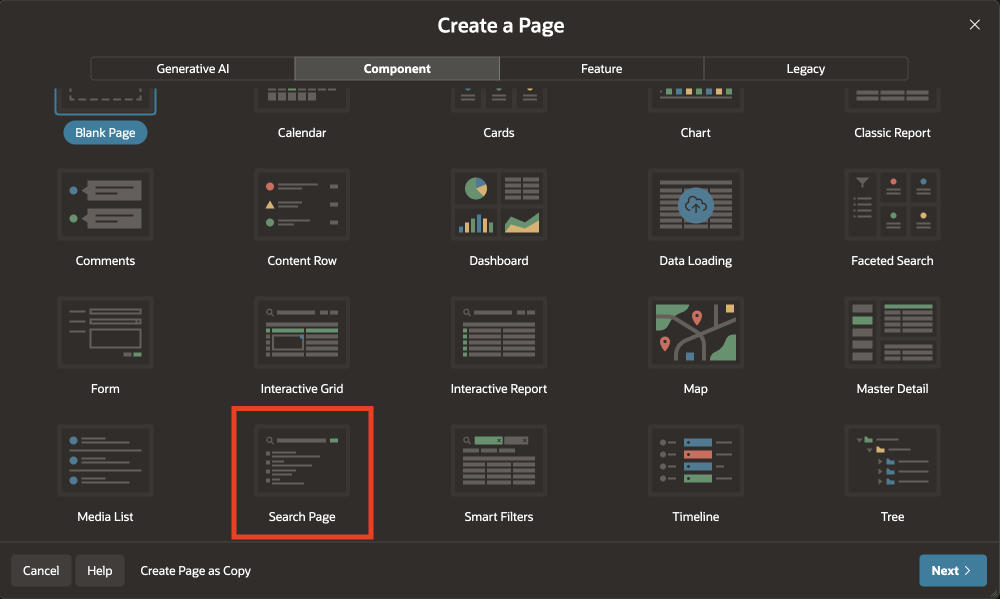
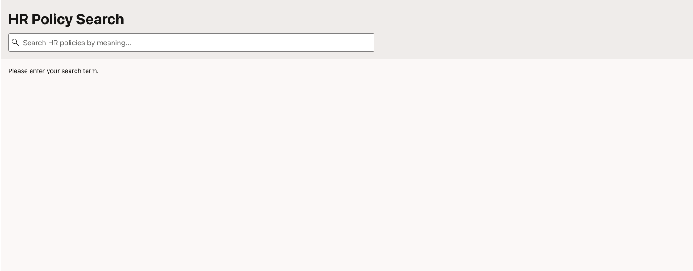
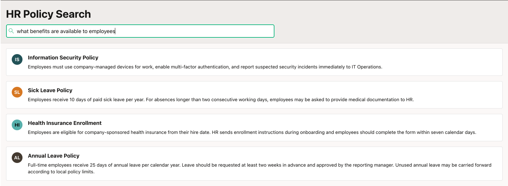

# Lab 4: Build the HR Policy Search Page in ESS

## Introduction

This lab prepares the HR policy data for semantic search and then creates a dedicated search page in ESS. You will embed policy content, build the search configuration, and test natural-language prompts such as annual leave policy, benefits information, and employee onboarding requirements.

Estimated Lab Time: 15 minutes

### Objectives

In this lab, you will:
- Generate embeddings for HR policy content

- Create an Oracle AI Vector Search configuration for policy records,
- Create an HR Policy Search page in ESS,
- Test semantic ranking for policy-related natural-language questions.

## Task 1: Generate HR policy embeddings

1. Open SQL Workshop and run the following update.

    ```sql
    <copy>UPDATE tms_hr_policy
    SET embedding_vector = apex_ai.get_vector_embeddings(
            p_value => title || ' ' || content,
            p_service_static_id => 'db-onnx-model'
        );
    COMMIT;</copy>
    ```

    

2. Verify the embedding status.

    Run:

    ```sql
    <copy>SELECT policy_id,
           category,
           title,
           CASE
               WHEN embedding_vector IS NULL THEN 'NOT EMBEDDED'
               ELSE 'EMBEDDED'
           END AS embedding_status
    FROM tms_hr_policy
    ORDER BY category, title;</copy>
    ```

    Confirm that the policy rows show EMBEDDED.

    

## Task 2: Create the HR Policy Vector Search configuration

1. Open ESS and navigate to Shared Components.

    Go to Shared Components, then Search Configurations, and select Create.

    

2. Configure the new search configuration.

    Use the following values:

    - Search Type: Oracle AI Vector Search
    - Name: HR Policy Semantic Search
    - Static ID: HR_POLICY_SEMANTIC_SEARCH
    - Source: TMS_HR_POLICY
    - Primary Key: POLICY_ID
    - Vector Column: EMBEDDING_VECTOR
    - Vector Provider: DB ONNX Model

    Configure the result mappings:

    - Title: TITLE
    - Description: CONTENT

    Save the Search Configuration.

    

    

## Task 3: Create the HR Policy Search page

1. Open ESS and create a page.

    Navigate to Create Page and choose Component, then Search Page.

    

2. Configure the page.

    Set the following values:

    - Name: HR Policy Search
    - Page Mode: Normal
    - Search Configuration: HR Policy Semantic Search

3. Complete the wizard.

    Configure navigation as follows:

    - Use Navigation: On
    - Parent Navigation Entry: HR Info
    - Navigation Entry: HR Policy Search

    Click Create Page.

4. Review the generated components.

    APEX generates a Search Page Item, a Search Results region, and the Search Source mapped to HR Policy Semantic Search.

    If the generated page number is 18, the search item is similar to P18_SEARCH and the Search Results region is automatically mapped to the Search Page Item and the Search Source.

5. Update the search field placeholder.

    In Page Designer, select the generated Search item. Set the placeholder to:

    ```text
    Search HR policies by meaning...
    ```

    Save the page.

    

    

## Task 4: Validate policy search behavior

1. Run the HR Policy Search page.

    Open ESS, go to HR Info, and run HR Policy Search.

2. Search for annual leave.

    Enter:

    ```text
    annual leave policy
    ```

    Relevant leave-related policies should rank higher.

    

3. Search for benefits information.

    Enter:

    ```text
    what benefits are available to employees
    ```

    Relevant benefit-related policies should rank higher.

    

4. Search for onboarding requirements.

    Enter:

    ```text
    new employee onboarding requirements
    ```

    Relevant onboarding and employee-policy content should rank higher.

## Summary

The HR policy search page now uses semantic ranking to match user intent across policy titles and content. That makes the search experience more natural and supports downstream AI agent grounding for onboarding and policy questions.

## Acknowledgements

- **Author** - Ankita Beri, Senior Product Manager
- **Last Updated By/Date** - Ankita Beri, August 2026
