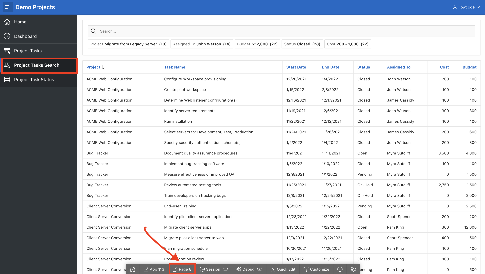
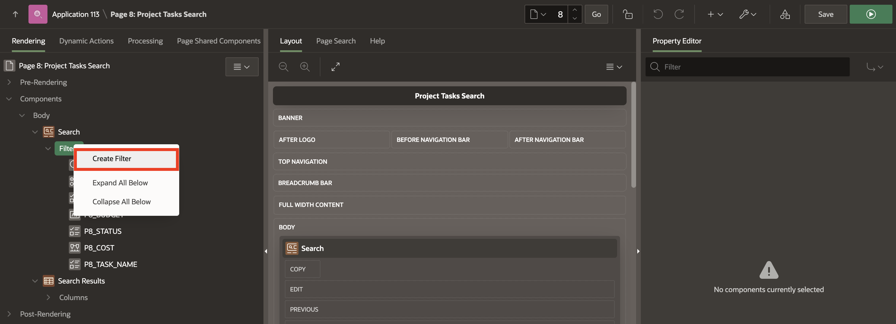
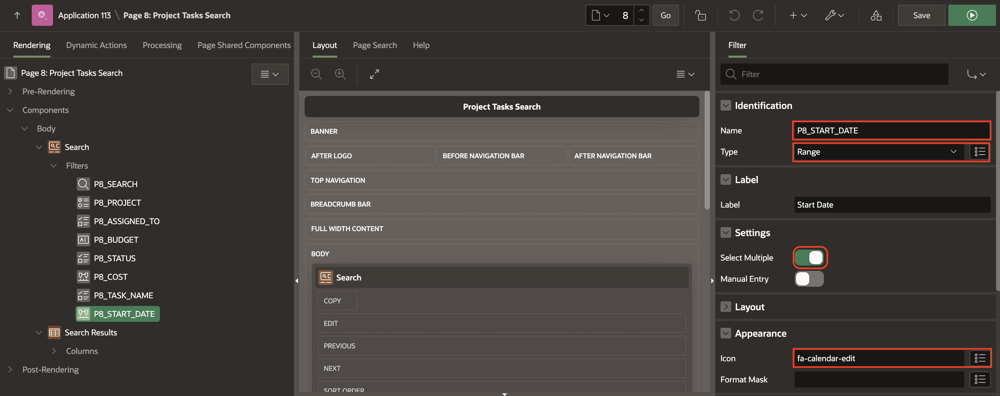
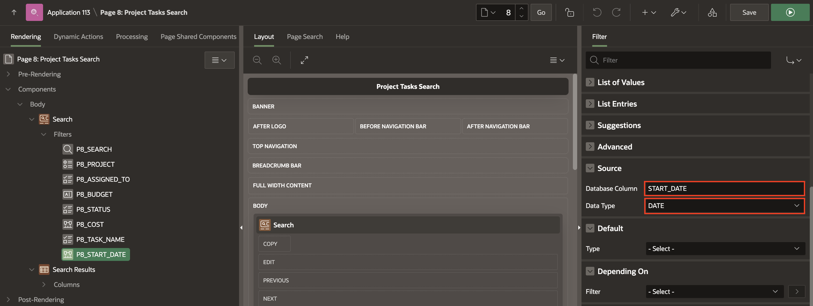
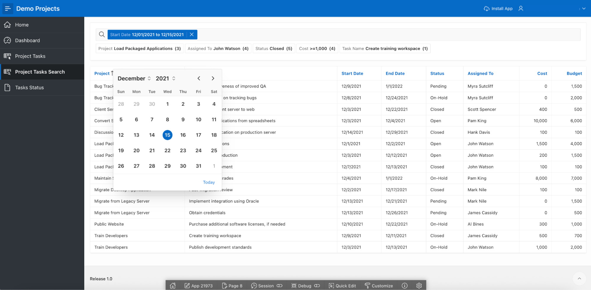

# Improve Smart Filters

## Introduction

In this lab, you will enhance your skills in utilizing Smart Filters within the Oracle APEX environment. Smart Filters allow users to dynamically refine data displayed in applications, providing an intuitive way to search and filter records based on various criteria. This hands-on lab will guide you through customizing existing filters and creating new ones, enabling a more robust and user-friendly application experience.

### Objectives

In this lab, you will:

- Customize existing Smart Filters to improve usability.

- Create new Smart Filters using different input types.

- Implement filters that allow for dynamic user input and selection.

- Understand the significance of each filter type in enhancing the search functionality.

Estimated Time: 5 minutes

### Downloads

- Did you miss out on trying the previous labs? Don’t worry! You can download the application from **[here](files/hol10.sql)** and import it into your workspace. To run the app, please run the steps described in **[Get Started with Oracle APEX](https://livelabs.oracle.com/pls/apex/r/dbpm/livelabs/run-workshop?p210_wid=3509)** and **[Using SQL Workshop](https://livelabs.oracle.com/pls/apex/r/dbpm/livelabs/run-workshop?p210_wid=3524)** workshops.

## Task 1: Enhance Smart Filters

In this task, you will focus on customizing the existing Smart Filters in the **Project Tasks Search** page of the **Demo Projects** application. You will learn how to modify filters to allow for better user interaction and data retrieval. Specifically, you'll enhance the existing Project and Budget filters, transforming them into more interactive components.

1. Navigate to the **App Builder**. Click **Demo Projects** application.

    

2. Now, you run the application using the **Run Application** icon. If prompted, enter your workspace username and password and click **Sign In**.

    

3. Navigate to **Project Tasks Search** page and click **Page 8** in the **Developer toolbar**.

   > **Note:** _Note** that your page number might be different._

   

4. Under **Search** region, select **P8\_PROJECT** and enter/select the following:

    - Identification > Type: **Radio Group**

    - List Entries > Client-side Filtering: **Toggle On**

    

5. Click **Save and Run Page** in the upper right corner.
The revised page appears.

    

6. Navigate back to **Page Designer - Page 8** . Now, you set the Budget filter as an input field that can be filtered, allowing you to input values and dynamically select the filter criteria.

7. In the **Rendering** tree (left pane), under **Search**, select **P8\_BUDGET** within filters and enter/select the following:

   - Under Identification > Type: **Input Field**

   - Under Settings > User can Choose Operator: **Toggle On**

    

8. Click **Save and Run**.

9. Select the **Budget** filter in the search bar in the runtime environment. Select **greater than** and enter **6000** in the input field. The results appear with a budget greater than 6000.

    

    

## Task 2: Add New Smart Filter

In this task, you will learn how to create new Smart Filters that cater to additional data needs in your application. By adding filters for **Task Name** and **Start Date**, you will gain hands-on experience in configuring different filter types, including Checkbox Groups and Ranges. This task emphasizes the importance of tailoring your application’s filtering capabilities to meet specific user requirements and improve the overall search experience.

1. In the **Rendering** tab, right-click **Filters** and select **Create Filter**.

    

2. In the property editor, enter/select the following:

    - Under **Identification**:

      - Name: **P8\_TASK_NAME**.

      - Type: **Checkbox Group**.

    - List of Values > Type: **Distinct Values**.

    

    

3. Again, right-click **Filters** and select **Create Filter**.

    

4. In the property editor, enter/select the following:

    - Under **Identification**:

        - Name: **P8\_START_DATE**.

        - Type: **Range**.

    - Settings > Select Multiple: **Toggle On**

    - Appearance > Icon: **fa-calender-edit**

    - Under Source:

        - Database Column: **START_DATE**

        - Data Type: **DATE**

    

    

5. Click **Save and Run Page** in the upper right corner. If prompted, enter your workspace username and password and click **Sign In**. The revised page appears.

    

## Summary

You now know how to customize existing filters and create new ones for the Project Tasks Search page. You transformed the Project and Budget filters for improved interactivity and added filters for Task Name and Start Date. These enhancements equip your application to provide users with a more efficient and tailored data exploration experience. You may now **proceed to the next Lab**.

## Acknowledgements

- **Author** - Roopesh Thokala, Senior Product Manager; Ankita Beri, Product Manager
- **Last Updated By/Date** - Ankita Beri, Product Manager, September 2024
