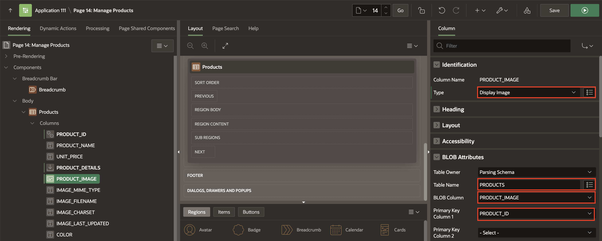
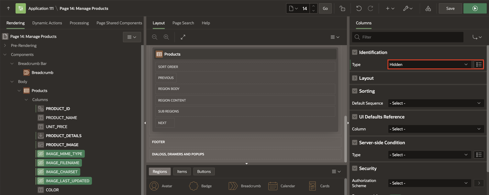

# Improve Classic Report

## Introduction

In this task, you will learn how to enhance a Classic Report in an Oracle APEX application by modifying its attributes and incorporating dynamic elements. Classic Reports are a powerful way to display data in a structured format, and by customizing the report, you can create an intuitive and interactive user experience. Specifically, we will enhance the Manage Products page within the Online Shopping Application by updating the SQL query, modifying column attributes, and configuring links and buttons.

### Objectives

In this lab, you will:

- Customize the Classic Report to enhance its presentation and functionality.

- Implement a Download BLOB feature for the PRODUCT_DETAILS column.

- Configure the PRODUCT_IMAGE column to display images directly within the report.

- Modify the SQL query to fetch additional product-related data (color, department, clothing).

- Adjust column settings, such as setting PRODUCT_ID as a clickable link.

- Hide unnecessary columns (e.g., IMAGE_NAME_TYPE, IMAGE_FILENAME) for a cleaner layout.

Estimated Time: 5 minutes

### Downloads

- Did you miss out on trying the previous labs? Don’t worry! You can download the application from **[here](files/hol10.sql)** and import it into your workspace. To run the app, please run the steps described in **[Get Started with Oracle APEX](https://livelabs.oracle.com/pls/apex/r/dbpm/livelabs/run-workshop?p210_wid=3509)** and **[Using SQL Workshop](https://livelabs.oracle.com/pls/apex/r/dbpm/livelabs/run-workshop?p210_wid=3524)** workshops.

## Task 1: Enhance Classic Report

1. On **Online Shopping Application**, navigate to **14 - Manage Products** page.

      

2. In the left pane, navigate to **Products** region and update the following:

    - Identification > Type: **Classic Report**

    - Source > SQL Query: Copy and replace the following SQL Query:

    ```
    <copy>
    SELECT
        "PRODUCT_ID",
        "PRODUCT_NAME",
        "UNIT_PRICE",
        "PRODUCT_DETAILS",
        "PRODUCT_IMAGE",
        "IMAGE_MIME_TYPE",
        "IMAGE_FILENAME",
        "IMAGE_CHARSET",
        "IMAGE_LAST_UPDATED",
        (
            SELECT
                L1."COLOR"
            FROM
                "COLOR_LOOKUP" L1
            WHERE
                L1."COLOR_ID" = M."COLOR_ID"
        ) COLOR,
        (
            SELECT
                L2."DEPARTMENT"
            FROM
                "DEPARTMENT_LOOKUP" L2
            WHERE
                L2."DEPARTMENT_ID" = M."DEPARTMENT_ID"
        ) DEPARTMENT,
        (
            SELECT
                L3."CLOTHING"
            FROM
                "CLOTHING_LOOKUP" L3
            WHERE
                L3."CLOTHING_ID" = M."CLOTHING_ID"
        ) CLOTHING
    FROM
        "PRODUCTS" M
    </copy>
    ```

    

3. Under **Products** region, expand columns and select **PRODUCT\_ID** column. In the Property Editor, enter/select the following:

    - Identification > Type: **Link**

    - Link > Target: Click **No Link Defined**

        - Page: **15**

        - Set Items > Name: **P18\_PRODUCT\_ID**, Value: **PRODUCT\_ID**

        - Clear Cache: **15**

        - Click **OK**.

    - Link > Link Text: **fa-edit**

    

    

4. Now, select **PRODUCT\_DETAILS** column and enter/select the following:

    - Identification > Type: **DOWNLOAD BLOB**

    - Under BLOB Attributes:

        - Table Name: **PRODUCTS**

        - BLOB Column: **PRODUCT_DETAILS**

        - Primary Key Column 1: **PRODUCT_ID**

     

5. Select **PRODUCT_IMAGE** column and enter/select the following:

    - Identification > Type: **Display Image**

    - Under BLOB Attributes:

        - Table Name: **PRODUCTS**

        - BLOB Column: **PRODUCT_DETAILS**

        - Primary Key Column 1: **PRODUCT_ID**

    

6. Select **IMAGE_NAME_TYPE, IMAGE_FILENAME, IMAGE_CHARSET, IMAGE_LAST_UPDATED** and change type to **Hidden**.

    

7. Navigate to **CREATE** button and update the following:

    - Under Layout:

        - Region: **Breadcrumb**

        - Slot: **CREATE**

     

8. Click **Save**.

## Summary

You now know how to enhance classic report. You may now **proceed to the next Lab**.

## What's next

In the next Lab, you learn how to Create and Customize a Form and then link the form to an Interactive Report. This process involves designing a user-friendly data entry form and connecting it to a dynamic, interactive report that displays data from a database table.

## Acknowledgements

- **Author** - Ankita Beri, Product Manager
- **Last Updated By/Date** - Ankita Beri, Product Manager, September 2024