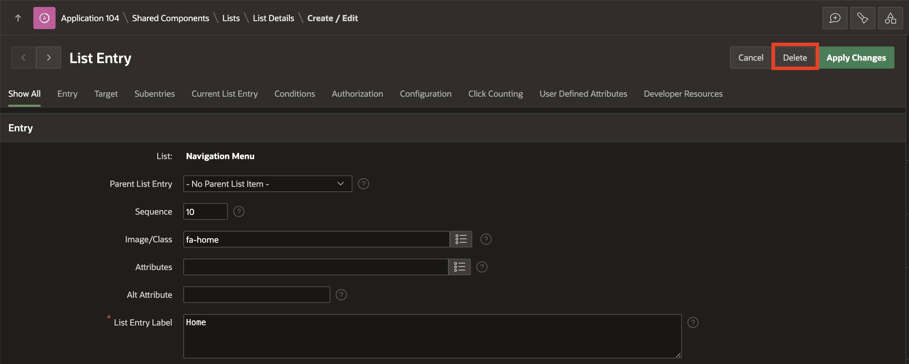
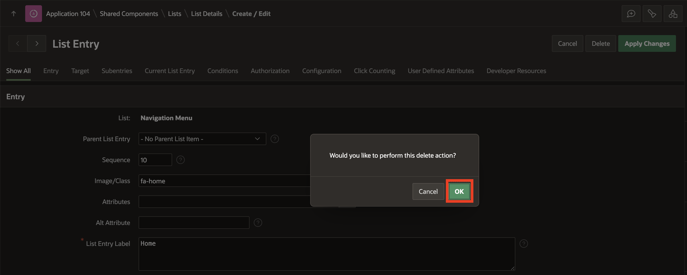
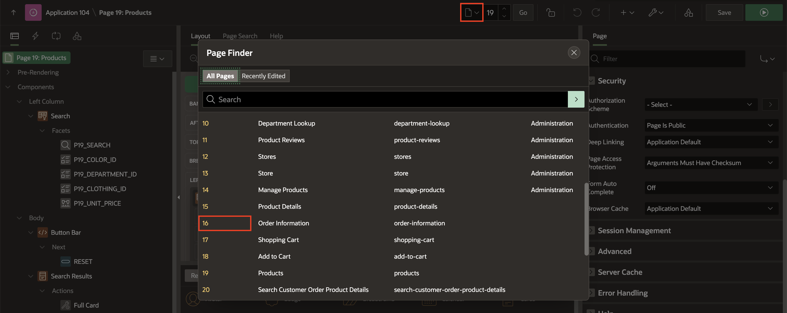
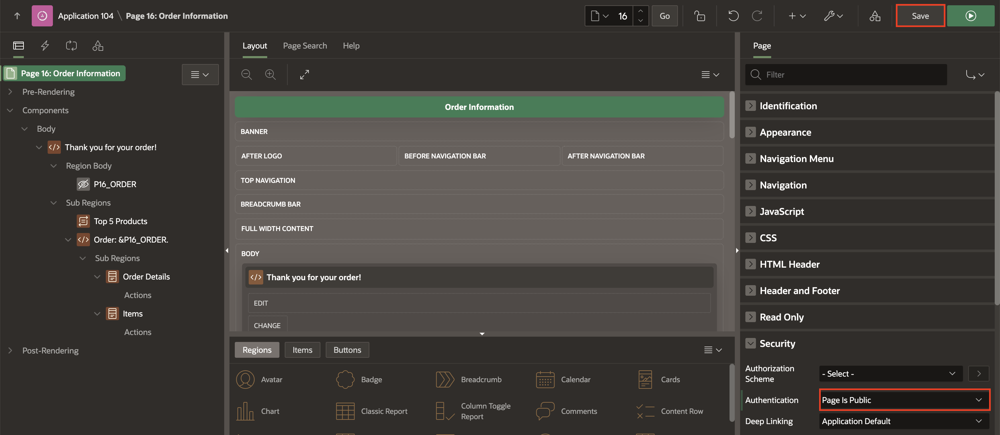
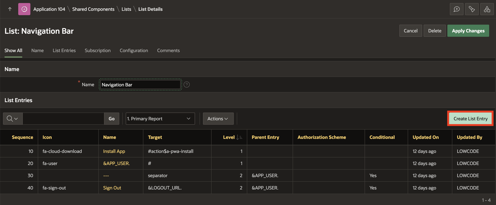
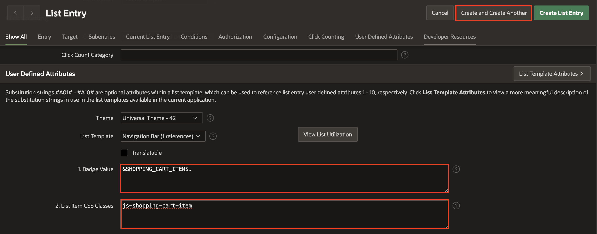
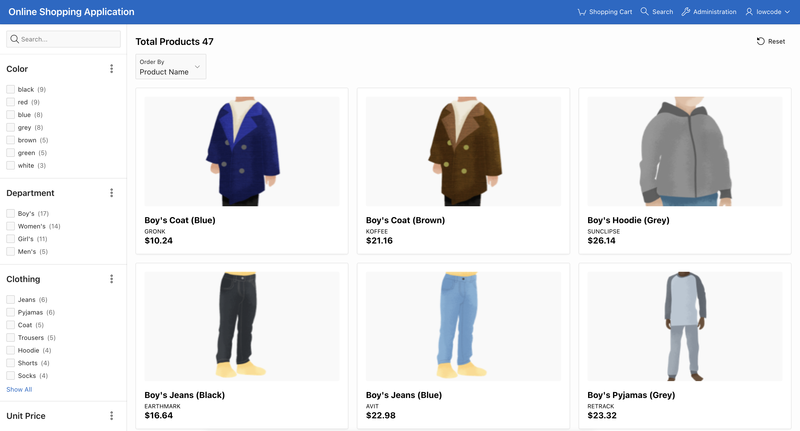

# Implement Navigation in your Application

## Introduction

In this lab, you will learn how to configure navigation settings by making specific pages publicly accessible, disabling menus, and enhancing the navigation bar for better usability. By the end of the lab, you will be able to customize the navigation for users, offering both customers and administrators easier access to essential features.

Estimated Time: 10 minutes

### Objectives

In this lab, you will:

- Set specific pages as public pages for easy access.

- Disable the default navigation menu to streamline user experience.

- Enhance the navigation bar to include important links, such as direct access to the shopping cart and the administration page.

## Task 1: Set the Products page as the Home Page

In this task, you will set the Products page as the default home page of the application, making it easier for users to navigate directly to the products section. Additionally, you will remove the old "Home" link from the navigation menu to prevent redundant entries.

1. Navigate to the **App Builder**. Select **Online Shopping Application**.

    

    

2. Select **Shared Components**.

    

3. Under **User Interface**, click **User Interface Attributes**.

    

4. Under **Attributes**, select **≡** next to **Home URL**. In the popup window, select **19 PRODUCTS** and click **Apply Changes**.

    

5. Since you have changed the **Home Page** to **Products** page. You must now remove the **Home** Page under the Navigation Menu. Navigate to **Shared Components**.

    

6. Under **Navigation and Search**, select **Navigation Menu**.

    

7. Select **Navigation Menu**.

    

8. Under **List Entries**, select **Home**.

    

9. Click **Delete** and confirm delete by clicking **OK**.

    

    

## Task 2: Set Pages to Public

Certain pages in your application should be publicly accessible without requiring a user login. In this task, you will configure the Products, Order Information, Shopping Cart, Add to Cart, and Search Customer Order Product Details pages as public. This will make the shopping process smoother for customers.

1. From the runtime application, navigate to the **Products** page. In the developer toolbar, click **Edit Page 19**.

    

2. In the **Rendering** tab (left pane), navigate to  **Page 19: Products**. In the Property Editor (right pane), update the following:
    - Security > Authentication: **Page Is Public**

      

3. Click **Save**.

4. Navigate to **Page Finder** and select page number **16** and repeat steps 2-3.

    

5. Similarly, repeat steps 2-3 for **Page 17: Shopping Cart**, **Page 18: Add to Cart** and **Page 20: Search Customer Order Product Details**.

    

## Task 3: Remove the Navigation Menu

Since the home page is now set as Products and it's publicly accessible, the navigation menu is no longer necessary. In this task, you will disable the navigation menu to create a more streamlined user interface.

1. Within Page Designer, click the **Shared Components** icon at the top right corner.

    

    Alternatively, if you are in the App Builder, click **Shared Components**.

   

2. Under **User Interface**, click **User Interface Attributes**.

    

3. Navigate to **Navigation Menu** tab and set **Display Navigation** to **Off**. Click **Apply Changes**.

    

## Task 4: Enhance the Navigation Bar List

A well-structured navigation bar can improve the overall user experience. In this task, you will add new entries to the navigation bar to allow customers to quickly access the Shopping Cart and administrators to access the Administration Page.

1. Navigate to **Shared Components** icon at the top right corner.

    

2. Under **Navigation and Search**, click **Navigation Bar List**.

    

3. Click **Navigation Bar**.

    

4. Click **Create List Entry**.

    

5. In the **List Entry** page, enter/select the following:

    - Sequence: **1**

    - Image/Class: **&SHOPPING\_CART\_ICON.**

    - List Entry Label: **Shopping Cart**

    - Page: **17**

    - Clear cache: **17**

    

6. Under **User Defined Attributes** and enter the following:

    - Badge Value:  **&SHOPPING\_CART\_ITEMS.**

    - List Item CSS Classes: **js-shopping-cart-item**

    

7. Click **Create and Create Another**.

8. In the **List Entry** page, enter/select the following:

    - Sequence: **2**

    - Image/Class: **fa-search**

    - List Entry Label: **Search**

    - Page: **20**

    - Clear cache: **20**

9. Click **Create List Entry**.

    

10. Under **List Entries**, click **&APP_USER.**

    

11. Under **Authorization** tab, for Authorization Scheme, select **Administration Rights**. Click **Apply Changes**.

    

12. Click **Create Entry**  and enter/select the following:

     - Sequence: **3**

     - Image/Class: **fa-wrench**

     - List Entry Label: **Administration**

     - Page: **10000**

    

13. Click **Create List Entry**.

14. Run the application and view the changes.

    

## Summary

In this lab, you learned how to configure pages as publicly accessible, manage the navigation menu, and enhance the navigation bar. By making the products and shopping-related pages public, you have simplified the user experience for customers. You also disabled navigation items and added key entries to the navigation bar, ensuring a smooth and intuitive interface for both users and administrators. You may now **proceed to the next lab**.

## What's Next

In the upcoming hands-on lab, you will learn to use a Theme roller to save a new Theme Style and how to import/export the theme styles.

## Acknowledgements

- **Author** - Roopesh Thokala, Senior Product Manager; Ankita Beri, Product Manager
- **Last Updated By/Date** - Ankita Beri, Product Manager, September 2024
