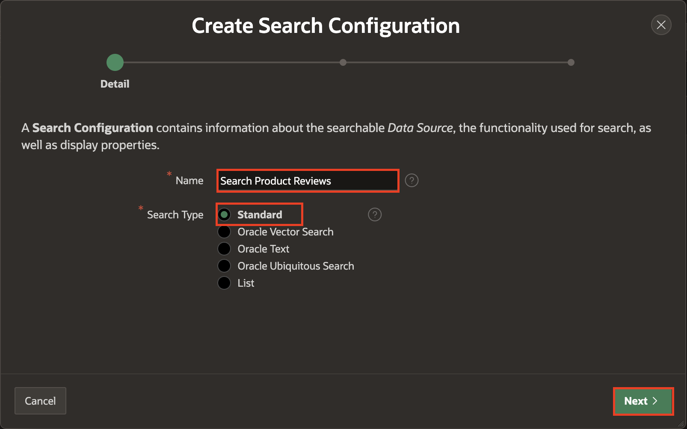
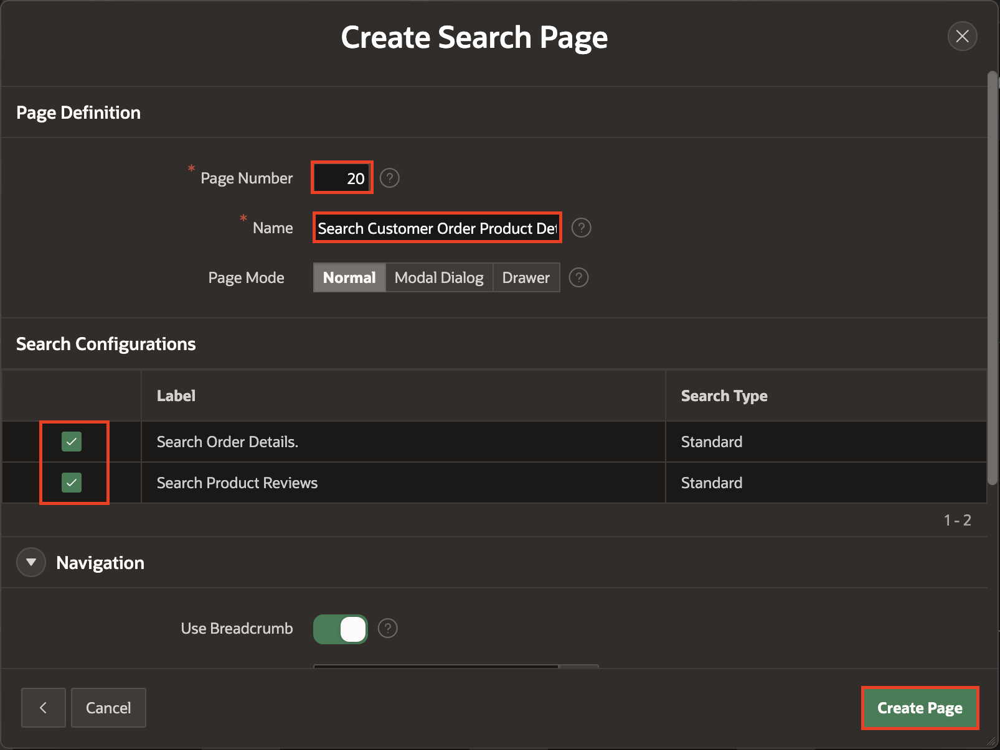

# Create Standard Search Configurations

## Introduction

In modern web applications, search functionalities play a crucial role in helping users find relevant data quickly and efficiently. Oracle APEX allows developers to implement robust search configurations for different data sources, enabling dynamic and effective data retrieval.

In this lab, you will learn how to create search configurations for two tables: CUSTOMER\_ORDER\_PRODUCTS and PRODUCT\_REVIEWS and develop a search page using the Create Page wizard. By the end of this lab, you will be able to map data to search configurations and build a fully functional search page to improve the user experience.

Estimated Time: 10 minutes

### Objectives

In this lab, you will:

- Implement two Search Configurations based on two different tables.

- Create a Search Page using the Create Page Wizard.

### Downloads

- Did you miss out on trying the previous labs? Don't worry! You can download the application from **[here](files/online-shopping-cart-8.sql)** and import it into your workspace. To run the app, please run the steps described in **[Get Started with Oracle APEX](https://livelabs.oracle.com/pls/apex/r/dbpm/livelabs/run-workshop?p210_wid=3509)** and **[Using SQL Workshop](https://livelabs.oracle.com/pls/apex/r/dbpm/livelabs/run-workshop?p210_wid=3524)** workshops.

## Task 1: Implement Standard Search Configurations

In this task, you will create two search configurations, one for the CUSTOMER\_ORDER\_PRODUCTS table and the other for the PRODUCT\_REVIEWS table. These search configurations will allow you to map specific columns to the primary key, title, and description for better search results.

1. Click the **App Builder** icon on the workspace home page.

2. Select an **Online Shopping application**.

    

3. On the Application home page, click **Shared Components**.

    

4. Under **Navigation and Search**, click **Search Configurations**.

    

5. Create the first search configuration that maps to the **CUSTOMER\_ORDER\_PRODUCTS** table: On the Search Configurations page, click **Create**.

    

6. On the **Create Search Configuration** wizard, enter/select the following details:

    - Name: **Search Order Details**.

    - Search Type: **Standard**

     Click **Next**.

   

7. For **Table/View Name**: Select **CUSTOMER\_ORDER\_PRODUCTS** and click **Next**.

   

8. Under **Column Mapping**, enter/select the following:

     - Primary Key Column: **ORDER\_ID**

     - Title Column: **FULL\_NAME**

     - Description Column: **ORDER\_STATUS**

    Click **Create Search Configuration**.

    

9. Navigate to **Column Mapping** tab, for **Subtitle Column**, select **ITEMS** and click **Apply Changes**.

   

10. Create a second search configuration that maps to the **PRODUCT_REVIEWS** table. Click **Create** on the Search Configurations page.

    

11. On the **Create Search Configuration** wizard, enter/select the following details:

     - Name: **Search Product Reviews**.

     - Search Type: **Standard**

    Click **Next**.

    

12. For **Table/View Name**, select **PRODUCT_REVIEWS** and click **Next**.

    

13. Under **Column Mapping**, enter/select the following:

     - Primary Key Column: **PRODUCT\_NAME**

     - Title Column: **PRODUCT\_NAME**

     - Description Column: **REVIEW**

   Click **Create Search Configuration**.

   

## Task 2: Create a Standard Search Page

A Search page features a Search field and a Search Results region. Page Designer's Search Results region contains Search Sources, which map to the search configurations defined in Shared Components.

In this task, you will create a search page using the Create Page wizard. The search page will allow users to search across the configurations created in Task 1, enabling efficient data retrieval from both CUSTOMER\_ORDER\_PRODUCTS and PRODUCT\_REVIEWS tables.

To create a search page by running the Create Page Wizard:

1. Navigate to the **Application ID**.

    

2. On the Application home page, click **Create Page**.

    

3. Under Component, select **Search Page**.

    

4. Under Page Definition, enter/select the following:

     - Page Number: **20**

     - Name: **Search Customer Order Product Details**

     - Search Configurations: Select both the search configurations to be used by this page - **Search Customer Order Products and Search Product Reviews**

    Click **Create Page**.

    

    > **Note:** _Note: In the Rendering tab, notice the page item, P20\_SEARCH and the Search Results region. P20\_SEARCH is the search field which enables users to submit search terms. The Search Results region contains the search results and two Search Sources, which map to search configurations maintained in Shared Components. You can further refine and control the search display and behavior by editing attributes in the Property Editor._

5. Click Save and Run Page.

    

## Summary

In this lab, you successfully created and mapped search configurations for two tables: CUSTOMER\_ORDER\_PRODUCTS and PRODUCT\_REVIEWS. Additionally, you built a search page that integrates both configurations, enabling users to search for relevant data easily You may now **proceed to the next lab**.

## Acknowledgements

- **Author** - Ankita Beri, Product Manager
- **Last Updated By/Date** - Ankita Beri, Product Manager, September 2024
