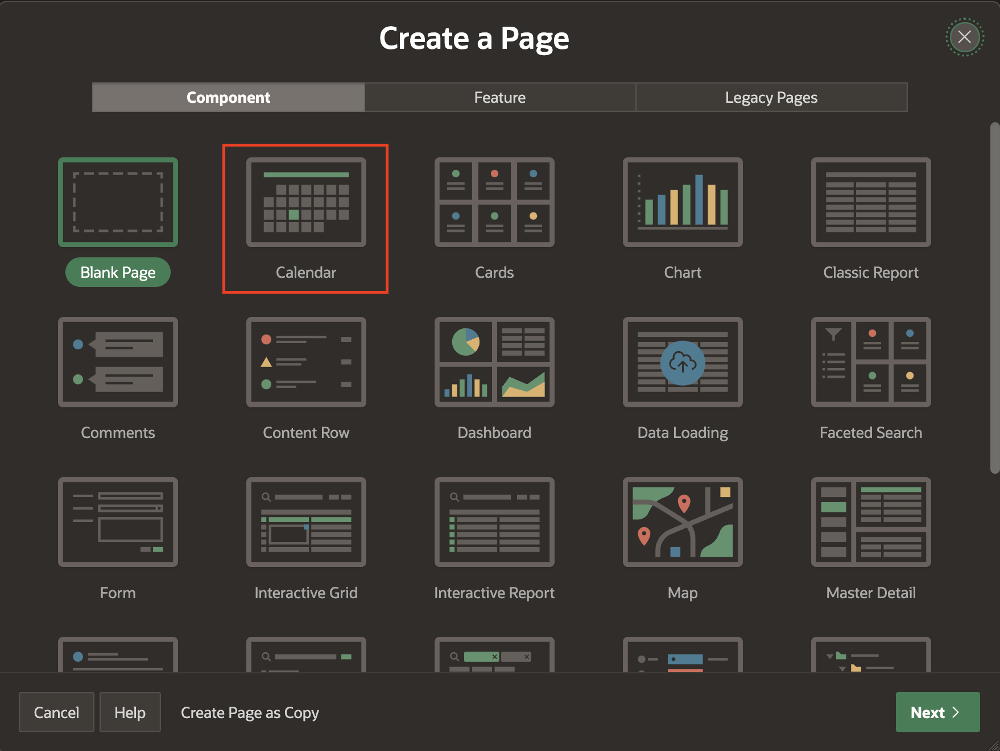
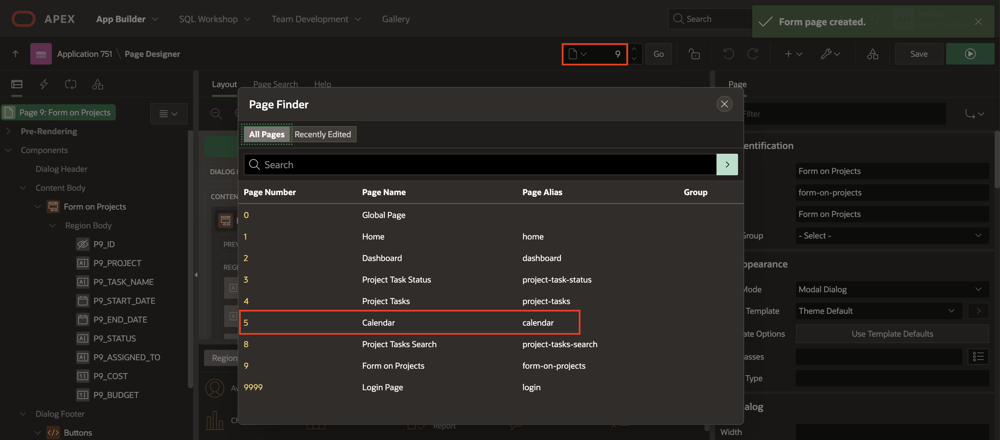
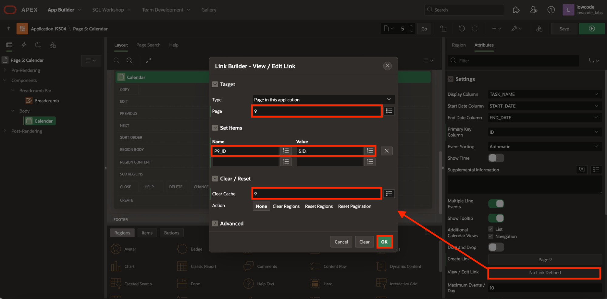
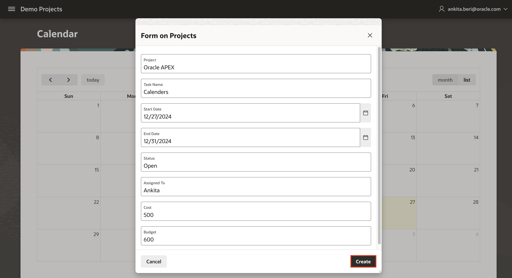
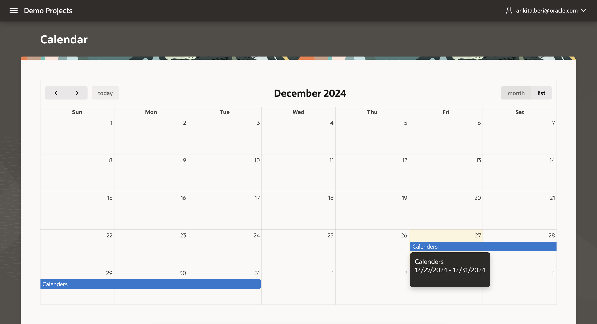

# Add additional pages to your Application

## Introduction

In this hands-on lab, you will enhance your Oracle APEX applications by adding new pages, such as Calendars, Charts, Tree Pages, and Maps. These additions will bring dynamic functionality to your applications, enabling better data visualization and interactivity. By working on the Demo Projects and Online Shopping applications, you will gain practical experience in designing and customizing essential application components.

Estimated Time: 15 minutes

### Objectives

By the end of this lab, you will be able to:

- Create and customize a Calendar page for tracking events and tasks.

- Build a Form page and link it to other pages.

- Integrate drag-and-drop functionality into the Calendar.

- Create and configure a Tree Page for hierarchical data visualization.

- Implement a Map Page to display geographical data.

### Downloads

Stuck or Missed out on completing the previous labs? Don't worry! You can download the application from the following:

- **[Demo Projects](https://c4u04.objectstorage.us-ashburn-1.oci.customer-oci.com/p/EcTjWk2IuZPZeNnD_fYMcgUhdNDIDA6rt9gaFj_WZMiL7VvxPBNMY60837hu5hga/n/c4u04/b/livelabsfiles/o/labfiles%2Fdemo-projects-hol14.sql)**

## Task 1: Create a Calendar

Calendars provide an intuitive way to visualize date-related data, such as tasks and project timelines. In this task, you will create a Calendar Page in the Demo Projects application. You’ll also customize its appearance to match your application’s design standards.

1. Navigate to **App Builder** and select **Demo Projects** application.

    

    

2. On the application home page, click **Create Page**.

    

3. Select **Calendar** as a page type.

    

4. In the **Create Calendar**, enter/select the following:

    - Under Page Definition:

        - Page Number: **5**

        - Name: **Calendar**

    - Data Source > Table/View Name: **DEMO_PROJECTS**

    Click **Next**.

    

5. In the **Create Calendar** page, enter/select the following:

    - Display Column: **TASK_NAME**

    - Start Date Column: **START_DATE**

    - End Date Column: **END_DATE**

    Click **Create Page**

    

6. Click **Save and Run**. Log in to the application with your credentials.

    

7. In the Developer Toolbar, click **Edit Page 5**.

    

8. The Calendar page displays the Region title as Calendar and has a border around the region. In the **Rendering** tab, navigate to **Calendar** region. In the Property Editor, enter/select the following:

    - Appearance > Template Options: Click **Use Template Defaults**

        - Header: **Hidden but accessible**

        - Style: **Remove UI Decoration**

         Click **OK**.

    

    

9. Click **Save and Run**.

## Task 2: Create a Form page on DEMO_PROJECTS Tables

Forms are essential for capturing user input and updating database records. In this task, you will create a Form Page for the DEMO_PROJECTS table. This form will later be linked to the Calendar to allow users to create and edit calendar events.

1. Navigate to Page Designer toolbar, click **(+ v)** icon and select **Page**.

    

2. Select **Form**.

   

3. In the **Create Form**, enter/select the following:

    - Under Page Definition:

        - Page Number: **9**

        - Name: **Form on Projects**

        - Page Mode: **Modal Dialog**

    - Data Source > Table/View Name: **DEMO_PROJECTS**

    Click **Next**.

   

4. Leave everything as default and click **Create Page**.

    

## Task 3: Customize the Calendar Page

In this task, you’ll link the Form Page created in Task 2 to the Calendar, enabling users to create and edit tasks directly from the Calendar interface. You will also enable drag-and-drop functionality for seamless task updates.

1. Navigate to **Page Finder** in the page designer toolbar and select page **5**.

   

2. To add the **Create** and **View / Edit** links, in the Rendering tree, navigate to **Calendar** region.

3. In the Property Editor, click **Attributes** and enter/select the following:

    - Under Settings:

        - Primary Key Column: **ID**

        - Create Link: Click **No Link Defined**.

            - Page: **9**

            - Clear Cache:**9**

            Click **OK**

    

    - View/Edit Link: Click **No Link Defined**.

        - Page: **9**

        - Set Items:

            | Name | Value |
            |----- | ----- |
            | P9_ID | &ID. |
            {: title="Set Items"}

        - Clear Cache: **9**

        Click **OK**.

   

4. Use the component attribute **Drag and Drop** to enable the calendar to drag and drop. Your SQL query must select a primary key column, and you must have set the Primary Key Column calendar attribute. Then, enter the PL/SQL code to update the event row in the database in the Drag and Drop PL/SQL Code attribute. That PL/SQL code typically performs an SQL update on the database table - the bind variables **:APEX$PK\_VALUE.**, **:APEX$NEW\_START\_DATE** and **:APEX$NEW\_END\_DATE** contain the dragged events' primary key value and the new start and end timestamp.

    - Under Settings:

        - Drag and Drop: **Toggle On**

        - Drag and Drop PL/SQL Code: Copy and paste the below code.
            ```
            <copy>
            begin
                update DEMO_PROJECTS
            set
                start_date = to_date(:APEX$NEW_START_DATE,'YYYYMMDDHH24MISS'),
                end_date = to_date(:APEX$NEW_END_DATE,'YYYYMMDDHH24MISS')
            where
                ID = :APEX$PK_VALUE;
            end;
            </copy>
            ```

    

5. Click **Save and Run**.
Notice that you can now drag and drop tasks in the calendar.

    

    

    

## Task 4: Create and Customize a Tree Page

Tree Pages are an excellent way to display hierarchical data, such as organizational structures or project dependencies. In this task, you’ll create a Tree Page to visualize employee relationships in the Demo Projects application. You will also learn to configure the tree layout and customize its appearance for optimal user experience.

1. Create a blank page in the **Demo Projects** application. Navigate to Create **(+ v)** in the page designer toolbar and select **Page**.

   

2. Select **Blank Page**.

   

3. On **Create Blank Page**, enter/select the following:

    - Page Number: **7**

    - Name: **Tree Page**

    Click **Create Page**.

    

4. Now, you create a **Tree region**. In the page designer, under **Rendering** tab, right-click **Body** and select **Create Region**.

    

5. In the Property Editor, enter/select the following:

    - Under Identification:

        - Name: **Tree**

        - Type: **Tree**

    - Under Source:

        - Type: **SQL Query**

        - SQL Query: Copy the following code and paste it.

            ```
            <copy>
            select case when connect_by_isleaf = 1 then 0
                    when level = 1             then 1
                    else                           -1
                end as status,
                level,
                "ENAME" as title,
                null as icon,
                "EMPNO" as value,
                "ENAME" as tooltip
                from EBA_DEMO_IR_EMP
                start with "MGR" is null
                connect by prior "EMPNO" = "MGR"
                order siblings by "ENAME"
            </copy>
            ```

    - Under Appearance > Template Options: Click **Use Template Defaults**

        - General: Check **Remove Body Padding**

        - Header: **Hidden but accessible**

        - Style: **Remove UI Decoration**

        Click **OK**.

    

    

    

6. In the **Property Editor**, select **Attributes** and enter/select the following:

    - Under Settings:

        - Node Label Column: **TITLE**

        - Node Value Column: **VALUE**

        - Hierarchy: **Not Computed**

        - Node Status Column: **STATUS**

        - Hierarchy Level Column: **LEVEL**

        - Tooltip: **Database Column**

        - Tooltip Column: **TOOLTIP**

7. Click **Save and Run**.

   

8. The **Tree Page** is now displayed.

    

## Summary

In this lab, you successfully created and customized a Calendar Page to display tasks and events, providing an intuitive way to manage date-related data. You also built a Form Page and linked it to the Calendar, enabling seamless task creation and editing. Additionally, you enabled drag-and-drop functionality in the Calendar, making it easier to update tasks interactively. Furthermore, you designed a Tree Page to represent hierarchical data, such as employee relationships or project dependencies. By completing this lab, you gained practical skills in building and customizing interactive pages in Oracle APEX, enhancing both the usability and functionality of your applications. You may now **proceed to the next Lab**.

## Acknowledgements

- **Author** - Roopesh Thokala, Principal Product Manager, Ankita Beri, Senior Product Manager
- **Last Updated By/Date** - Ankita Beri, Senior Product Manager, October 2025
