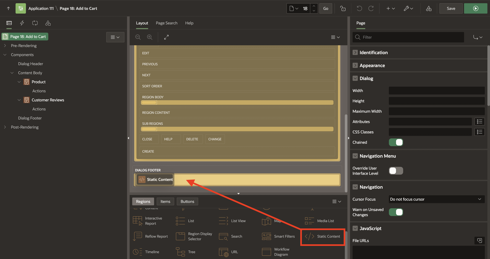
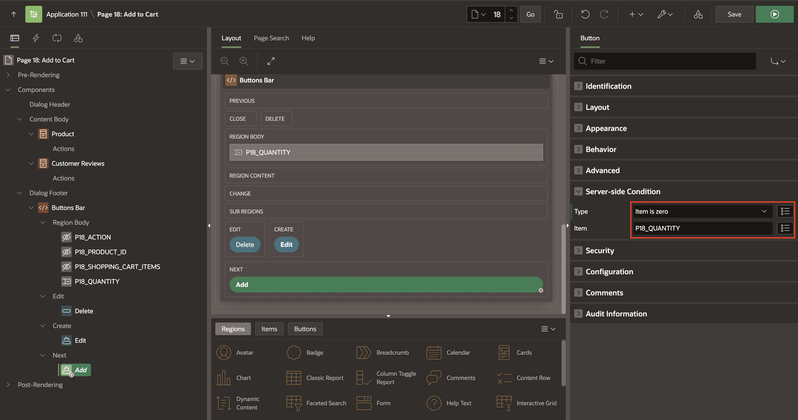
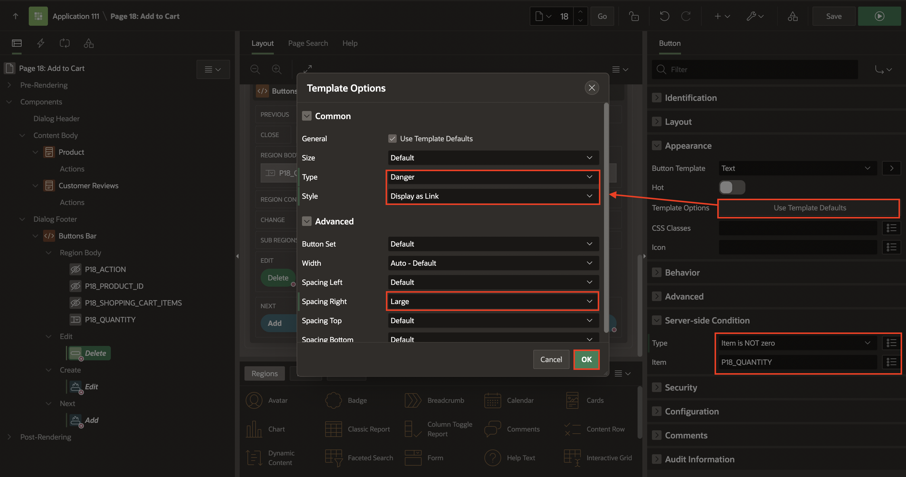

# Create and Use Page-Level Items and Buttons

In this lab, you will learn how to add new items and buttons to a shopping cart page in an online shopping application. You will create and configure page items like customer details, product information, and buttons to manage the shopping cart. This enables users to review, modify, and interact with their cart seamlessly and intuitively.

Estimated Time: 15 minutes

## Objectives

By the end of this lab, you will be able to:

- Add static content regions and create page items to capture order information.

- Create and configure buttons to manage the shopping cart.

- Implement server-side conditions to control button visibility based on user actions.

- Add and configure hidden fields to store and manipulate shopping cart data.

### Downloads

- Did you miss out on trying the previous labs? Don’t worry! You can download the application from [here](https://c4u04.objectstorage.us-ashburn-1.oci.customer-oci.com/p/EcTjWk2IuZPZeNnD_fYMcgUhdNDIDA6rt9gaFj_WZMiL7VvxPBNMY60837hu5hga/n/c4u04/b/livelabsfiles/o/data-management-library-files/apex-23-2-object-storage-files/hol5-lab-2.sql) and import it into your workspace. To run the app, please run the steps described in the following workshops:

1. **[Get Started with Oracle APEX](https://livelabs.oracle.com/pls/apex/r/dbpm/livelabs/run-workshop?p210_wid=3509)**

2. **[Using SQL Workshop](https://livelabs.oracle.com/pls/apex/r/dbpm/livelabs/run-workshop?p210_wid=3524)**

## Task 1: Add Items and Buttons to display Order Information

In this task, you will enhance the functionality of the Shopping Cart page in an online shopping application. By adding new page items and buttons, such as "Proceed to Checkout" and "Clear Shopping Cart," users can manage their shopping experience more efficiently. You will also create fields to capture customer details like email, full name, and store selection, streamlining the checkout process and improving the user interface.

1. Navigate to the **App Builder** and click **Online Shopping Application**.

    

    

2. Now, select the **Shopping Cart** page.

    

3. Drag a **Static Content** region and drop it to the right of the **Shopping Cart** region.

    

4. In the Property Editor, for **Name** enter **Order Information**.

    

5. Right-click **Order Information** (left pane) region and click **Create Page Item**.

    

6. In the **Property Editor**, enter/select the following:

    - Identification > Name: **P17\_CUSTOMER\_EMAIL**

    - Label > Label: **Email Address**

    

7. Now, create four page items one after the other:

    | Name                    | Type        | Label     |
    | ----------------------- | ----------- | --------- |
    | P17\_CUSTOMER\_FULLNAME | Text Field  | Full Name |
    | P17\_ORDER\_ID          | Hidden      |           |
    | P17\_CUSTOMER\_ID       | Hidden      |           |
    | P17_STORE               | Select List | Store     |
    {: title="List of Page Items to be created"}

8. Select **P17\_STORE**. In the property editor, enter/select the following:

    - Under List of Values:

        - Type: **SQL Query**

        - SQL Query: Copy and paste the following SQL Query:

        ```
        <copy>
        select STORE_NAME as d,
        STORE_ID as r
        from STORES
        order by 1
        </copy>
        ```

        - Display Extra Values: Toggle **Off**

        - Null Display Value: **- Select a Store -**

    

9. Right-click **Order Information** region and select **Create Button**.

    

10. Now, create two buttons one after the other:

    | Button Name | Label               | Slot | Button Template | Hot | Icon          |
    | ----------- | ------------------- | --------------- | --------------- | --- | ------------- |
    | Proceed     | Proceed to Checkout | Create          | Text            | On  |               |
    | Clear       | Clear Shopping Cart | Change          | Text with Icon  | Off | fa-cart-empty |
    {: title="List of Buttons to be created"}

    

    

11. Under Server-side Condition, update as follows:

    | Button Name | Type             | Item                  |
    | ----------- | ---------------- | --------------------- |
    | Proceed     | Item is NOT NULL | Application > SHOPPING\_CART\_ITEMS |
    | Clear       | Item is NOT NULL | Application > SHOPPING\_CART\_ITEMS |
    {: title="Server-side conditions for Buttons"}

    

12. Click **Save and Run**.

    

## Task 2: Add Items and Buttons to Edit the Cart

In this task, you will create four-page items:

- **PRODUCT\_ID**: To get the product ID.

- **ACTION**: To identify the action (Add / Edit / Delete) made for the customer.

- **QUANTITY**: To permit customers to select the number of items to add or edit in the shopping cart.

- **SHOPPING\_CART\_ITEMS**: To get the number of items (total) in the shopping cart after an action is performed.

1. From the page designer, click the **Page Finder** icon and select page **18**.

    

2. Drag a **Static Content** region and drop it to the **Dialog Footer**.

    

3. In the property editor, enter/select the following:

    - Identification > Name: **Buttons Bar**

    - Appearance > Template: **Buttons Container**

    

4. Right-click the **Buttons Bar** region and click **Create Page Item**.

    

5. Create four items as follows. In the Property Editor, enter/select the following:

    | Name                      | Type        | Label    | Template |
    | ------------------------- | ----------- | -------- | -------- |
    | P18_ACTION                | Hidden      |
    | P18\_PRODUCT\_ID          | Hidden      |
    | P18_SHOPPING\_CART\_ITEMS | Hidden      |
    | P18_QUANTITY              | Select List | Quantity | Required |
    {: title="Page Items' properties"}

6. For **P18_QUANTITY** page item. In the property editor, enter/select the following:

    - Under List of Values:

        - Type: **Static Values**

        - Static Values: Enter the following:

        | Display Value | Return Value |
        | ------------- | ------------ |
        | 1             | 1            |
        | 2             | 2            |
        | 3             | 3            |
        | 4             | 4            |
        | 5             | 5            |
        {: title="Display and Return Values"}

        - Click **OK**.

    - Display Extra Values: Toggle **Off**

    - Display Null Value: Toggle  **Off**

    

7. Navigate to the **Buttons Bar** region. Right-click and select **Create Button**.

    

8. Create three buttons, one after the other, as follows:

    | Name   | Label            | Slot | Hot |
    | ------ | ---------------- | --------------- | --- |
    | Add    | Add to Cart      | Next            | On  |
    | Edit   | Update Quantity  | Create          | On  |
    | Delete | Remove from Cart | Edit            | Off |
    {: title="Buttons to be created"}

    

9. Under Server-side Condition, update as follows:

    | Name   | Type             | Item         |
    | ------ | ---------------- | ------------ |
    | Add    | Item is zero     | P18_QUANTITY |
    | Edit   | Item is NOT zero | P18_QUANTITY |
    | Delete | Item is NOT zero | P18_QUANTITY |
    {: title="Server-side conditions for Buttons}

    

10. For the **Delete** button in the property editor, enter/select the following:

    - Under Appearance > Template Options:

        - Type: **Danger**

        - Style: **Display as Link**

        - Spacing Right: **Large**

        Click **OK**.

    

11. Click **Save**.

## Summary

In this lab, you learned how to create new page items and buttons for the shopping cart and add to cart pages. This enables the end users to review, edit item quantities, remove items, clear the cart, and proceed to checkout for a more user-friendly shopping experience. You may now **proceed to the next lab**.

## What's Next?

In the next workshop, you will understand how to create validations in APEX to ensure data integrity. Then, you will also explore creating custom processes to enhance shopping cart functionality. Lastly, you learn to implement Dynamic Actions for seamless cart management and navigation.

## Acknowledgments

- **Author** - Roopesh Thokala, Senior Product Manager; Ankita Beri, Product Manager
- **Last Updated By/Date** -  Ankita Beri, Product Manager, September 2024
