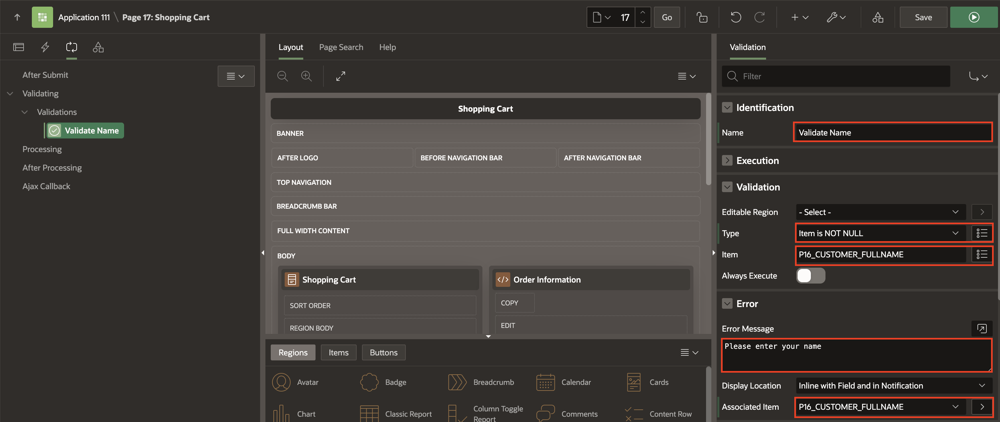
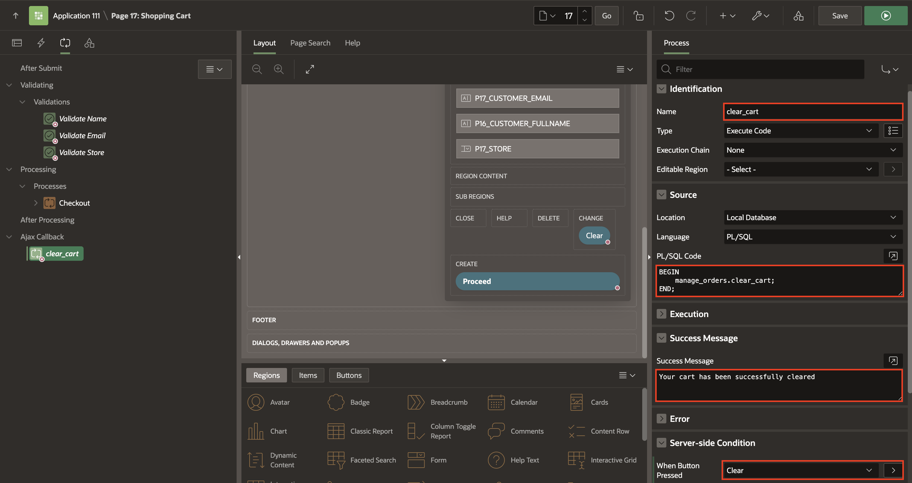
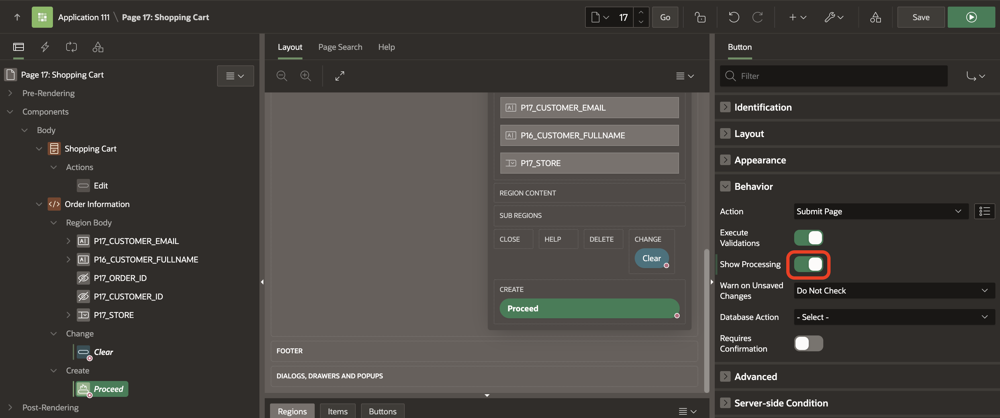

# Add Validations and Processes to the Shopping Cart Page

This lab is a collection of six tasks.  After completing this lab, your application will enable customers to:

This Hands-on Lab is a collection of six tasks.  After completing this lab, your application will enable customers to:

- Create validations on the Page Items.
- Create a Page process to create the Order
- Clear the shopping cart
- Proceed to checkout

Estimated Time: 15 minutes

## Objectives

In this lab, you:

- Create Validations, Processes and Branches to manage the Shopping Cart.

### Downloads

- Did you miss out on trying the previous labs?  Don't worry!  You can download the application from [here](https://c4u04.objectstorage.us-ashburn-1.oci.customer-oci.com/p/EcTjWk2IuZPZeNnD_fYMcgUhdNDIDA6rt9gaFj_WZMiL7VvxPBNMY60837hu5hga/n/c4u04/b/livelabsfiles/o/data-management-library-files/apex-23-2-object-storage-files/hol8.sql) and import it into your workspace.  To run the app, please run the steps described in **[Get Started with Oracle APEX](https://livelabs.oracle.com/pls/apex/r/dbpm/livelabs/run-workshop?p210_wid=3509)** and **[Using SQL Workshop](https://livelabs.oracle.com/pls/apex/r/dbpm/livelabs/run-workshop?p210_wid=3524)** workshops.

## Task 1: Create Validations on the Page

1. Navigate to the **App Builder**.

    

2. Click **Online Shopping Application**.

    

3. Select **17 - Shopping Cart** page.

    

4. In the Rendering tree (left pane), click the **Processing** tab. Right-click **Validating** and select **Create Validation**.

    

5. In the property editor, enter/select the following:

    - Identification > Name: **Validate Name**

    - Under Validation:

        - Type: **Item is NOT NULL**

        - Item: **P17\_CUSTOMER\_FULL_NAME

    - Error > Error Message: **Please enter your name.**

    - Server-side Condition > When Button Pressed: **Proceed**

    

6. Now, Create two more validations for the following items:  **Email**, and **Store**.

    

    | Name           | Validation > Type | Validation > Item       | Error Message                      | Associated Item         | Server-side Condition > When Button Pressed |
    | -------------- | ----------------- | ----------------------- | ------------------------------- |----------------------- | ------------- |
    | Validate Email | Item is NOT NULL  | P17\_CUSTOMER\_EMAIL    | Please enter your email address | P17\_CUSTOMER\_EMAIL    | Proceed |
    | Validate Store | Item is NOT NULL  | P17_STORE               | Please select a store           | P17_STORE               | Proceed |
    {: title="Validation Properties"}

    

    

## Task 2: Add a Process to Create the Order

1. Navigate to **Processing** tab (left pane). Right- click **Processing** and click **Create Process**.

    

2. In the Property Editor, enter/select the following:
    - Under Identification:

        - Name: **Checkout**

        - Type: **Invoke API**

    - Under Settings:

        - Type: **PL/SQL Package**

        - Package: **MANAGE_ORDERS**.  You can type in the name or pick from the list.

        - Procedure or Function: **CREATE_ORDER**,  defined in the selected PL/SQL package.  You can type in the name or pick from the list.

    

3. Expand the **Checkout** process. Under **Parameters**, Click **p_customer** and enter/select the following:
    - Under Value:

        - Type: **Item**

        - Value: **P17\_CUSTOMER\_FULLNAME**

    

4. Click **Save**.

## Task 3: Add Process to Clear the Shopping Cart

1. Right-click **Ajax Callback** and click **Create Process**.

    

2. In the property editor, enter/select the following:

    - Identification > Name - Enter **clear_cart**.

    - Source > PL/SQL Code: Copy and paste the below code:

    ```
    <copy>
    BEGIN
        manage_orders.clear_cart;
    END;
    ```
    </copy>

    - Success Message > Success Message: **Your cart has been successfully cleared**

    - Server-side Condition > When Button Pressed: **Clear**

    

3. Navigate to **Rendering** tab. Click **Clear** button and enter/select the following:

    - Under Behavior:

        - Action: **Redirect to Page in this Application**

        - Target: Click **No Linked Defined**

            - Target > Page: **1**

            - Advanced > Request: **APPLICATION_PROCESS=clear_cart**

            Click **OK**.

    

4. Click **Proceed** button. Under **Behavior**, enable **Show Processing**.

    This would avoid accidental multiple page submissions by displaying a processing animation and temporarily disabling page interaction using the new Show Processing attribute available for page buttons.

    

5. Click Save.

## Task 4: Add Branches to the Page

1. In the **Processing** tab (left pane), right-click **After Processing** and select **Create Branch**.

     

2. In the Property Editor, enter/select the following:

    - Identification > Name: **Go to Orders**

    - Target: click **No Link Defined**.
        - Type: **Page in this application**
        - Page: **16**
        - Set Items: Enter/select the following:

          | Name           | Value            |
          | -------------- | ---------------- |
          | P17\_ORDER\_ID | &P17\_ORDER\_ID. |
          {: title="List of Taregt Item(s)"}

        - Clear Cache: **17**.

        Click **OK**.

    - Server-side condition > When Button Pressed: **Proceed**.

    

3. Create a  second branch when the user clears the shopping cart.  Right-click on **After Processing** and click **Create Branch**.

4. In the Property Editor, enter the following:
    - Name > **Go to Products**

    - Navigate to the Target attribute and click **No Link Defined**
        - Type: **Page in this application**
        - Page: **1**
        - Clear Cache: enter **1**
        - Click **OK**

    - Server-side condition > When Button Pressed: **Clear**

    

  Click Save.

## Summary

In this hands-on lab, you learned to create data validations for page items, ensuring data accuracy.  You also implemented a dedicated page process to streamline order creation.  Additionally, the lab covered clearing the shopping cart and enabling a seamless transition to the checkout process, enhancing the overall user experience.  You may now **proceed to the next lab**.

## What's Next

In the next lab, you explore the use of Dynamic Actions to manage the shopping cart, allowing for efficient real-time updates.  Additionally, you learn how to review product details and enable users to add, edit, or remove items from their cart with the help of Page Process.

## Acknowledgements

- **Author** - Roopesh Thokala, Senior Product Manager; Ankita Beri, Product Manager
- **Last Updated By/Date** - Ankita Beri, Product Manager, September 2024
