# Configure Generative AI Service and Create a Data Model using AI

## Introduction

In this lab, you learn how to configure Generative AI Services to create a data model, build an application, generate SQL queries, Generate AI-powered text, and develop a chatbot. Ensure you have a secure key for accessing OCI Generative AI, OpenAI or Cohere services. You will then use Generative AI to create a data model that includes project statuses, milestones, tasks, to-dos, links, and comments—tools for efficient project management.

In this lab, you will explore how to use Generative AI Services to build a complete application. You will configure the Generative AI services to create a data model, generate SQL queries, produce AI-powered text, and develop a chatbot. Before starting, ensure you have a secure key to access OCI Generative AI, or OpenAI, or Cohere services.

Using Generative AI, you will design a data model tailored for project management, incorporating key elements such as project statuses, milestones, tasks, task to-dos, task links, and comments. These components will provide the foundation for building an efficient and interactive project management application.

Estimated Time: 5 minutes

### Objectives

In this lab, you will:

- Create/Configure Generative AI Services into your APEX Workspace.

- Create a Data Model using AI in Oracle APEX Workspace.

### What You will Need

- Sign up and Get access for one of the supported Generative AI Services like OCI Generative AI, OpenAI or Cohere.

- An Oracle Cloud paid account, or free trial.

- An APEX Workspace

## Task 1: Creating a Generative AI Service Object - Open AI

1. Log into your workspace.

2. From your APEX workspace home page, click **App Builder**

    

3. On the **App Builder** page, select **Workspace Utilities**.

    

4. Under Workspace Utilities, click **Generative AI**.

    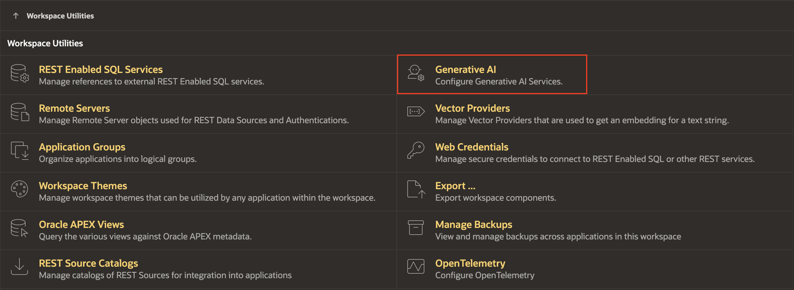

5. On the **Generative AI Services** page, click **Create**.

    

6. If AI Provider is Open AI, under **Create/Edit** Generative AI Service Page, enter the following details.

    - Under Identification:

        - AI Provider: **Open AI**

        - Name: **Open AI**

    - Settings > Used by App Builder: **Toggle On**

    - Credentials > API Key: Type 'Bearer **Enter the API Key you procured from OpenAI**'

    - Advanced > AI Model: **gpt-4o**

    >**Note:** When entering your API key, ensure you prepend it with **Bearer ' '**  (including a space after **Bearer**)*

7. To validate the information you enter prior to completing the setup, click **Test Connection**.

    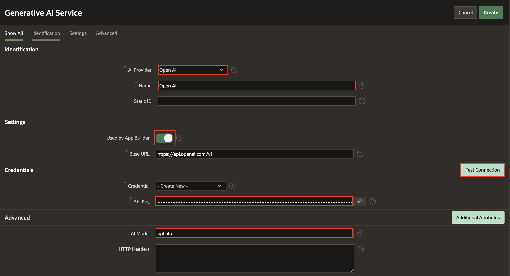

8. Once the Connection is Successful, click **Create**.

    

    

## Task 2: Create Event Management Data Model using AI

To create a data model with AI, you need to have a configured Generative AI Service and ensure the **Used by App Builder** is enabled. If no AI Service is available, the Create Data Model Using AI option will not be visible.

1. Login to your Application. On the Workspace home page, click **SQL Workshop**.

    

2. Click **Utilities**.

    

3. Click **Create Data Model Using AI**.

    

    

    >**Note:** You can also access Create Data Model Using AI directly from the Tasks list on the SQL Workshop home page.

4. When using Generative AI features within the APEX development environment, you will be asked to provide consent. In the **APEX Assistant** Wizard, if you see a Dialog regarding **consent**. Click on **Accept**.

    

5. Use the **APEX Assistant** Wizard to create a Data Model using AI. To create a Project Management Data Model, enter the prompt mentioned below. Make sure that you choose **Oracle SQL** for **SQL Format**.

    >Prompt:
    >Create a data model for an Event Management App. The data model should include events, sessions, speakers, venues and attendees

    

6. Enter another prompt to **Add Event Types**.

    >Prompt:
    >Add Event Types

    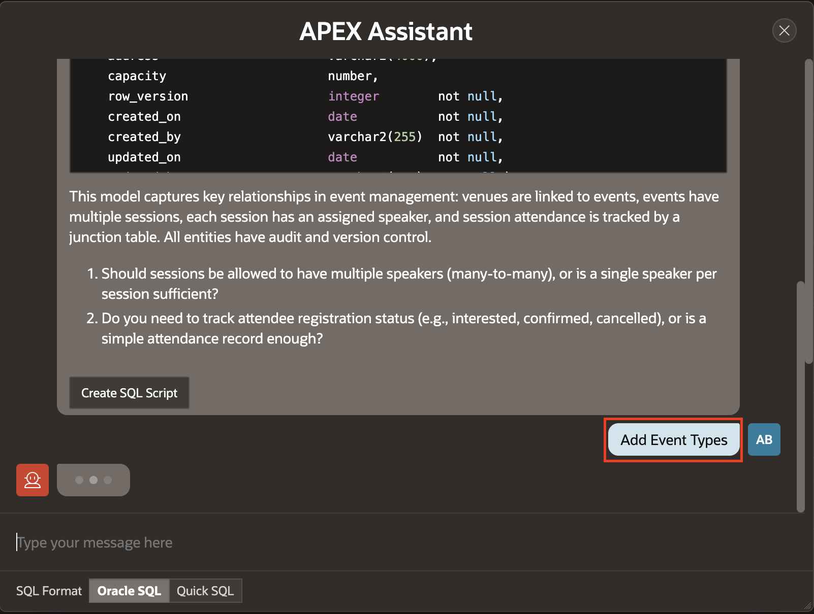

7. Add another prompt to update prefix of all database objects.

    >Prompt:
    >Prefix all objects with ev_

    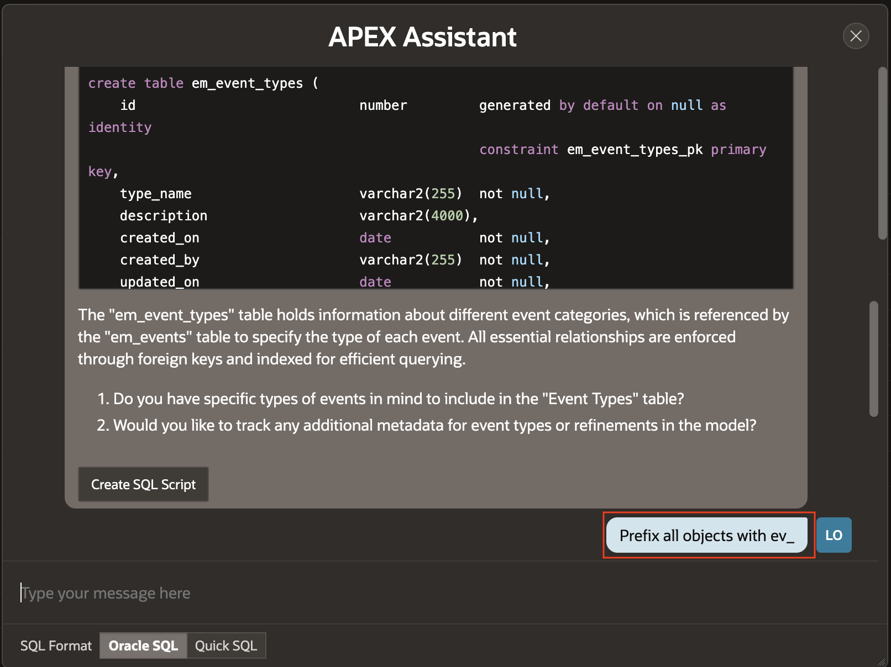

8. To complete the **SQL script**, click **Create SQL Script**.

    

9. For Script Name: Enter **Event Data Model**.

    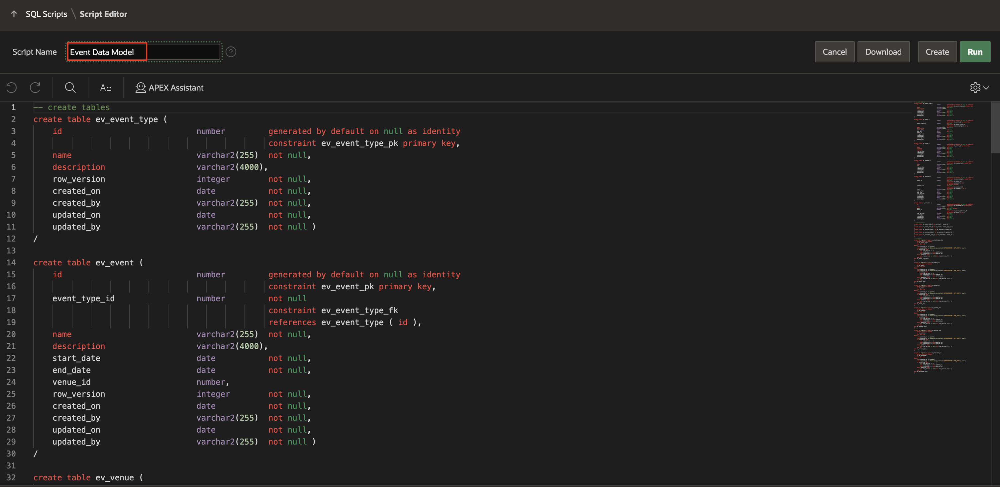

10. Now to add sample data into the tables. Click **APEX Assistant**.

    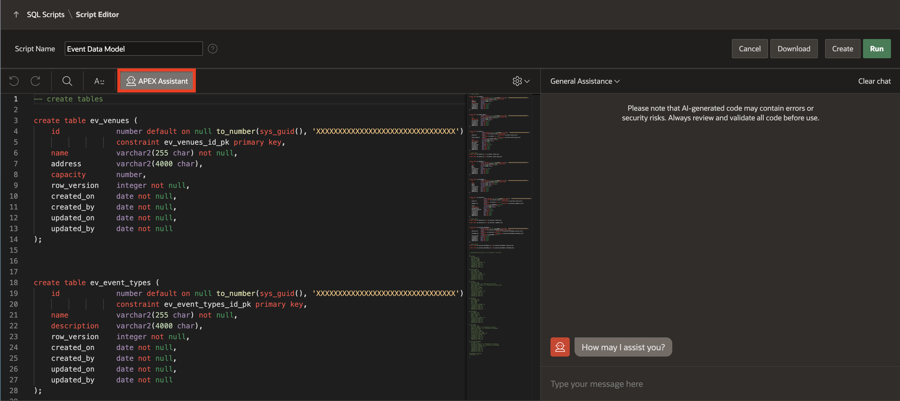

11. Select your SQL code and click **Use Selection** from the APEX Assistant box.

    

12. In APEX Assistant box, enter the prompt to generate sample data for that tables.

    >Prompt:
    >Generate Sample Data

    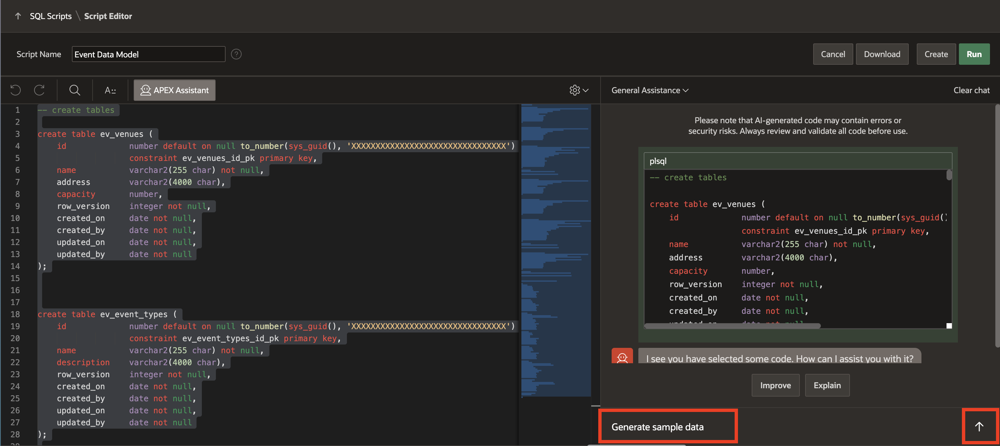

13. **Copy** the generated insert queries from the APEX Assistant box. insert it into the left code editor in the end.

    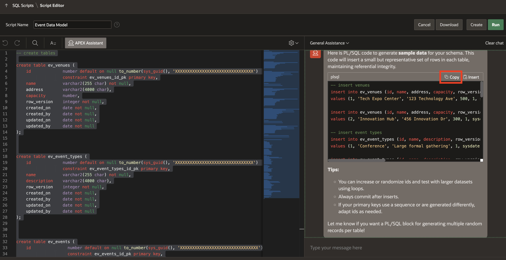

14. Paste the copied queries into the left code editor in the end.

    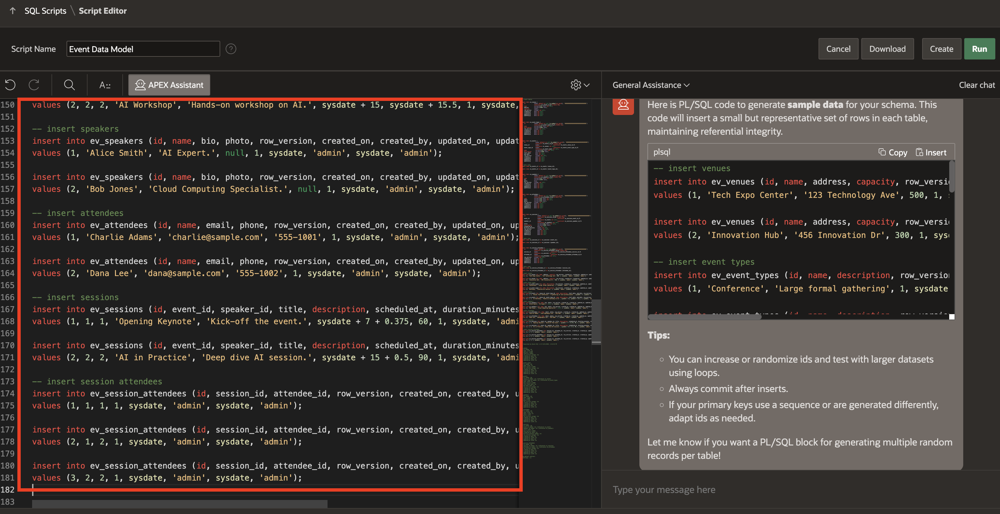

15. Replace the code editor with the below modified database objects code:

    ```
    <copy>
    -- create tables
    create table ev_venues (
    id            number generated by default on null as identity
                  constraint ev_venues_id_pk primary key,
    name          varchar2(255 char) not null,
    address       varchar2(4000 char),
    capacity      number,
    created       date not null,
    created_by    varchar2(255 char) not null,
    updated       date not null,
    updated_by    varchar2(255 char) not null );

    create table ev_event_types (
    id            number generated by default on null as identity
                  constraint ev_event_types_id_pk primary key,
    name          varchar2(255 char) not null,
    description   varchar2(4000 char),
    created       date not null,
    created_by    varchar2(255 char) not null,
    updated       date not null,
    updated_by    varchar2(255 char) not null
    );
    create table ev_events (
    id             number generated by default on null as identity
                   constraint ev_events_id_pk primary key,
    venue_id       number                   constraint ev_events_venue_id_fk
                   references ev_venues not null,
    event_type_id  number                   constraint ev_events_event_type_id_fk
                   references ev_event_types not null,
    name           varchar2(255 char) not null,
    description    varchar2(4000 char),
    start_date     date not null,
    end_date       date not null,
    created        date not null,
    created_by     varchar2(255 char) not null,
    updated        date not null,
    updated_by     varchar2(255 char) not null);
    -- table index
    create index ev_events_i1 on ev_events (venue_id);
    create index ev_events_i2 on ev_events (event_type_id);
    create table ev_speakers (
    id            number generated by default on null as identity
                  constraint ev_speakers_id_pk primary key,
    name          varchar2(255 char) not null,
    bio           varchar2(4000 char),
    email         varchar2(255 char),
    phone         varchar2(255 char),
    created       date not null,
    created_by    varchar2(255 char) not null,
    updated       date not null,
    updated_by    varchar2(255 char) not null);
    create table ev_attendees (
    id            number generated by default on null as identity
                  constraint ev_attendees_id_pk primary key,
    name          varchar2(255 char) not null,
    email         varchar2(255 char),
    phone         varchar2(255 char),
    created       date not null,
    created_by    varchar2(255 char) not null,
    updated       date not null,
    updated_by    varchar2(255 char) not null
    );
    create table ev_sessions (
    id                    number generated by default on null as identity
                          constraint ev_sessions_id_pk primary key,
    event_id              number                          constraint ev_sessions_event_id_fk
                          references ev_events not null,
    speaker_id            number                          constraint ev_sessions_speaker_id_fk
                          references ev_speakers not null,
    name                  varchar2(255 char) not null,
    description           varchar2(4000 char),
    session_start_date    date not null,
    session_end_date      date not null,
    created               date not null,
    created_by            varchar2(255 char) not null,
    updated               date not null,
    updated_by            varchar2(255 char) not null);
    -- table index
    create index ev_sessions_i1 on ev_sessions (event_id);
    create index ev_sessions_i2 on ev_sessions (speaker_id);
    create table ev_event_attendees (
    id             number generated by default on null as identity
                   constraint ev_event_attendees_id_pk primary key,
    event_id       number                   constraint ev_event_attendees_event_id_fk
                   references ev_events not null,
    attendee_id    number                   constraint ev_event_attendees_attendee_id_fk
                   references ev_attendees not null,
    created        date not null,
    created_by     varchar2(255 char) not null,
    updated        date not null,
    updated_by     varchar2(255 char) not null);

    -- table index
    create index ev_event_attendees_i1 on ev_event_attendees (event_id);

    create index ev_event_attendees_i2 on ev_event_attendees (attendee_id);

    -- triggers
    create or replace trigger ev_venues_biu
    before insert or update
    on ev_venues
    for each row
    begin
    if inserting then
        :new.created := sysdate;
        :new.created_by := coalesce(sys_context('APEX$SESSION','APP_USER'),user);
    end if;
    :new.updated := sysdate;
    :new.updated_by := coalesce(sys_context('APEX$SESSION','APP_USER'),user);
    end ev_venues_biu;
    /

    create or replace trigger ev_event_types_biu
    before insert or update
    on ev_event_types
    for each row
    begin
    if inserting then
        :new.created := sysdate;
        :new.created_by := coalesce(sys_context('APEX$SESSION','APP_USER'),user);
    end if;
    :new.updated := sysdate;
    :new.updated_by := coalesce(sys_context('APEX$SESSION','APP_USER'),user);
    end ev_event_types_biu;
    /

    create or replace trigger ev_events_biu
    before insert or update
    on ev_events
    for each row
    begin
    if inserting then
        :new.created := sysdate;
        :new.created_by := coalesce(sys_context('APEX$SESSION','APP_USER'),user);
    end if;
    :new.updated := sysdate;
    :new.updated_by := coalesce(sys_context('APEX$SESSION','APP_USER'),user);
    end ev_events_biu;
    /
    create or replace trigger ev_speakers_biu
    before insert or update
    on ev_speakers
    for each row
    begin
    if inserting then
        :new.created := sysdate;
        :new.created_by := coalesce(sys_context('APEX$SESSION','APP_USER'),user);
    end if;
    :new.updated := sysdate;
    :new.updated_by := coalesce(sys_context('APEX$SESSION','APP_USER'),user);
    end ev_speakers_biu;
    /
    create or replace trigger ev_attendees_biu
    before insert or update
    on ev_attendees
    for each row
    begin
    if inserting then
        :new.created := sysdate;
        :new.created_by := coalesce(sys_context('APEX$SESSION','APP_USER'),user);
    end if;
    :new.updated := sysdate;
    :new.updated_by := coalesce(sys_context('APEX$SESSION','APP_USER'),user);
    end ev_attendees_biu;
    /

    create or replace trigger ev_sessions_biu
    before insert or update
    on ev_sessions
    for each row
    begin
    if inserting then
        :new.created := sysdate;
        :new.created_by := coalesce(sys_context('APEX$SESSION','APP_USER'),user);
    end if;
    :new.updated := sysdate;
    :new.updated_by := coalesce(sys_context('APEX$SESSION','APP_USER'),user);
    end ev_sessions_biu;
    /

    create or replace trigger ev_event_attendees_biu
      before insert or update
      on ev_event_attendees
    for each row
    begin
    if inserting then
        :new.created := sysdate;
        :new.created_by := coalesce(sys_context('APEX$SESSION','APP_USER'),user);
    end if;
    :new.updated := sysdate;
    :new.updated_by := coalesce(sys_context('APEX$SESSION','APP_USER'),user);
    end ev_event_attendees_biu;
    /
    -- Sample Data Insert Scripts for Event Management System
    -- Events scheduled for July-August 2025 and November 2025

    -- Insert Event Types
    INSERT INTO ev_event_types (name, description) VALUES
    ('Conference', 'Large-scale professional gatherings with multiple speakers and sessions');
    INSERT INTO ev_event_types (name, description) VALUES
    ('Roadshow', 'Series of events held in different locations to promote products or services');
    INSERT INTO ev_event_types (name, description) VALUES
    ('Webinar', 'Online seminar or presentation conducted over the internet');
    INSERT INTO ev_event_types (name, description) VALUES
    ('Bootcamp', 'Intensive training program designed to rapidly build skills');
    INSERT INTO ev_event_types (name, description) VALUES
    ('Meetup', 'Informal gathering of people with shared interests');
    INSERT INTO ev_event_types (name, description) VALUES
    ('Hackathon', 'Event where programmers collaborate intensively on software projects');
    INSERT INTO ev_event_types (name, description) VALUES
    ('Workshop', 'Hands-on learning session with practical exercises');
    INSERT INTO ev_event_types (name, description) VALUES
    ('Summit', 'High-level meeting of experts or leaders in a particular field');

    -- Insert Venues
    INSERT INTO ev_venues (name, address, capacity) VALUES
    ('Tech Convention Center', '123 Innovation Drive, San Francisco, CA 94105', 2500);
    INSERT INTO ev_venues (name, address, capacity) VALUES
    ('Downtown Conference Hall', '456 Business Blvd, New York, NY 10001', 800);
    INSERT INTO ev_venues (name, address, capacity) VALUES
    ('Innovation Hub', '789 Startup Street, Austin, TX 78701', 300);
    INSERT INTO ev_venues (name, address, capacity) VALUES
    ('Virtual Event Platform', 'Online', 5000);
    INSERT INTO ev_venues (name, address, capacity) VALUES
    ('Grand Ballroom Hotel', '321 Luxury Ave, Chicago, IL 60601', 1200);
    INSERT INTO ev_venues (name, address, capacity) VALUES
    ('Tech Park Auditorium', '654 Silicon Valley Way, Palo Alto, CA 94301', 500);
    INSERT INTO ev_venues (name, address, capacity) VALUES
    ('Community Center', '987 Main Street, Denver, CO 80202', 200);
    INSERT INTO ev_venues (name, address, capacity) VALUES
    ('University Lecture Hall', '147 Campus Drive, Boston, MA 02101', 400);
    INSERT INTO ev_venues (name, address, capacity) VALUES
    ('Moscone Center', '747 Howard Street, San Francisco, CA 94103', 3000);
    INSERT INTO ev_venues (name, address, capacity) VALUES
    ('Co-working Space', '258 Entrepreneur Lane, Seattle, WA 98101', 150);

    -- Insert Speakers
    INSERT INTO ev_speakers (name, bio, email, phone) VALUES
    ('Sarah Johnson', 'Oracle APEX Lead Developer with 10+ years experience in enterprise applications', 'sarah.johnson@email.com', '555-0101');
    INSERT INTO ev_speakers (name, bio, email, phone) VALUES
    ('Michael Chen', 'Cloud Architecture Expert and AWS Certified Solutions Architect', 'michael.chen@email.com', '555-0102');
    INSERT INTO ev_speakers (name, bio, email, phone) VALUES
    ('Dr. Emily Rodriguez', 'Data Science Professor and Machine Learning Researcher', 'emily.rodriguez@email.com', '555-0103');
    INSERT INTO ev_speakers (name, bio, email, phone) VALUES
    ('James Wilson', 'Full-stack Developer and Open Source Contributor', 'james.wilson@email.com', '555-0104');
    INSERT INTO ev_speakers (name, bio, email, phone) VALUES
    ('Lisa Thompson', 'DevOps Engineer and Kubernetes Expert', 'lisa.thompson@email.com', '555-0105');
    INSERT INTO ev_speakers (name, bio, email, phone) VALUES
    ('Robert Kim', 'Cybersecurity Specialist and Ethical Hacker', 'robert.kim@email.com', '555-0106');
    INSERT INTO ev_speakers (name, bio, email, phone) VALUES
    ('Maria Garcia', 'UX Designer and Product Strategy Consultant', 'maria.garcia@email.com', '555-0107');
    INSERT INTO ev_speakers (name, bio, email, phone) VALUES
    ('David Brown', 'Oracle Database Administrator and Performance Tuning Expert', 'david.brown@email.com', '555-0108');
    INSERT INTO ev_speakers (name, bio, email, phone) VALUES
    ('Jennifer Lee', 'Agile Coach and Scrum Master', 'jennifer.lee@email.com', '555-0109');
    INSERT INTO ev_speakers (name, bio, email, phone) VALUES
    ('Alex Turner', 'Blockchain Developer and Cryptocurrency Expert', 'alex.turner@email.com', '555-0110');
    INSERT INTO ev_speakers (name, bio, email, phone) VALUES
    ('Rachel Green', 'Mobile App Developer specializing in React Native', 'rachel.green@email.com', '555-0111');
    INSERT INTO ev_speakers (name, bio, email, phone) VALUES
    ('Tom Anderson', 'Oracle APEX Consultant and Community Leader', 'tom.anderson@email.com', '555-0112');

    -- Insert Attendees
    INSERT INTO ev_attendees (name, email, phone) VALUES
    ('John Smith', 'john.smith@company.com', '555-1001');
    INSERT INTO ev_attendees (name, email, phone) VALUES
    ('Anna Davis', 'anna.davis@tech.com', '555-1002');
    INSERT INTO ev_attendees (name, email, phone) VALUES
    ('Mike Johnson', 'mike.johnson@startup.com', '555-1003');
    INSERT INTO ev_attendees (name, email, phone) VALUES
    ('Sophie Wilson', 'sophie.wilson@enterprise.com', '555-1004');
    INSERT INTO ev_attendees (name, email, phone) VALUES
    ('Carlos Rodriguez', 'carlos.rodriguez@consulting.com', '555-1005');
    INSERT INTO ev_attendees (name, email, phone) VALUES
    ('Emma Thompson', 'emma.thompson@university.edu', '555-1006');
    INSERT INTO ev_attendees (name, email, phone) VALUES
    ('Ryan Lee', 'ryan.lee@freelance.com', '555-1007');
    INSERT INTO ev_attendees (name, email, phone) VALUES
    ('Olivia Brown', 'olivia.brown@agency.com', '555-1008');
    INSERT INTO ev_attendees (name, email, phone) VALUES
    ('Daniel Kim', 'daniel.kim@corporation.com', '555-1009');
    INSERT INTO ev_attendees (name, email, phone) VALUES
    ('Grace Taylor', 'grace.taylor@nonprofit.org', '555-1010');

    -- Insert Events (July-August 2025 and November 2025)

    -- July 2025 Events
    INSERT INTO ev_events (venue_id, event_type_id, name, description, start_date, end_date) VALUES
    (1, 1, 'Tech Innovation Conference 2025', 'Annual conference showcasing the latest in technology innovation and digital transformation', DATE '2025-07-15', DATE '2025-07-17');

    INSERT INTO ev_events (venue_id, event_type_id, name, description, start_date, end_date) VALUES
    (4, 3, 'Cloud Computing Webinar Series', 'Three-part webinar series covering AWS, Azure, and Google Cloud Platform best practices', DATE '2025-07-08', DATE '2025-07-08');

    INSERT INTO ev_events (venue_id, event_type_id, name, description, start_date, end_date) VALUES
    (3, 4, 'Full-Stack Development Bootcamp', 'Intensive 5-day bootcamp covering modern web development technologies', DATE '2025-07-22', DATE '2025-07-26');

    INSERT INTO ev_events (venue_id, event_type_id, name, description, start_date, end_date) VALUES
    (7, 5, 'Local Developers Meetup', 'Monthly meetup for local developers to network and share knowledge', DATE '2025-07-30', DATE '2025-07-30');

    -- August 2025 Events
    INSERT INTO ev_events (venue_id, event_type_id, name, description, start_date, end_date) VALUES
    (6, 6, 'AI/ML Hackathon', '48-hour hackathon focused on artificial intelligence and machine learning solutions', DATE '2025-08-05', DATE '2025-08-07');

    INSERT INTO ev_events (venue_id, event_type_id, name, description, start_date, end_date) VALUES
    (2, 2, 'Cybersecurity Roadshow', 'Multi-city roadshow covering enterprise security best practices', DATE '2025-08-12', DATE '2025-08-14');

    INSERT INTO ev_events (venue_id, event_type_id, name, description, start_date, end_date) VALUES
    (8, 7, 'UX Design Workshop', 'Hands-on workshop covering user experience design principles and tools', DATE '2025-08-19', DATE '2025-08-20');

    INSERT INTO ev_events (venue_id, event_type_id, name, description, start_date, end_date) VALUES
    (4, 3, 'Database Performance Tuning Webinar', 'Advanced techniques for optimizing Oracle database performance', DATE '2025-08-25', DATE '2025-08-25');

    INSERT INTO ev_events (venue_id, event_type_id, name, description, start_date, end_date) VALUES
    (10, 5, 'Startup Networking Meetup', 'Networking event for entrepreneurs and startup enthusiasts', DATE '2025-08-28', DATE '2025-08-28');

    -- October 2025 Events
    INSERT INTO ev_events (venue_id, event_type_id, name, description, start_date, end_date) VALUES
    (1, 8, 'Oracle AI World 2025', 'Premier global conference showcasing Oracle AI innovations and enterprise AI solutions', DATE '2025-10-13', DATE '2025-10-16');

    -- November 2025 Events
    INSERT INTO ev_events (venue_id, event_type_id, name, description, start_date, end_date) VALUES
    (9, 8, 'Oracle APEX Summit 2025', 'Premier conference for Oracle Application Express developers and users', DATE '2025-11-15', DATE '2025-11-17');

    INSERT INTO ev_events (venue_id, event_type_id, name, description, start_date, end_date) VALUES
    (5, 1, 'DevOps and Automation Conference', 'Conference focusing on DevOps practices, CI/CD, and infrastructure automation', DATE '2025-11-08', DATE '2025-11-10');

    INSERT INTO ev_events (venue_id, event_type_id, name, description, start_date, end_date) VALUES
    (4, 3, 'Mobile Development Trends Webinar', 'Exploring the latest trends in iOS and Android development', DATE '2025-11-22', DATE '2025-11-22');

    INSERT INTO ev_events (venue_id, event_type_id, name, description, start_date, end_date) VALUES
    (1, 6, 'Blockchain Innovation Hackathon', 'Weekend hackathon exploring blockchain and cryptocurrency technologies', DATE '2025-11-29', DATE '2025-12-01');

    -- Insert Sessions for Oracle AI World 2025
    INSERT INTO ev_sessions (event_id, speaker_id, name, description, session_start_date, session_end_date) VALUES
    (10, 3, 'Oracle AI Services: Enterprise Ready Solutions', 'Overview of Oracle AI services and their enterprise applications', DATE '2025-10-13' + INTERVAL '9' HOUR, DATE '2025-10-13' + INTERVAL '10' HOUR + INTERVAL '30' MINUTE);

    INSERT INTO ev_sessions (event_id, speaker_id, name, description, session_start_date, session_end_date) VALUES
    (10, 2, 'AI-Driven Database Management', 'How Oracle Autonomous Database leverages AI for self-managing capabilities', DATE '2025-10-13' + INTERVAL '11' HOUR, DATE '2025-10-13' + INTERVAL '12' HOUR + INTERVAL '30' MINUTE);

    INSERT INTO ev_sessions (event_id, speaker_id, name, description, session_start_date, session_end_date) VALUES
    (10, 3, 'Machine Learning at Scale with Oracle Cloud', 'Building and deploying ML models using Oracle Cloud Infrastructure', DATE '2025-10-13' + INTERVAL '14' HOUR, DATE '2025-10-13' + INTERVAL '15' HOUR + INTERVAL '30' MINUTE);

    INSERT INTO ev_sessions (event_id, speaker_id, name, description, session_start_date, session_end_date) VALUES
    (10, 8, 'AI-Powered Analytics and Business Intelligence', 'Leveraging AI for advanced analytics and decision making', DATE '2025-10-14' + INTERVAL '9' HOUR, DATE '2025-10-14' + INTERVAL '10' HOUR + INTERVAL '30' MINUTE);

    -- Insert Sessions for Oracle APEX Summit 2025
    INSERT INTO ev_sessions (event_id, speaker_id, name, description, session_start_date, session_end_date) VALUES
    (11, 1, 'APEX 23.2 New Features Deep Dive', 'Comprehensive overview of the latest Oracle APEX features and enhancements', DATE '2025-11-15' + INTERVAL '9' HOUR, DATE '2025-11-15' + INTERVAL '10' HOUR + INTERVAL '30' MINUTE);

    INSERT INTO ev_sessions (event_id, speaker_id, name, description, session_start_date, session_end_date) VALUES
    (11, 12, 'Building Modern Applications with APEX', 'Best practices for creating contemporary web applications using Oracle APEX', DATE '2025-11-15' + INTERVAL '11' HOUR, DATE '2025-11-15' + INTERVAL '12' HOUR + INTERVAL '30' MINUTE);

    INSERT INTO ev_sessions (event_id, speaker_id, name, description, session_start_date, session_end_date) VALUES
    (11, 8, 'APEX Performance Optimization', 'Techniques for improving Oracle APEX application performance and scalability', DATE '2025-11-15' + INTERVAL '14' HOUR, DATE '2025-11-15' + INTERVAL '15' HOUR + INTERVAL '30' MINUTE);

    INSERT INTO ev_sessions (event_id, speaker_id, name, description, session_start_date, session_end_date) VALUES
    (11, 1, 'APEX Security Best Practices', 'Essential security considerations for Oracle APEX applications', DATE '2025-11-16' + INTERVAL '9' HOUR, DATE '2025-11-16' + INTERVAL '10' HOUR + INTERVAL '30' MINUTE);

    -- Insert Sessions for Tech Innovation Conference
    INSERT INTO ev_sessions (event_id, speaker_id, name, description, session_start_date, session_end_date) VALUES
    (1, 2, 'Cloud-Native Architecture Patterns', 'Modern approaches to building scalable cloud applications', DATE '2025-07-15' + INTERVAL '9' HOUR, DATE '2025-07-15' + INTERVAL '10' HOUR + INTERVAL '30' MINUTE);

    INSERT INTO ev_sessions (event_id, speaker_id, name, description, session_start_date, session_end_date) VALUES
    (1, 3, 'Machine Learning in Production', 'Best practices for deploying ML models at scale', DATE '2025-07-15' + INTERVAL '11' HOUR, DATE '2025-07-15' + INTERVAL '12' HOUR + INTERVAL '30' MINUTE);

    INSERT INTO ev_sessions (event_id, speaker_id, name, description, session_start_date, session_end_date) VALUES
    (1, 7, 'The Future of User Experience', 'Trends and predictions in UX design and human-computer interaction', DATE '2025-07-15' + INTERVAL '14' HOUR, DATE '2025-07-15' + INTERVAL '15' HOUR + INTERVAL '30' MINUTE);

    -- Insert Sessions for other events
    INSERT INTO ev_sessions (event_id, speaker_id, name, description, session_start_date, session_end_date) VALUES
    (3, 4, 'Modern JavaScript Frameworks', 'Comparing React, Vue, and Angular for modern web development', DATE '2025-07-22' + INTERVAL '9' HOUR, DATE '2025-07-22' + INTERVAL '12' HOUR);

    INSERT INTO ev_sessions (event_id, speaker_id, name, description, session_start_date, session_end_date) VALUES
    (5, 3, 'AI Ethics and Bias Detection', 'Identifying and mitigating bias in machine learning models', DATE '2025-08-05' + INTERVAL '10' HOUR, DATE '2025-08-05' + INTERVAL '11' HOUR + INTERVAL '30' MINUTE);

    INSERT INTO ev_sessions (event_id, speaker_id, name, description, session_start_date, session_end_date) VALUES
    (6, 6, 'Zero Trust Security Model', 'Implementing zero trust architecture in enterprise environments', DATE '2025-08-12' + INTERVAL '9' HOUR, DATE '2025-08-12' + INTERVAL '10' HOUR + INTERVAL '30' MINUTE);

    -- Insert Event Attendees (sample registrations)
    INSERT INTO ev_event_attendees (event_id, attendee_id) VALUES (1, 1);
    INSERT INTO ev_event_attendees (event_id, attendee_id) VALUES (1, 2);
    INSERT INTO ev_event_attendees (event_id, attendee_id) VALUES (1, 3);
    INSERT INTO ev_event_attendees (event_id, attendee_id) VALUES (1, 4);
    INSERT INTO ev_event_attendees (event_id, attendee_id) VALUES (1, 5);

    INSERT INTO ev_event_attendees (event_id, attendee_id) VALUES (10, 1);
    INSERT INTO ev_event_attendees (event_id, attendee_id) VALUES (10, 2);
    INSERT INTO ev_event_attendees (event_id, attendee_id) VALUES (10, 3);
    INSERT INTO ev_event_attendees (event_id, attendee_id) VALUES (10, 6);
    INSERT INTO ev_event_attendees (event_id, attendee_id) VALUES (10, 9);

    INSERT INTO ev_event_attendees (event_id, attendee_id) VALUES (11, 1);
    INSERT INTO ev_event_attendees (event_id, attendee_id) VALUES (11, 2);
    INSERT INTO ev_event_attendees (event_id, attendee_id) VALUES (11, 6);
    INSERT INTO ev_event_attendees (event_id, attendee_id) VALUES (11, 7);
    INSERT INTO ev_event_attendees (event_id, attendee_id) VALUES (11, 8);

    INSERT INTO ev_event_attendees (event_id, attendee_id) VALUES (3, 3);
    INSERT INTO ev_event_attendees (event_id, attendee_id) VALUES (3, 4);
    INSERT INTO ev_event_attendees (event_id, attendee_id) VALUES (3, 9);
    INSERT INTO ev_event_attendees (event_id, attendee_id) VALUES (3, 10);

    INSERT INTO ev_event_attendees (event_id, attendee_id) VALUES (5, 1);
    INSERT INTO ev_event_attendees (event_id, attendee_id) VALUES (5, 5);
    INSERT INTO ev_event_attendees (event_id, attendee_id) VALUES (5, 6);

    INSERT INTO ev_event_attendees (event_id, attendee_id) VALUES (6, 2);
    INSERT INTO ev_event_attendees (event_id, attendee_id) VALUES (6, 7);
    INSERT INTO ev_event_attendees (event_id, attendee_id) VALUES (6, 8);

    INSERT INTO ev_event_attendees (event_id, attendee_id) VALUES (12, 1);
    INSERT INTO ev_event_attendees (event_id, attendee_id) VALUES (12, 3);
    INSERT INTO ev_event_attendees (event_id, attendee_id) VALUES (12, 5);
    INSERT INTO ev_event_attendees (event_id, attendee_id) VALUES (12, 9);

     -- Commit all changes
    COMMIT;
    ```
    </copy>

16. After replacing the code, click **Run** and confirm it with **Yes**.

    

17. Review the summary and then click **Run Now**.

    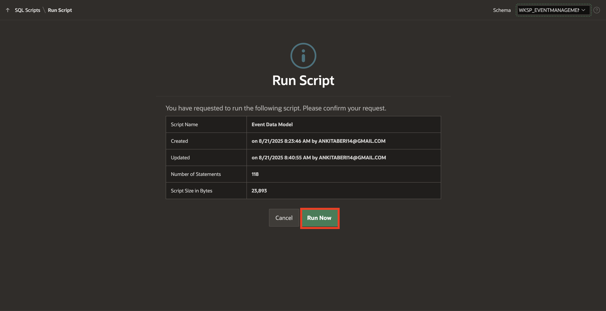

18. We can see that all the statements were run successfully.

    

>**Note:** You do NOT want to click Create Application, as you will use Generative AI to create an application later.

## Task 3: Review Database Objects

1. Navigate to **SQL Workshop** > **Object Browser**.

    

2. Click on tables to view different tables and then you will see various tabs, such as Data, Constraints, and so forth, to review the table details.

    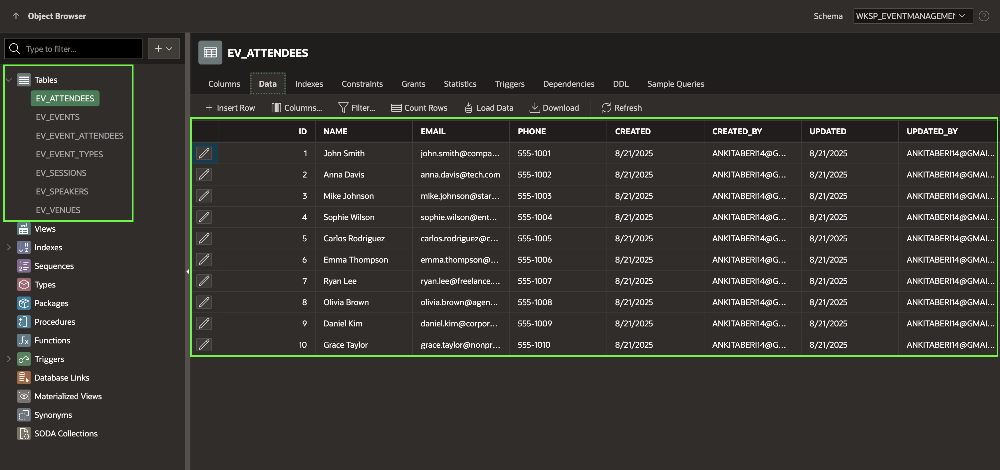

## Summary

You now know how to configure Generative AI Services using Workspace Utilities and Create a Data Model using AI. You may now **proceed to the next lab**.

## Acknowledgments

- **Author** - Ankita Beri, Product Manager
- **Last Updated By/Date** - Ankita Beri Product Manager, August 2025
