# Enhance UI with APEX Assistant

## Introduction

In this lab, you will learn how to modernize a classic report in Oracle APEX by converting it into a content row layout. You will also explore how to enhance the report presentation with features like avatars, badges, and title links. Additionally, you will use APEX Assistant to modify SQL queries and generate dynamic HTML for improved descriptions. These enhancements demonstrate how APEX makes it easy to combine low-code development with AI-assisted productivity tools, resulting in a richer and more engaging user experience.

### Objectives

By the end of this lab, you will be able to:

- Convert a classic report into a content row layout to improve readability and design.

- Use APEX Assistant in the code editor to extend SQL queries and generate HTML.

- Enhance the report with avatars, badges, and hyperlinks for better interactivity.

## Task 1: Convert a Classic Report into a Content Row

1. From the runtime environment, navigate to your faceted search page. For this demo the page is **Discover Events**. The name might differ because app has been generated using AI.

    

2. From the developer toolbar, click **Page 3**.

    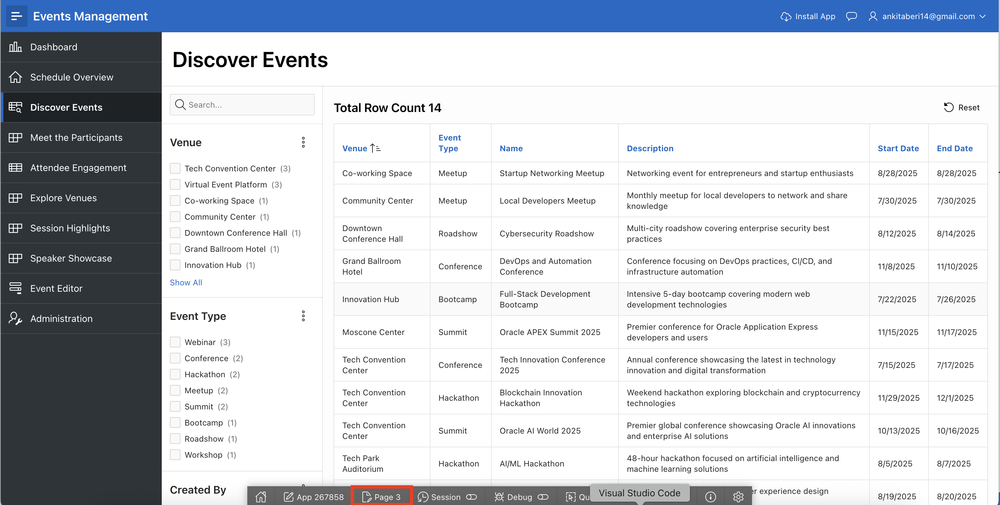

3. Select **Events** region. In the Property Editor, select the following:

    - Identification > Type: **Content Row**

    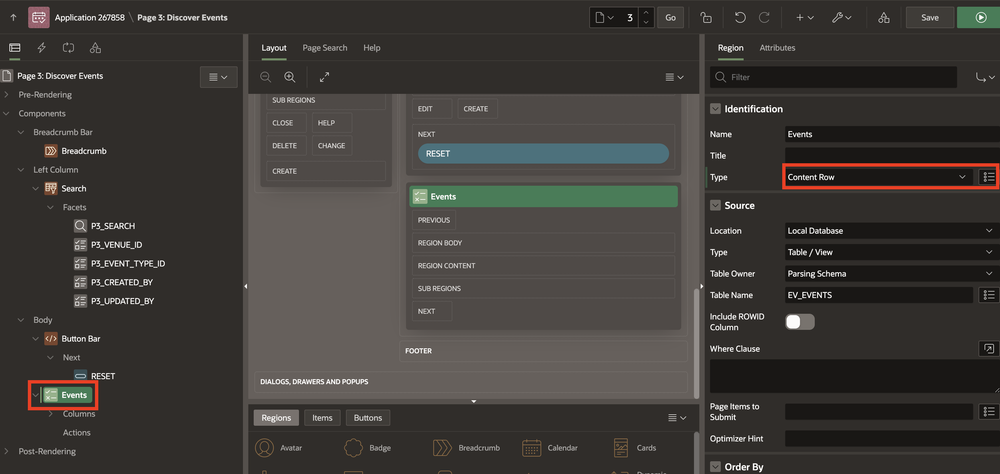

4. Navigate to **Attributes**. In the Property Editor, enter/select the following:

    - Under Settings:

        - Name: **&NAME.**

        - Description: **&DESCRIPTION.**

        - Display Avatar: Toggle **On**

    - Avatar > Icon: **fa-calender-month**

    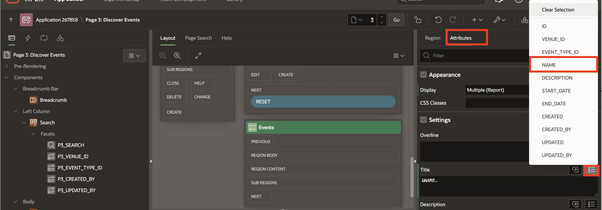

    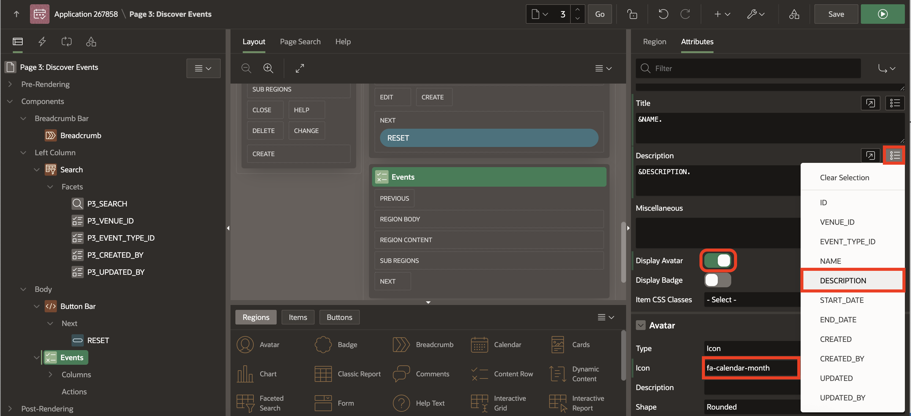

5. Navigate back to **Region** tab. In the Property Editor, update **Source > Type** to **SQL Query** and open the code editor of SQL Query.

    

6. Select the SQL Query. Click **APEX Assistant** and add the following prompt:

    >Prompt 1:
    > Add venue and event type

    

7. Click **Insert**.

    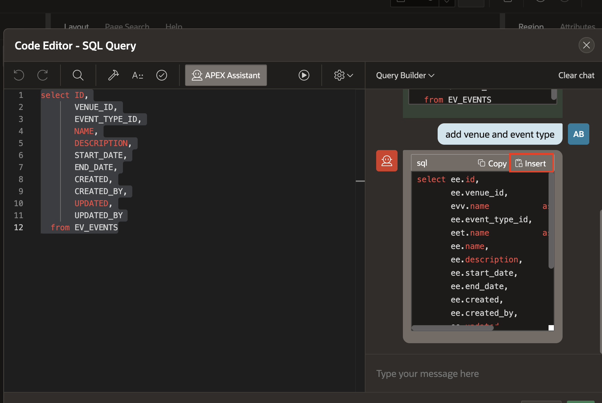

8. Click **OK** to close the dialog.

    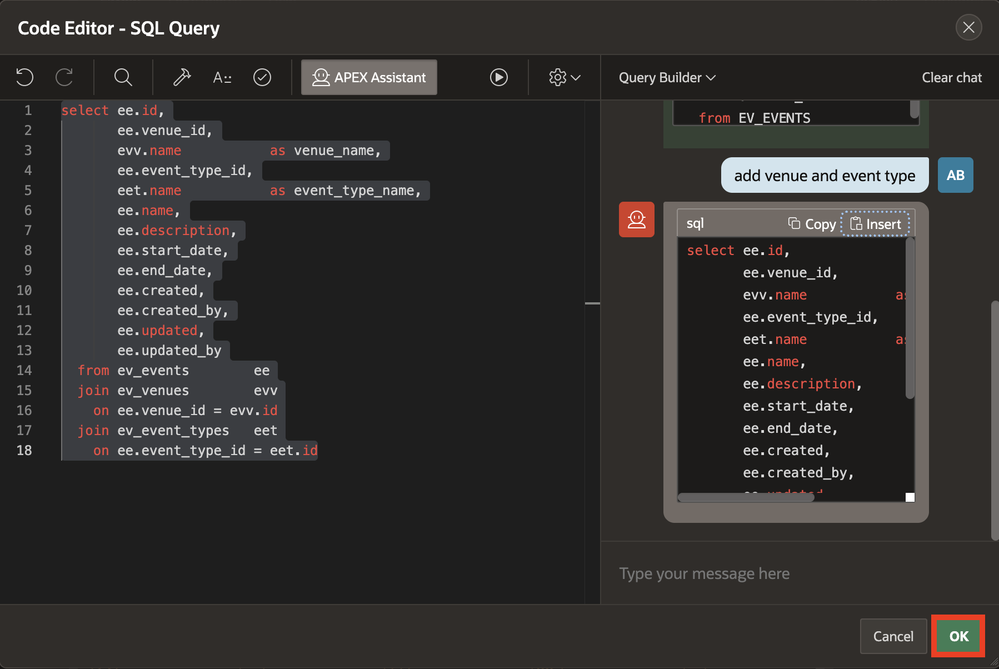

9. Again, navigate back to **Attributes** tab and open the code editor of **Description**.

    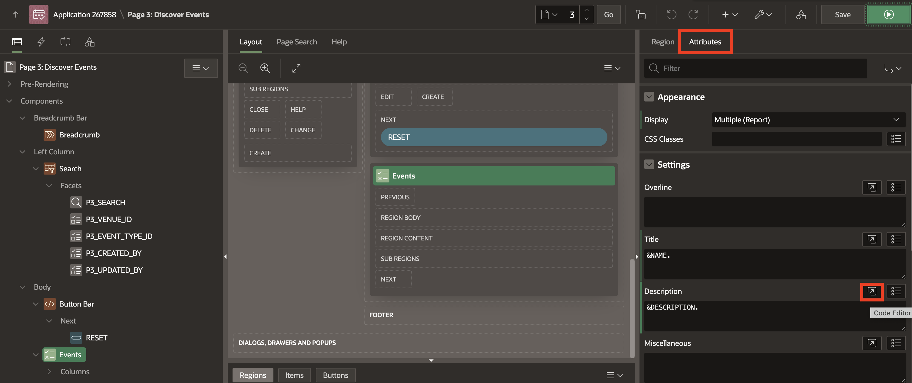

10. Select **&DESCRIPTION.** and click **APEX Assistant**. Now add the following prompts:

    > Prompt 1:
    > Generate a HTML to display start date and venue as a labelled information using span tag.

    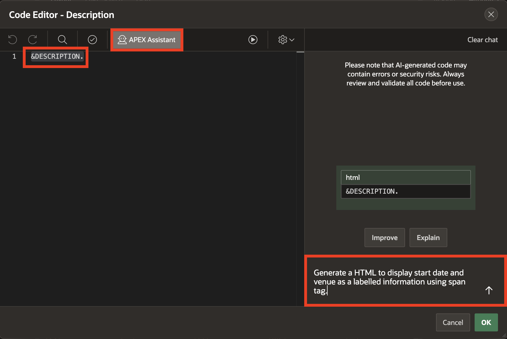

    > Prompt 2:
    > use APEX substitution strings

    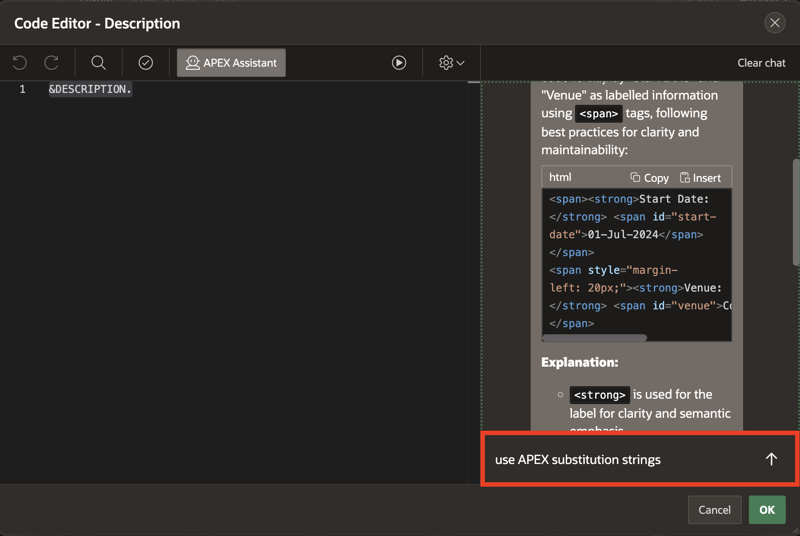

    > Prompt 3:
    > Display it below description

    

11. Click **Insert** and **OK**.

    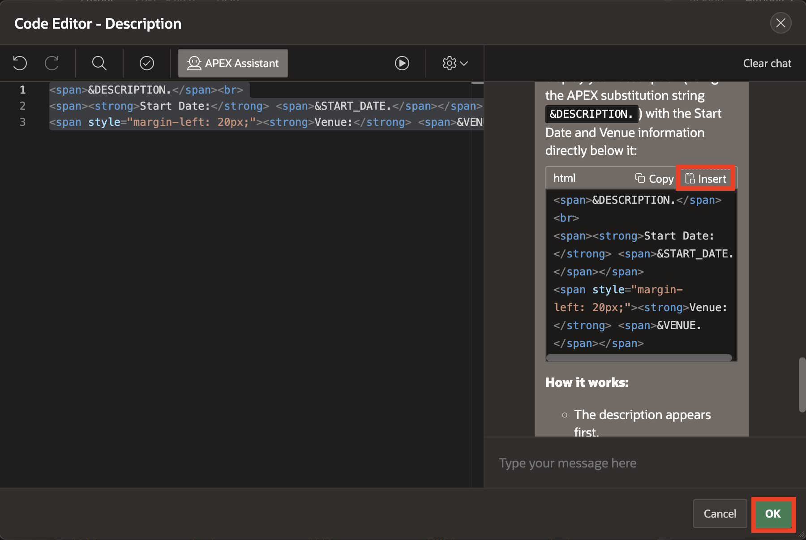

12. Click **Save and Run**.

    

13. Now, view the updated content row report using APEX Assistant.

    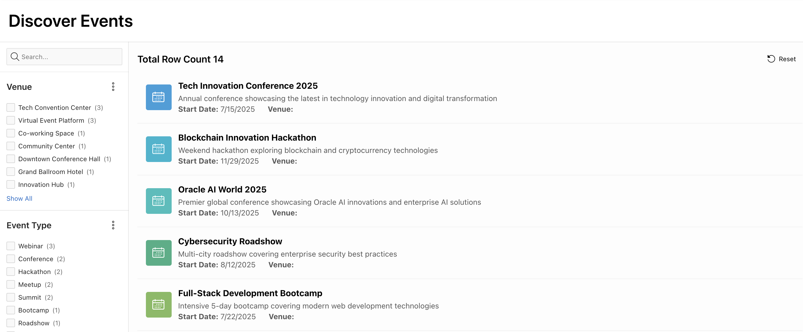

14. Next, let's add a badge to the content row. Navigate back to the page designer. Navigate to **Attributes** tab and enter/select the following:

    - Settings > Display Badge: Toggle **On**

    - Under Badge:

        - Label: **&EVENT_TYPE_ID.**

        - Value: **EVENT_TYPE_NAME**

        - Position: **End**

        - Alignment: **Center**

    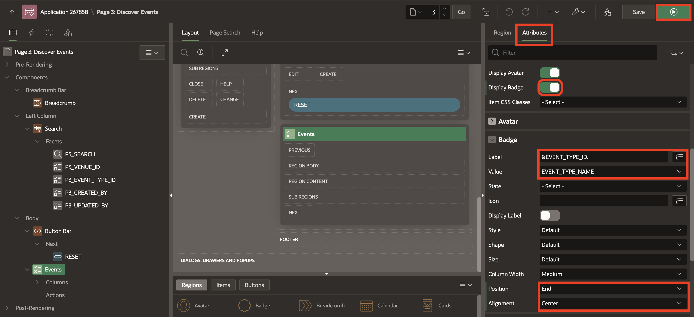

15. Click **Save and Run** and view the changes.

    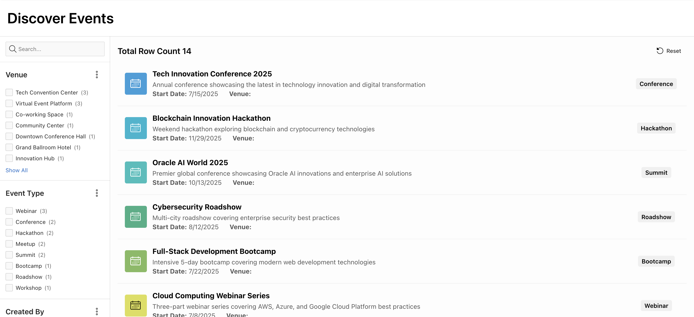

16. Next, let's add hyperlink to title and open a form page. Navigate back to the page designer. Under **Events** region, right-click **Actions** and click **Create Action**.

    

17. In the Property Editor, enter/select the following:

    - Identification > Position: **Title Link**

    - Link > Target: Click **No Link Defined**

        - Set Items:

        | Name | Value |
        | ----- | ---- |
        | P11_ID | &ID.|

        - Clear Cache: **11**

        Click **OK**.

    

18. Click **Save and Run** and view the changes.

    

    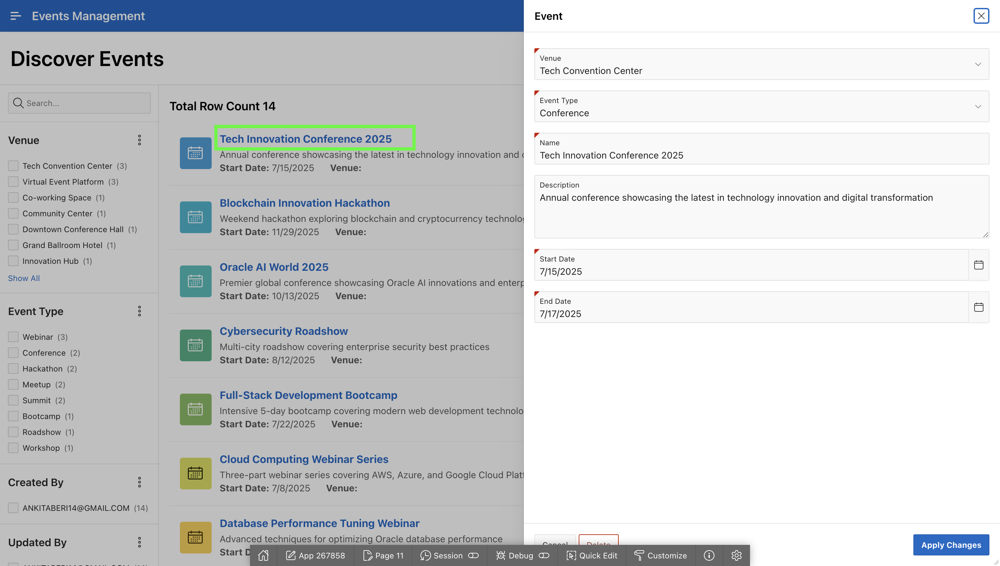

## **Summary**

In this lab, you transformed a classic report into a content row layout, improving the overall presentation of data. You learned how to enhance the report with avatars, badges, and title links, making it more interactive and visually appealing. You also used APEX Assistant to modify SQL queries and generate custom HTML within the description, showcasing how AI integration within APEX accelerates development and improves application design.

## **Acknowledgments**

- **Author** - Ankita Beri, Product Manager
- **Last Updated By/Date** - Ankita Beri, Product Manager, August 2025

