# Create a Movies Vector Search Page using Search Configurations

## Introduction

In this lab, you will learn how to load ONNX models into Oracle Database and create a Vector Provider to generate vector embeddings. You will create Search Configuration based on Oracle Vector Search to build an efficient search system. Finally, you will create a search page that utilizes these search configurations for powerful and accurate search functionality.

> *Note: This lab assumes you are using Oracle Database 23ai.*

Estimated Time: 15 minutes

### Objectives

- Load ONNX Models.

- Create a Vector Provider.

- Generate Vector Embeddings.

- Create and Synchronize a REST Data Source for Popular Movies by Importing Its Data into a New Local Table.

- Create Search Configuration based on Oracle Vector Search.

- Create a Search Page.

## Task 1: Load ONNX Model to Oracle Database

In this lab, you will create a Database View for your APEX application, containing all the necessary project-related information. This view will be used when adding RAG Sources to AI Configurations. Next, you will go to the AI Attributes page and set the Generative AI Service name to the one configured in Lab 1.

Before uploading the ONNX model to your database schema, you must grant the schema the privilege to create mining models while logged in as SYS/ADMIN.

- Login as SYS/Admin User and execute the below command.

- Command: GRANT create mining model TO *YourSchemaName*;

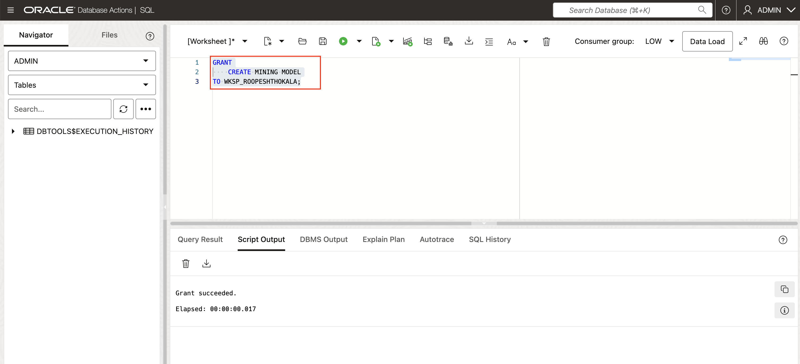

1. Navigate to **SQL Workshop** and select **SQL Commands**.

    

2. In the SQL Commands Page, copy and paste the below code and click **Run**.

    ```
    <copy>
        DECLARE
        L_PAR_URL       VARCHAR2(1000);
        L_RESPONSE_BLOB BLOB;
        BEGIN
            L_PAR_URL := 'https://adwc4pm.objectstorage.us-ashburn-1.oci.customer-oci.com/p/eLddQappgBJ7jNi6Guz9m9LOtYe2u8LWY19GfgU8flFK4N9YgP4kTlrE9Px3pE12/n/adwc4pm/b/OML-Resources/o/all_MiniLM_L12_v2.onnx'
            ;
            L_RESPONSE_BLOB := APEX_WEB_SERVICE.MAKE_REST_REQUEST_B(
                P_URL         => L_PAR_URL,
                P_HTTP_METHOD => 'GET'
            );
            DBMS_VECTOR.LOAD_ONNX_MODEL(
                MODEL_NAME => 'DOC_MODEL',
                MODEL_DATA => L_RESPONSE_BLOB,
                METADATA   =>
                        JSON(
                            ' {
                        "function" : "embedding",
                        "embeddingOutput" : "embedding" ,
                        "input":{"input": ["DATA"]}
                    }'
                        )
            );

        END;
    </copy>
    ```

    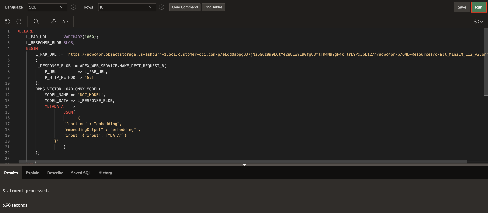

## Task 2: Create Vector Provider from Workspace Utilities

In this task, you will create a Vector Provider that will be used later to set up a Search Configuration.

1. From your SQL Commands page, click the Down Arrow next to **App Builder** and select **Workspace Utilities**. Then, select **All Workspace Utilities**.

    

2. In the Workspace Utilities page, select **Vector Providers**.

    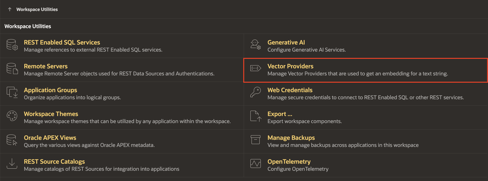

3. Click **Create**.

    

4. In the Vector Provider Configuration page, enter the following:

    - Under Identification:

        - Provider Type : **Database ONNX Model**

        - Name: **DB ONNX Model**

        - Static ID: **db\_onnx\_model**

    - Under Local Embedding:

        - ONNX Model Owner: **Select your Parsing Schema**

        - ONNX Model Name: **DOC_MODEL**

5. Click **Create**.

    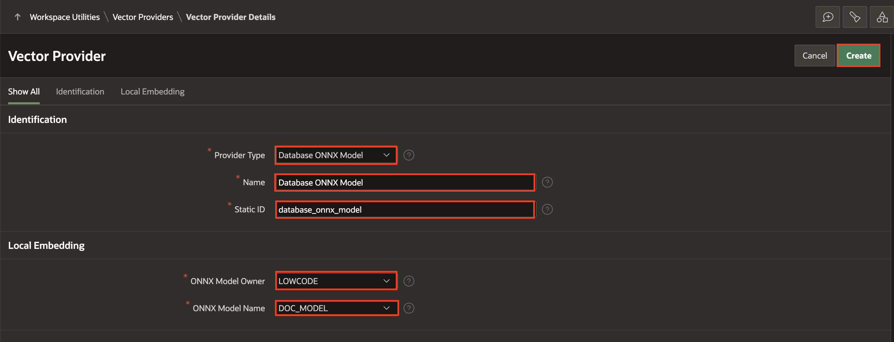

## Task 3: Configure REST Synchronization for Popular Movies REST Data Source

This task involves configuring REST Synchronization for the Popular_Movies REST Data Source. The synchronized data will be stored in a local table and used in vector search configurations to enable semantic search capabilities.

1. Go to **App Builder**, open the **Movies Watchlist** application, and click **Shared Components**.

    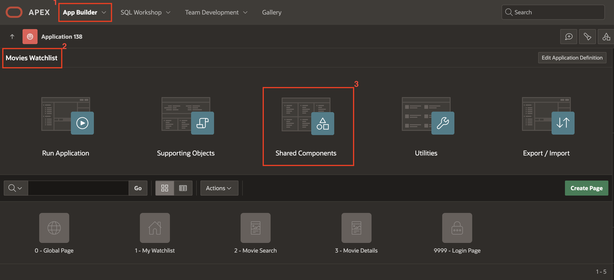

2. Under **Data Sources**, click **REST Data Sources**.

    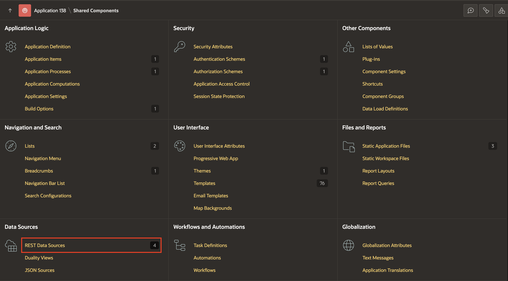

3. Select **Popular Movies** REST Data Source.

    

4. On the right side menu, select **Manage Synchronization**.

    

5. Under **Details**, enter/select the following:

    - Synchronize To: **New Table**

    - Table Name: **POPULAR_MOVIES**

6. Click **Save**.

    

7. You will notice that the Synchronization Table does not exist yet. To create it, go to **Table Status** and click **Create Table**.

    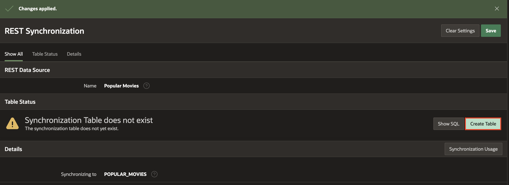

8. To configure the synchronization schedule, go to **Details** and click the Interval Builder *icon* next to Synchronization Schedule. In the Interval Builder dialog, choose **Weekly** as the Frequency and click **Set Execution Interval**.

    

9. Click **Save and Run**.

    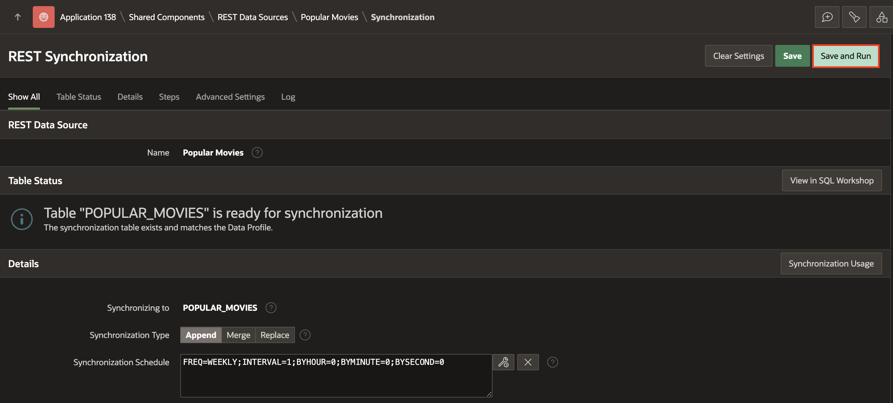

## Task 4: Add a Vector Column and Generate Vector Embeddings for Popular Movies

In this task, you will add a vector column in popular_movies table and write a PL/SQL code which generates vector embeddings for movie title and overview in the popular_movies table using the apex\_ai.get\_vector\_embeddings function. It iterates through each movie, computes the vector representation of the movie title and overview using a specified AI model (db\_onnx\_model), and stores the resulting embedding in the pname\_vector column. .

1. From your Vector Provider page, click the Down Arrow next to **SQL Workshop** and select **SQL Commands**.

    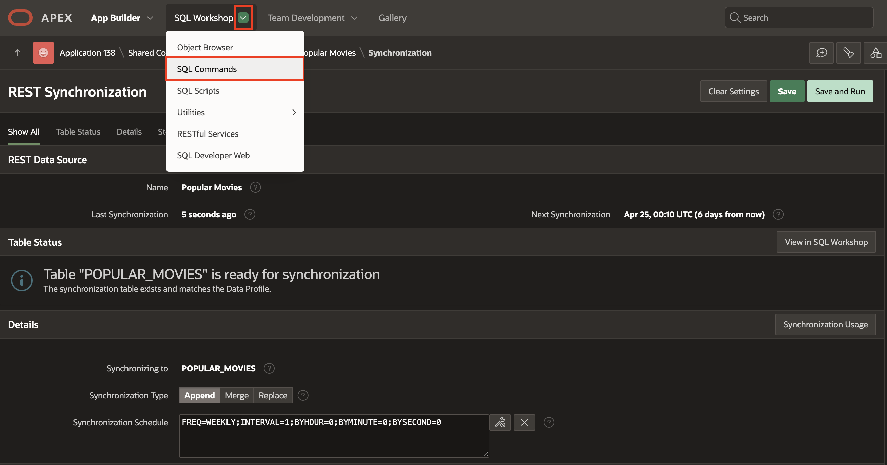

2. Copy and Paste the following SQL queries one after the other and click **Run**.

    ```
    <copy>
    ALTER TABLE PRODUCTS
    ADD PNAME_VECTOR VECTOR;
    </copy>
    ```

    ```
    <copy>
    DECLARE
        l_vector VECTOR;
    BEGIN
        FOR i IN (SELECT id,
                 Title,
                 overview
          FROM   popular_movies) LOOP
        SELECT apex_ai.Get_vector_embeddings(p_value => i.Title || ','|| i.overview,
                                                  p_service_static_id =>
                                                  'db_onnx_model')
        INTO   l_vector
        FROM   popular_movies
        WHERE  id = i.id;

        UPDATE popular_movies
        SET    pname_vector = l_vector
        WHERE  id = i.id;
    END LOOP;
    END;
    </copy>
    ```

    

    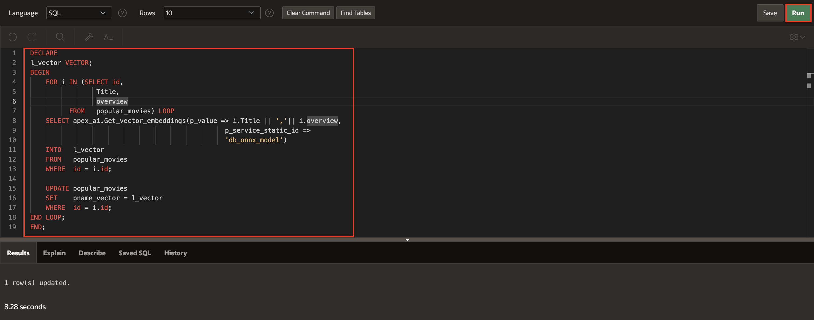

## Task 5: Create a Search Configuration

In this task, you will set up a Search Configuration based on Oracle Vector Search.

1. From the Navigation bar in your workspace, click **App Builder**.

    

2. Select your application and click **Shared Components**.

    

    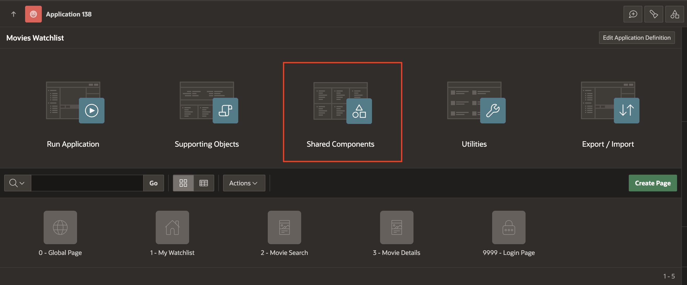

3. Under **Navigation and Search**, select **Search Configurations**.

    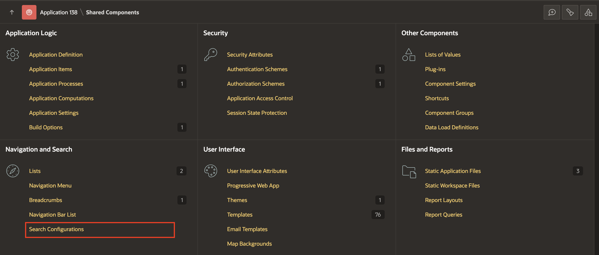

4. Click **Create**.

    

5. In the Create Search Configuration Detail Wizard, enter/select the following:

    - Name : **Products Search - Vector**

    - Search Type: **Oracle Vector Search**

    Click **Next**.

    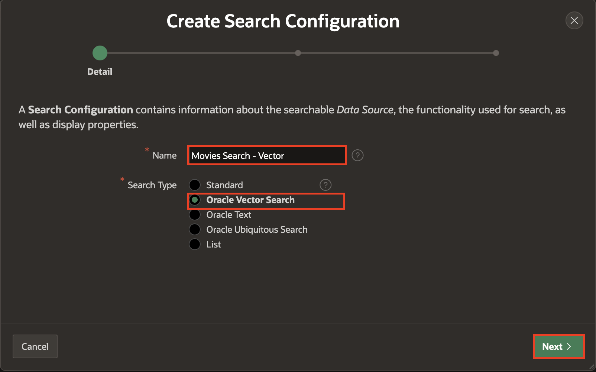

6. In the Create Search Configuration **Source** Wizard, enter/select the following:

    - Vector Provider : **DB ONNX Model**

    - Table/View Name: **POPULAR_MOVIES**

    Click **Next**.

    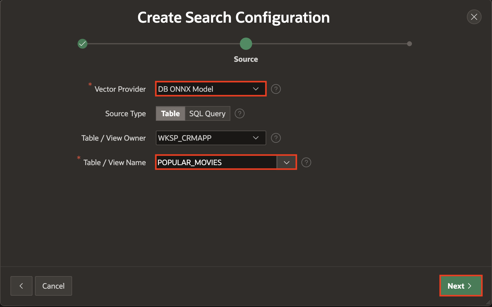

7. In the Create Search Configuration Column Mapping Wizard, enter/select the following:

    - Primary Key Column Column 2 : **ID(Number)**

    - Vector Column: **PNAME_VECTOR(Vector)**

    - Title Column: **TITLE(Varchar2)**

    - Description Column: **OVERVIEW(Varchar2)**

    Click **Create Search Configuration**.

    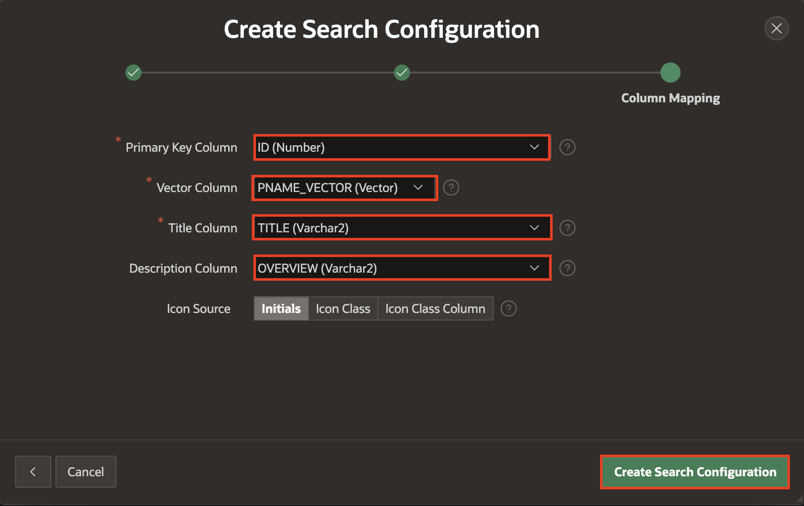

8. Navigate to  **Icon and Display** tab and enter/select the following:

    - Icon Source: **Image URL**

    - Icon Image URL: **https://image.tmdb.org/t/p/w500&POSTER_PATH.**

    Click **Apply Changes**.

    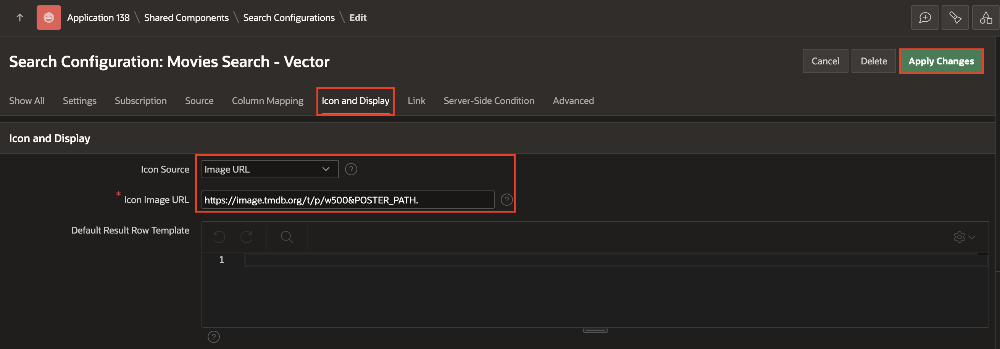

## Task 6: Create an Oracle Vector Search Page

In this task, you will create a Vector Search Page to search across popular movies.

1. From your Search Configurations Page, click **App xxx**.

    

2. Click **Create Page**.

    

3. Select **Search Page**.

    

4. Under Create Search Page wizard, enter/select the following:

    - Page Definition > Name: **Movies Search**

    - Search Configurations > Movies Search - Vector: Set checkbox to **Yes**

    - Navigation > Use Breadcrumb: Toggle **OFF**

    Click **Create Page**.

    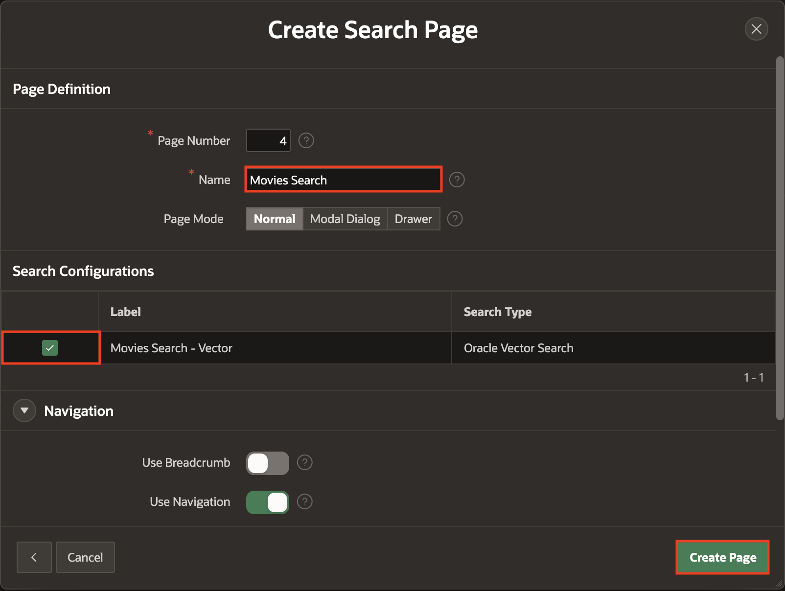

## Task 7: Run the New Vector Search Page

1. In Page Designer of the newly created page, click **Run and Save**.

    

2. Now, play around with the Search Page.

    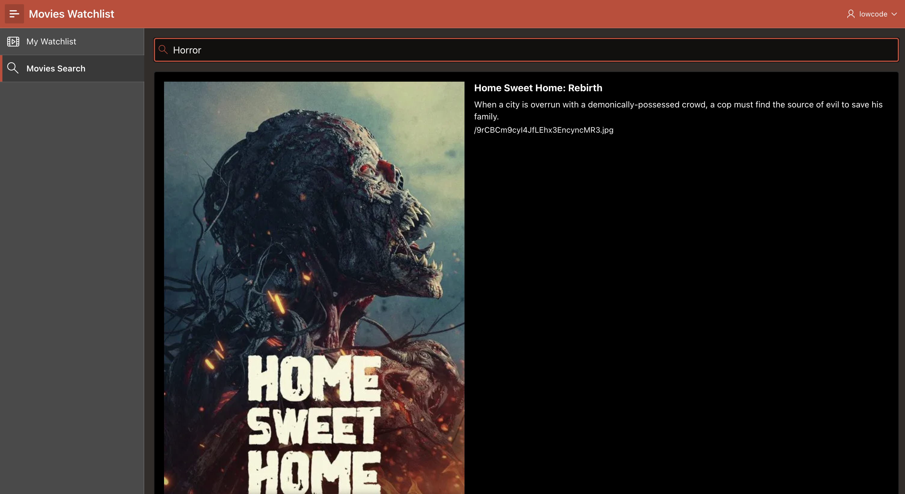

## Summary

In this lab, you loaded ONNX models into Oracle Database, created a Vector Provider, and generated vector embeddings. Then, you configured Oracle Vector Search for enhanced search capabilities and built a search page to leverage these embeddings for efficient and accurate search results.

## Learn More - *Useful Links*

- APEX on Autonomous:   [https://apex.oracle.com/autonomous](https://apex.oracle.com/autonomous)
- APEX Collateral:   [https://apex.oracle.com](https://apex.oracle.com)
- Tutorials:   [https://apex.oracle.com/en/learn/tutorials](https://apex.oracle.com/en/learn/tutorials)
- Community:  [https://apex.oracle.com/community](https://apex.oracle.com/community)
- External Site + Slack:   [http://apex.world](http://apex.world)

## Acknowledgments

- **Author** - Ankita Beri, Product Manager
- **Last Updated By/Date** - Ankita Beri, Product Manager, April 2025
