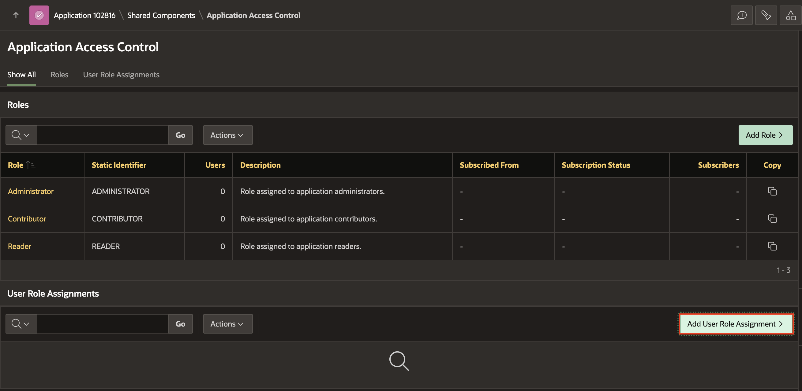
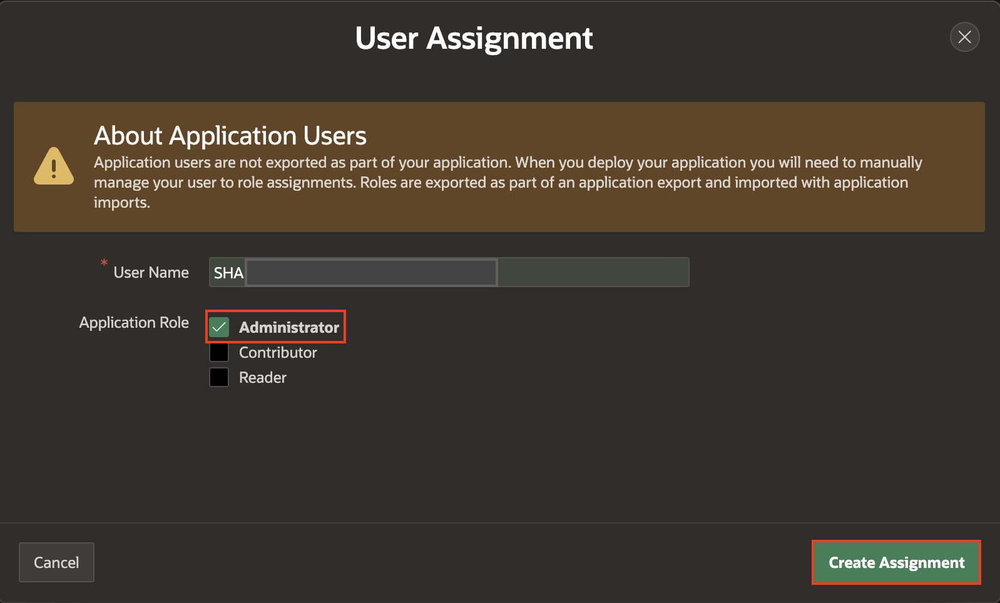

# Introduction

## About this Workshop

In this workshop, you'll create a Shopping Cart application that allows managing products, customers, and  stores. The application will have two application roles:

- Administrators:

    - To manage the products, customers and stores.

    - To access a dashboard to identify the top products.

- Customers:

    - To review, add, delete, or edit the number of products in the shopping cart.

    - To submit orders.

Estimated Workshop Time: 2.5 hours

<if type="odbw">If you would like to watch us do the workshop, click [here](https://youtu.be/ioduhe7gHvc).</if>

### Objectives

In this lab, you will:

- Obtain a free development environment.

- Install a sample dataset.

- Learn how to create lookup tables.

- Learn how to create a page to list all the products.

- Learn how to manage the products.

- Build AI Generative Text and Chat Assistant.

- Create a Products Vector Search Page using Search Configurations.

>*Note: This workshop assumes you are using Oracle APEX 24.2. Some of the features might not be available in prior releases and the instructions, flow, and screenshots might differ if you use an older version of Oracle APEX.*

### Labs

| # | Module | Est. Time |
| --- | --- | --- |
| 1 | [Install a Sample Dataset](?lab=1-installing-sample-tables) | 5 min |
| 2 | [Add Columns to the Products Table](?lab=2-adding-columns) | 10 min |
| 3 | [Create Database Objects](?lab=3-creating-db-objects) | 5 min |
| 4 | [Create the Application](?lab=4-create-app) | 15 min |
| 5 | [Create the Order Page](?lab=5-creating-orders-page) | 15 min |
| 6 | [Create the Shopping Cart Page](?lab=6-creating-shopping-cart) | 20 min |
| 7 | [Create the Add to Cart Page](?lab=7-creating-add-to-cart-page) | 20 min |
| 8 | [Improve the Products Page](?lab=8-improving-products) | 20 min |
| 9 | [Build AI Generative text and Chat Assistant](?lab=9-chat-assistant) | 20 min |
| 10 | [Create a Products Vector Search Page using Search Configurations](?lab=10-vector-search-configurationst) | 15 min |
| 11 | [Improve the Application](?lab=9-improving-app) | 10 min |<if type="odbw">
| 10 | [Terminate Oracle Autonomous Database Instance](?lab=terminate-adb) | 5 min |</if>
{: title="List of Labs in the Shopping Cart Application Workshop"}

### **Let's Get Started!**

- If the menu is not displayed, you can open by clicking the menu button () at the top-left of the page.

### Downloads

- If you are stuck or the application is not working as expected, you can download and install the completed App as follows:

    1. First, install the sample dataset from your workspace using the following lab: **[Using SQL Workshop > Lab 1: Install Sample Tables](https://livelabs.oracle.com/pls/apex/r/dbpm/livelabs/run-workshop?p210_wid=3524&p210_wec=&session=8379360721545)**

    2. After installing the sample dataset tables, download the SQL script from **[here](https://c4u04.objectstorage.us-ashburn-1.oci.customer-oci.com/p/EcTjWk2IuZPZeNnD_fYMcgUhdNDIDA6rt9gaFj_WZMiL7VvxPBNMY60837hu5hga/n/c4u04/b/livelabsfiles/o/labfiles%2FOnlineShoppingApp-PartialDDLs.sql)**. If you have already created the database objects, you can skip this step.

        To import the SQL script follow the below steps:

        - Navigate to your APEX homepage, click the down arrow next to **SQL Workshop**, and select **SQL Scripts**.

        

        - Click **Upload** and drag and drop the SQL script file downloaded in the previous step.

        

        - After uploading, click the **Run** icon.

        

        

    3. Now, **[Click here](https://c4u04.objectstorage.us-ashburn-1.oci.customer-oci.com/p/EcTjWk2IuZPZeNnD_fYMcgUhdNDIDA6rt9gaFj_WZMiL7VvxPBNMY60837hu5hga/n/c4u04/b/livelabsfiles/o/labfiles%2Foic-library_acme-shop.sql)** to download the completed application and import it into your workspace.

    4. When you run the application, you may encounter an “unauthorized user” error because no user has been assigned to the authorization scheme yet. To fix this, go to **Shared Components** in your workspace. Under Security, select **Application Access Control**, and click **Add User Role Assignment**. Then, add the username you wish to log in to the application, choose the appropriate application role, and click **Create Assignment**.

        

        

    5. Follow **LAB 9** to configure Generative AI.

    6. To use the **Vector Search** capabilities of this application, perform the steps mentioned in **LAB 10: Task 1, Task 2  and Task 3**.

- [Download the Application icon](./images/shopping-cart-01.png)

> Note: If you want to reinstall the the database objects, you can download the provided **[script](https://c4u04.objectstorage.us-ashburn-1.oci.customer-oci.com/p/EcTjWk2IuZPZeNnD_fYMcgUhdNDIDA6rt9gaFj_WZMiL7VvxPBNMY60837hu5hga/n/c4u04/b/livelabsfiles/o/labfiles%2FCleanup-Scripts.sql)** to drop the existing database objects.

## Learn More - *Useful Links*

- **Introduction to APEX**
    - [App Builder Concepts](https://docs.oracle.com/en/database/oracle/apex/24.2/htmdb/application-builder-concepts.html#GUID-6D22E307-6D48-49BC-9FDC-A7D8B037E46A)
    - [Page Designer](https://docs.oracle.com/en/database/oracle/apex/24.2/htmdb/about-page-designer.html#GUID-F4A825A2-6BD5-4A11-8D68-B24B2B6ED18B)
    - [Shared Components](https://docs.oracle.com/en/database/oracle/apex/24.2/htmdb/shared-components-page.html#GUID-2CDE44A1-E219-44BC-B983-B6780266F315)
    - [Cards](https://docs.oracle.com/en/database/oracle/apex/24.2/htmdb/managing-cards.html#GUID-4B524AC4-9507-45EB-B4EA-A4D33F469B2D)
    - [APEX_COLLECTION API](https://docs.oracle.com/en/database/oracle/apex/24.2/aeapi/APEX_COLLECTION.html#GUID-859B488C-2628-44D7-969F-50872C685B76)
    - [Web Credentials](https://docs.oracle.com/en/database/oracle/apex/24.2/htmdb/creating-web-credentials.html)
    - [Generative AI](https://docs.oracle.com/en/database/oracle/apex/24.2/htmdb/managing-generative-ai-in-apex.html#HTMDB-GUID-FDA021EF-D1A4-42AB-886F-617BE89B2557)

- [APEX on Autonomous](https://apex.oracle.com/autonomous)
- [APEX Service](https://apex.oracle.com/en/platform/apex-service/)
- [APEX Collateral](https://apex.oracle.com)
- [Tutorials](https://apex.oracle.com/en/learn/tutorials)
- [Community](https://apex.oracle.com/community)
- [External Site + Slack](http://apex.world)

## Acknowledgments

- **Author** - Apoorva Srinivas, Principal Product Manager; Mónica Godoy, Senior Principal Product Manager; Ankita Beri, Senior Product Manager
- **Last Updated By/Date** - Ankita Beri, Senior Product Manager, October 2025
