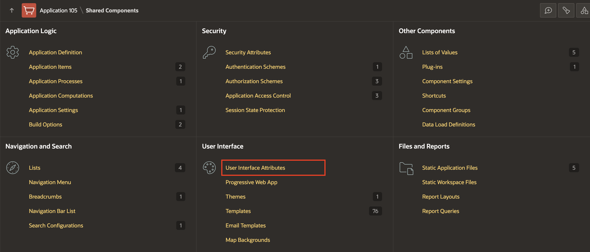
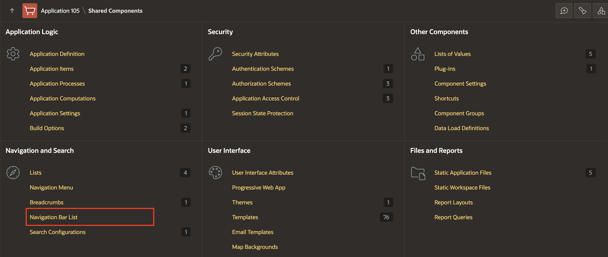
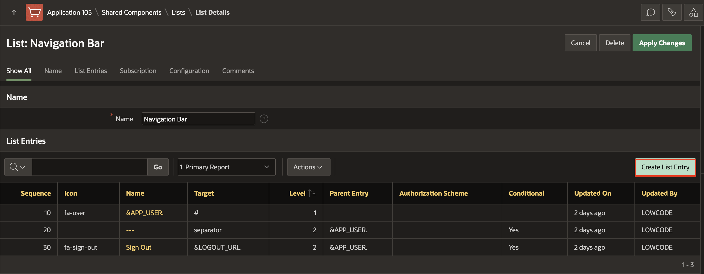
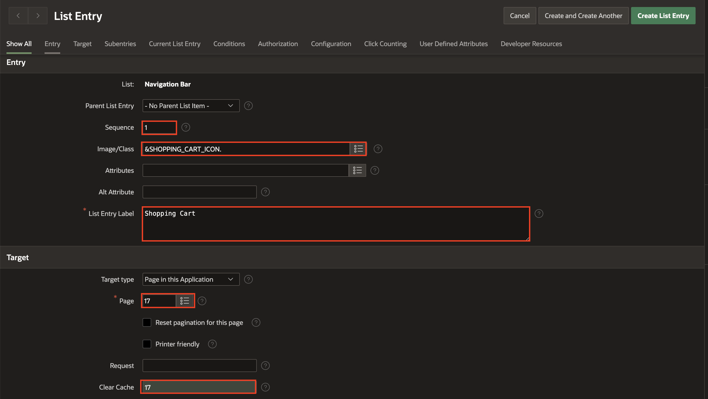
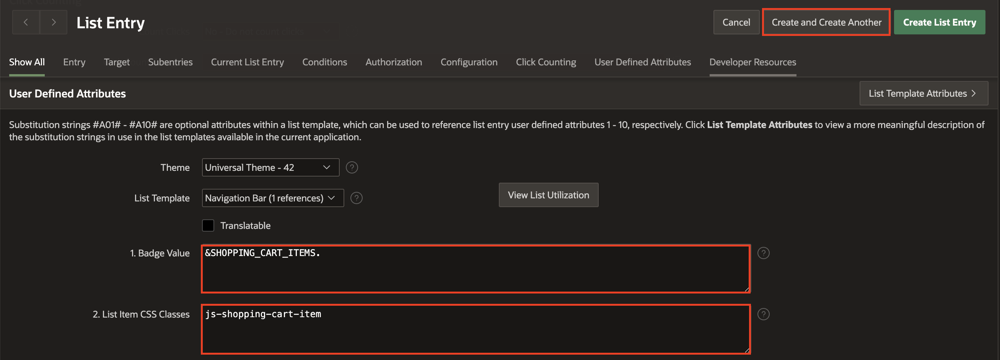
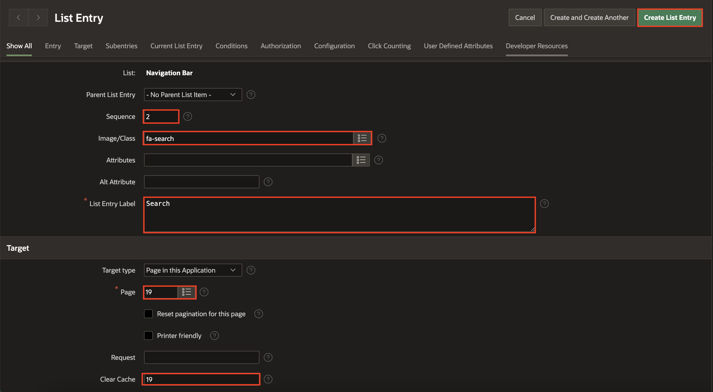
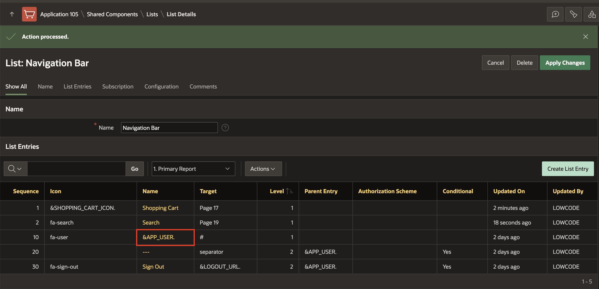
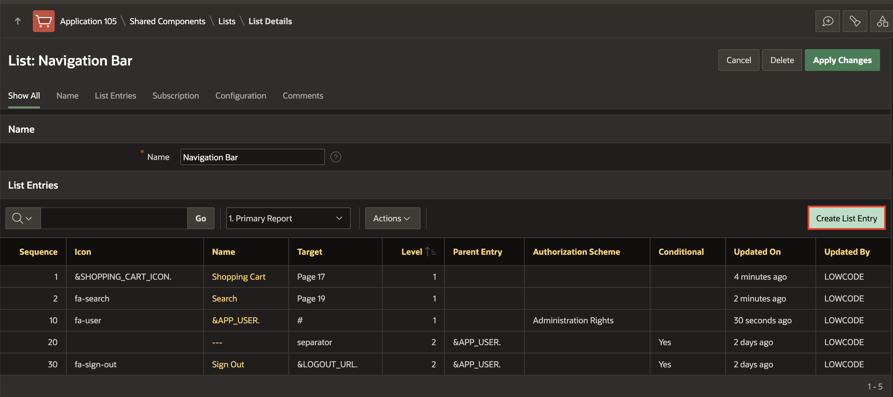
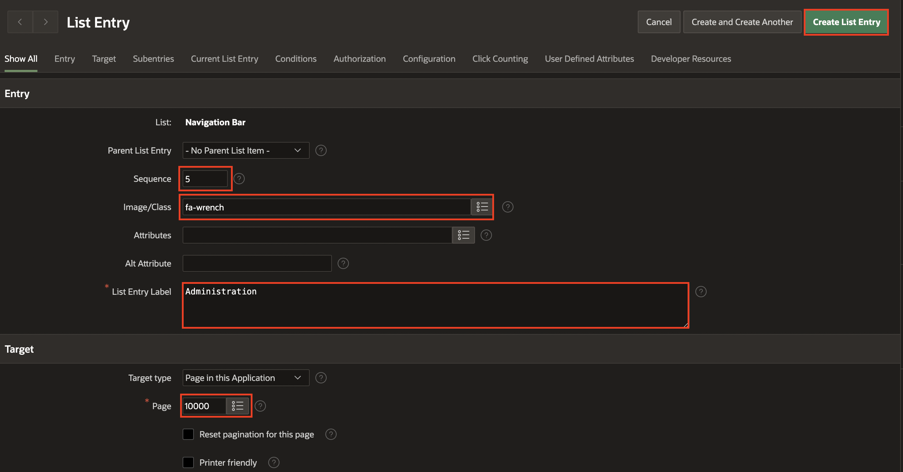

# Improve the application

## Introduction

In this lab, you will learn how to make some pages publicly accessible.

Estimated Time: 10 minutes

Watch the video below for a quick walk-through of the lab.
[Improve the application](videohub:1_g5q8c5n1)

### Objectives

In this lab, you will:

- Set the following pages as public pages:

    - Products

    - Shopping Cart

    - Order Information

- Disable the Navigation Menu.

- Enhance the Navigation Bar.

## Task 1: Set Pages to be Public

Your customers don't need to log in the app to shop the products, so let's set the following pages as public:

- Page  1: Products
- Page 16: Order Information
- Page 17: Shopping Cart
- Page 18: Add to Cart
- Page 19: Product Search

Follow these steps for the four listed pages:

1. From the runtime application, navigate to **ACME Shop** and click **Page 1** from developer toolbar.

2. Within Page Designer, in the Rendering tree (left pane), navigate to  root node **Page 1: Products**.

3. In the Property Editor, select the following:

    - Under Security > Authentication: **Page Is Public**

    

4. Click **Save**.

## Task 2: Clean the Navigation Menu

Since the home page is the Products page and this is a public access page as some others too, it's not needed to have a navigation menu.
In this task, you will turn off displaying the navigation menu.

1. Within Page Designer, click the **Shared Components** icon at the top right.

    

   Alternatively, if you are in the App Builder, click Shared Components.

   

2. Under **User Interface**, click **User Interface Attributes**.

    

3. Navigate to **Navigation Menu** tab and set Display Navigation to **Off**.

    

4. Click **Apply Changes**.

## Task 3: Enhance the Navigation Bar List

Add a new navigation menu entry to allow:

- Customers to go directly to the Shopping Cart.

- Administrators to login and access to administration page.

1. Navigate to **Shared Components** icon at the top right.

    

2. Under **Navigation and Search**, click **Navigation Bar List**.

    

3. Click **Navigation Bar**.

    

4. Click **Create List Entry** and enter/select the following:

    - Sequence: **1**

    - Image/Class: **&SHOPPING\_CART\_ICON.**

    - List Entry Label: **Shopping Cart**

    - Page: **17**

    - Clear cache: **17**

    

    

5. Scroll under **User Defined Attributes** and enter the following:

    - Badge Value:  **&SHOPPING\_CART\_ITEMS.**

    - List Item CSS Classes: **js-shopping-cart-item**

    Click **Create and Create Another**.

    

6. Enter/select the following:

    - Sequence: **2**

    - Image/Class: **fa-search**

    - List Entry Label: **Product Search**

    - Page: **19**

    - Clear cache: **19**

    Click **Create List Entry**.

    

7. Under **List Entries**, navigate to **&APP_USER.**

    

8. Under Authorization, for Authorization Scheme, select **Administration Rights**.

9. Click **Apply Changes**.

    

10. Click **Create List Entry** and enter/select the following:

    - Sequence: **5**

    - Image/Class: **fa-wrench**

    - List Entry Label: **Administration**

    - Page: **10000**

11. Click **Create List Entry**.

    

    

12. Click **Run Page** and view the updated application.

    

## Summary

You now know how to enhance and maintain both navigation menu and navigation bar.

## Acknowledgments

- **Author(s)** - Apoorva Srinivas, Senior Product Manager; Monica Godoy, Principal Product Manager
- **Last Updated By/Date** - Ankita Beri, Product Manager, January 2025
